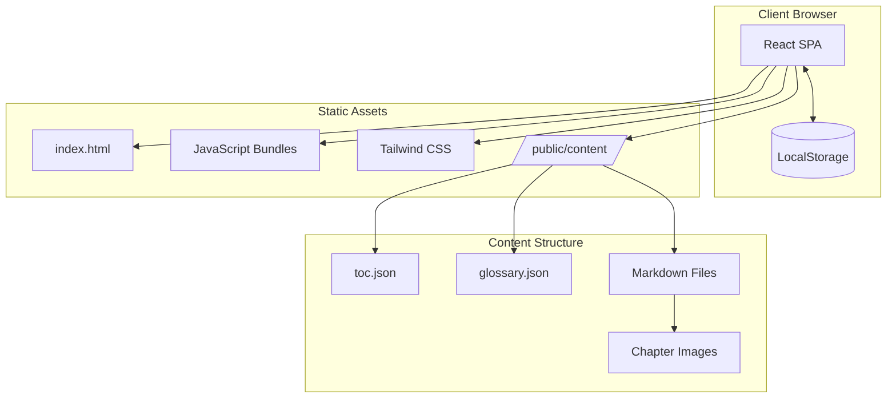
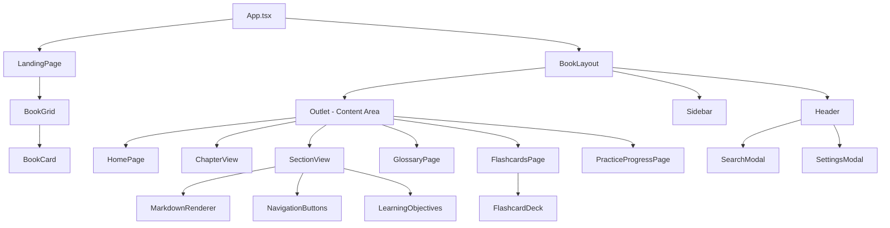
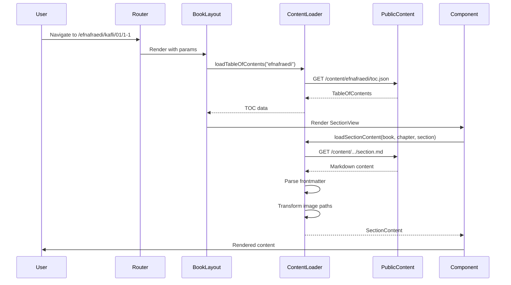
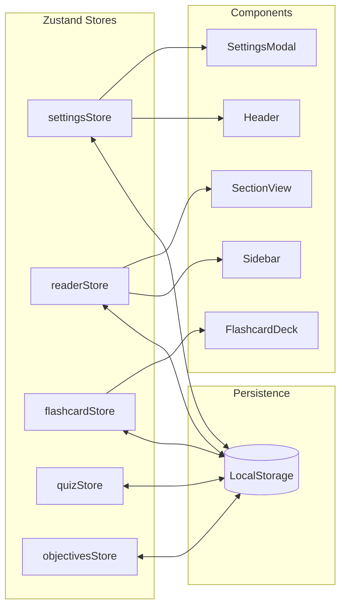

# Architecture Documentation

## System Overview

Námsbókasafn is a static single-page application (SPA) built with React and TypeScript. It serves as an interactive reader for Icelandic translations of OpenStax educational textbooks.



## Technology Stack

| Layer | Technology | Purpose |
|-------|------------|---------|
| UI Framework | React 19.2 | Component-based UI |
| Language | TypeScript 5.7 | Type safety |
| Build Tool | Vite 7.2 | Fast bundling & HMR |
| Styling | Tailwind CSS 4.1 | Utility-first CSS |
| Routing | React Router 7.1 | Client-side navigation |
| State | Zustand 5.0 | Lightweight state management |
| Markdown | react-markdown 10.1 | Content rendering |
| Math | KaTeX 0.16 | LaTeX equation rendering |
| Icons | Lucide React | UI iconography |

## Application Architecture

### Component Hierarchy



### Directory Structure

```
src/
├── App.tsx                 # Root component with routing
├── main.tsx               # Application entry point
├── config/
│   └── books.ts           # Book configuration registry
├── components/
│   ├── catalog/           # Landing page components
│   │   ├── LandingPage.tsx
│   │   ├── BookCard.tsx
│   │   └── BookGrid.tsx
│   ├── layout/            # Page structure components
│   │   ├── BookLayout.tsx # Context provider wrapper
│   │   ├── Header.tsx     # Navigation header
│   │   └── Sidebar.tsx    # Table of contents
│   ├── reader/            # Content display components
│   │   ├── ChapterView.tsx
│   │   ├── SectionView.tsx
│   │   ├── MarkdownRenderer.tsx
│   │   ├── GlossaryPage.tsx
│   │   ├── FlashcardsPage.tsx
│   │   ├── FlashcardDeck.tsx
│   │   └── ...
│   └── ui/                # Reusable UI components
│       ├── Modal.tsx
│       ├── Button.tsx
│       ├── SettingsModal.tsx
│       └── SearchModal.tsx
├── hooks/
│   ├── useBook.ts         # Book context hook
│   ├── useTheme.ts        # Theme management
│   └── useGlossary.ts     # Glossary data loading
├── stores/                # Zustand state stores
│   ├── settingsStore.ts   # UI preferences
│   ├── readerStore.ts     # Reading progress
│   ├── flashcardStore.ts  # Flashcard study data
│   ├── quizStore.ts       # Exercise tracking
│   └── objectivesStore.ts # Learning objectives
├── types/
│   ├── content.ts         # Content data types
│   ├── flashcard.ts       # Flashcard types
│   ├── glossary.ts        # Glossary types
│   └── quiz.ts            # Quiz types
├── utils/
│   ├── contentLoader.ts   # Markdown/JSON loading
│   ├── searchIndex.ts     # Full-text search
│   ├── srs.ts             # Spaced repetition algorithm
│   └── flashcardGenerator.ts
└── styles/
    └── globals.css        # Global styles & CSS variables
```

## Data Flow

### Content Loading



### State Management



## Key Architectural Decisions

### 1. Static Content Architecture

**Decision**: All book content is stored as static files in `/public/content/`.

**Rationale**:
- No backend server required
- Easy deployment to any static hosting
- Content can be updated independently
- Works offline after initial load
- Simple content management via Git

### 2. Client-Side State Persistence

**Decision**: Use localStorage for all user state (progress, settings, flashcards).

**Rationale**:
- No user accounts needed
- Privacy-friendly (data stays on device)
- Works offline
- Instant load of user preferences

### 3. Context-Based Book Scoping

**Decision**: Use React Context (`BookContext`) to provide book-specific data to all child components.

**Rationale**:
- Avoids prop drilling
- Clean separation between book selection and reading
- Easy to add multi-book support

### 4. Lazy Loading Routes

**Decision**: Use React.lazy() for route-level code splitting.

**Rationale**:
- Smaller initial bundle
- Faster first paint
- Only load code when needed

### 5. Zustand for State Management

**Decision**: Use Zustand instead of Redux or React Context for global state.

**Rationale**:
- Minimal boilerplate
- Built-in persistence middleware
- Works well with TypeScript
- No Provider wrapper needed

## Routing Architecture

| Path | Component | Description |
|------|-----------|-------------|
| `/` | LandingPage | Book catalog |
| `/:bookSlug` | HomePage | Book home page |
| `/:bookSlug/ordabok` | GlossaryPage | Vocabulary/glossary |
| `/:bookSlug/minniskort` | FlashcardsPage | Flashcard study |
| `/:bookSlug/aefingar` | PracticeProgressPage | Practice problems |
| `/:bookSlug/kafli/:chapter` | ChapterView | Chapter overview |
| `/:bookSlug/kafli/:chapter/:section` | SectionView | Section content |

## Build Configuration

### Code Splitting Strategy

```javascript
// vite.config.ts
manualChunks: {
  'react-vendor': ['react', 'react-dom', 'react-router-dom'],
  'markdown': ['react-markdown', 'remark-gfm', 'remark-math'],
  'katex': ['katex', 'rehype-katex'],
  'ui-vendor': ['lucide-react', 'zustand']
}
```

### Bundle Output

- `index.html` - Entry point
- `assets/index-[hash].js` - Main application bundle
- `assets/react-vendor-[hash].js` - React runtime
- `assets/markdown-[hash].js` - Markdown processing
- `assets/katex-[hash].js` - Math rendering

## Performance Considerations

### Optimizations Implemented

1. **Route-level code splitting** - Only load components when navigating
2. **Image lazy loading** - Images load on scroll
3. **Debounced search** - 300ms delay before searching
4. **Memoized components** - Prevent unnecessary re-renders
5. **CSS variables** - Efficient theme switching without re-render

### Lighthouse Targets

| Metric | Target | Strategy |
|--------|--------|----------|
| LCP | < 2.5s | Code splitting, static assets |
| FID | < 100ms | Minimal JavaScript blocking |
| CLS | < 0.1 | Reserved space for images |

## Security Considerations

1. **No backend** - No attack surface for server-side exploits
2. **No user data collection** - All data stored client-side
3. **Content Security** - Static content from known source
4. **HTTPS** - Enforced in production deployment

## Extensibility

### Adding a New Book

1. Add configuration to `src/config/books.ts`
2. Create content directory: `public/content/{bookSlug}/`
3. Add `toc.json`, `glossary.json`, and chapter content
4. Add cover image to `public/covers/`

### Adding a New Feature

1. Create store in `src/stores/` if state needed
2. Add types in `src/types/`
3. Create components in appropriate directory
4. Add route if needed in `App.tsx`
5. Update existing components to integrate

## Deployment Architecture

```mermaid
graph TB
    subgraph "GitHub"
        Repo[Repository]
    end

    subgraph "Build Process"
        GHA[GitHub Actions]
        Build[npm run build]
        Dist[/dist/ folder]
    end

    subgraph "Production Server"
        Nginx[Nginx]
        Static[Static Files]
        SSL[Let's Encrypt SSL]
    end

    subgraph "Users"
        Browser[Web Browser]
    end

    Repo --> GHA
    GHA --> Build
    Build --> Dist
    Dist --> Static
    Nginx --> Static
    SSL --> Nginx
    Browser --> Nginx
```

## Future Architecture Considerations

- **PWA Support**: Service worker for offline reading
- **Content CDN**: Move content to CDN for faster global access
- **Incremental Static Regeneration**: If moving to Next.js
- **Backend Services**: Optional sync service for cross-device progress
