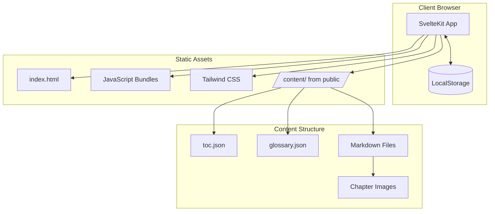
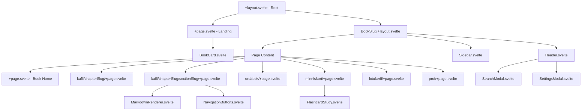
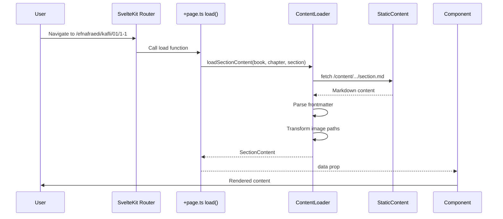
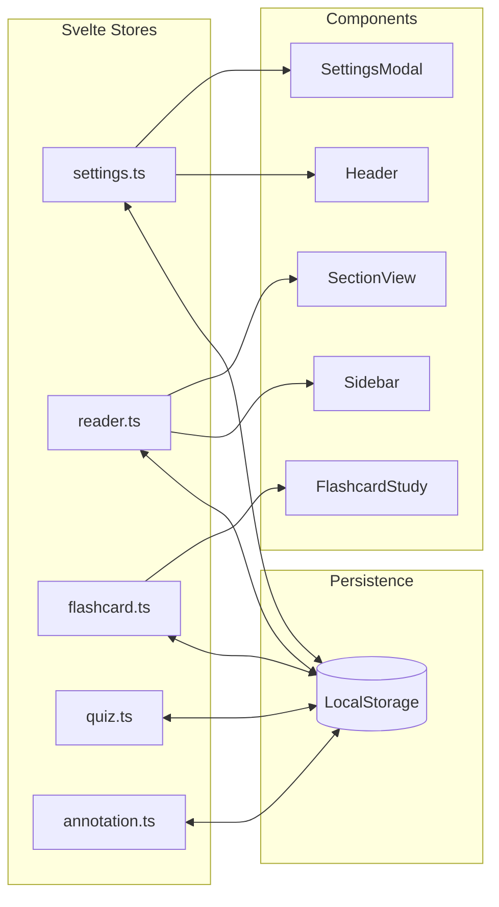

# Architecture Documentation

## System Overview

Námsbókasafn is a static site built with SvelteKit and TypeScript. It serves as an interactive reader for Icelandic translations of OpenStax educational textbooks.



## Technology Stack

| Layer | Technology | Purpose |
|-------|------------|---------|
| UI Framework | SvelteKit 2.21 | Full-stack framework with SSG |
| Components | Svelte 5.33 | Reactive component library |
| Language | TypeScript 5.7 | Type safety |
| Build Tool | Vite 6.3 | Fast bundling & HMR |
| Styling | Tailwind CSS 4.1 | Utility-first CSS |
| Routing | SvelteKit | File-based routing |
| State | Svelte Stores | Built-in state management |
| Markdown | unified/remark/rehype | Content rendering |
| Math | KaTeX 0.16 | LaTeX equation rendering |
| Icons | Lucide Svelte | UI iconography |
| PWA | @vite-pwa/sveltekit | Offline support |

## Application Architecture

### Component Hierarchy



### Directory Structure

```
src/
├── app.html               # HTML template
├── app.css                # Global styles + Tailwind
├── lib/
│   ├── components/        # Svelte components
│   │   ├── layout/        # Page structure components
│   │   │   ├── Header.svelte
│   │   │   ├── Sidebar.svelte
│   │   │   └── FocusModeNav.svelte
│   │   ├── BookCard.svelte
│   │   ├── FlashcardStudy.svelte
│   │   ├── MarkdownRenderer.svelte
│   │   ├── PeriodicTable.svelte
│   │   ├── SearchModal.svelte
│   │   ├── SettingsModal.svelte
│   │   └── ...
│   ├── stores/            # Svelte stores
│   │   ├── settings.ts    # UI preferences
│   │   ├── reader.ts      # Reading progress
│   │   ├── flashcard.ts   # Flashcard study data
│   │   ├── quiz.ts        # Quiz tracking
│   │   ├── annotation.ts  # Highlights & notes
│   │   └── ...
│   ├── actions/           # Svelte actions
│   │   ├── equations.ts   # KaTeX rendering
│   │   ├── practiceProblems.ts
│   │   ├── crossReferences.ts
│   │   └── figureViewer.ts
│   ├── types/
│   │   ├── book.ts
│   │   ├── content.ts
│   │   ├── flashcard.ts
│   │   └── ...
│   └── utils/
│       ├── contentLoader.ts
│       ├── markdown.ts
│       ├── searchIndex.ts
│       └── srs.ts         # Spaced repetition
└── routes/                # SvelteKit file-based routing
    ├── +layout.svelte     # Root layout
    ├── +page.svelte       # Landing page
    └── [bookSlug]/
        ├── +layout.svelte # Book layout with sidebar
        ├── +layout.ts     # Book config loader
        ├── +page.svelte   # Book home
        ├── ordabok/
        ├── minniskort/
        ├── lotukerfi/
        ├── prof/
        └── kafli/
            └── [chapterSlug]/
                ├── +page.svelte
                └── [sectionSlug]/
```

## Data Flow

### Content Loading



### State Management



## Key Architectural Decisions

### 1. Static Site Generation

**Decision**: Use SvelteKit with `@sveltejs/adapter-static` for SSG.

**Rationale**:
- No backend server required
- Easy deployment to any static hosting
- Excellent performance (pre-rendered HTML)
- Works offline after initial load
- Simple content management via Git

### 2. Client-Side State Persistence

**Decision**: Use localStorage for all user state (progress, settings, flashcards).

**Rationale**:
- No user accounts needed
- Privacy-friendly (data stays on device)
- Works offline
- Instant load of user preferences

### 3. Svelte Stores for State Management

**Decision**: Use Svelte's built-in stores instead of external libraries.

**Rationale**:
- No additional dependencies
- Automatic subscription/unsubscription with `$` syntax
- Simple API for localStorage persistence
- TypeScript support

### 4. File-Based Routing

**Decision**: Use SvelteKit's file-based routing.

**Rationale**:
- Intuitive structure
- Automatic code splitting
- Load functions for data fetching
- Type-safe route parameters

### 5. Svelte Actions for DOM Manipulation

**Decision**: Use Svelte actions for complex DOM interactions (equations, lightbox, etc.).

**Rationale**:
- Clean separation of concerns
- Reusable across components
- Proper lifecycle management
- Works well with server-side rendering

## Routing Architecture

| Path | Component | Load Function |
|------|-----------|---------------|
| `/` | `+page.svelte` | - |
| `/:bookSlug` | `[bookSlug]/+page.svelte` | `+layout.ts` (book config) |
| `/:bookSlug/ordabok` | `ordabok/+page.svelte` | - |
| `/:bookSlug/minniskort` | `minniskort/+page.svelte` | - |
| `/:bookSlug/lotukerfi` | `lotukerfi/+page.svelte` | - |
| `/:bookSlug/prof` | `prof/+page.svelte` | - |
| `/:bookSlug/kafli/:chapter` | `kafli/[chapterSlug]/+page.svelte` | `+page.ts` |
| `/:bookSlug/kafli/:chapter/:section` | `[sectionSlug]/+page.svelte` | `+page.ts` |

## Build Configuration

### Static Adapter

```javascript
// svelte.config.js
import adapter from '@sveltejs/adapter-static';

export default {
  kit: {
    adapter: adapter({
      pages: 'build',
      assets: 'build',
      fallback: 'index.html',  // SPA fallback
      precompress: false,
      strict: true
    })
  }
};
```

### Bundle Output

- `build/` - Static output directory
- `build/index.html` - Entry point with SPA fallback
- `build/_app/` - JavaScript and CSS bundles
- `build/content/` - Static content files

## Performance Considerations

### Optimizations Implemented

1. **Static site generation** - Pre-rendered HTML for fast initial load
2. **Code splitting** - Automatic route-based splitting
3. **Image lazy loading** - Images load on scroll
4. **Debounced search** - 300ms delay before searching
5. **CSS purging** - Tailwind removes unused styles

### Lighthouse Targets

| Metric | Target | Strategy |
|--------|--------|----------|
| LCP | < 2.5s | SSG, static assets |
| FID | < 100ms | Minimal JavaScript blocking |
| CLS | < 0.1 | Reserved space for images |

## Security Considerations

1. **No backend** - No attack surface for server-side exploits
2. **No user data collection** - All data stored client-side
3. **Content Security** - Static content from known source
4. **HTTPS** - Enforced in production deployment

## Extensibility

### Adding a New Book

1. Add configuration to `src/routes/[bookSlug]/+layout.ts`
2. Create content directory: `static/content/{bookSlug}/`
3. Add `toc.json`, `glossary.json`, and chapter content
4. Add cover image to `static/covers/`

### Adding a New Feature

1. Create store in `src/lib/stores/` if state needed
2. Add types in `src/lib/types/`
3. Create components in `src/lib/components/`
4. Add route in `src/routes/` if needed
5. Update existing components to integrate

## Deployment Architecture

```mermaid
graph TB
    subgraph "GitHub"
        Repo[Repository]
    end

    subgraph "Build Process"
        GHA[GitHub Actions]
        Build[npm run build]
        Output[/build/ folder]
    end

    subgraph "Production Server"
        Nginx[Nginx]
        Static[Static Files]
        SSL[Let's Encrypt SSL]
    end

    subgraph "Users"
        Browser[Web Browser]
    end

    Repo --> GHA
    GHA --> Build
    Build --> Output
    Output --> Static
    Nginx --> Static
    SSL --> Nginx
    Browser --> Nginx
```

## Migration History

This project was originally built with React 19 and migrated to SvelteKit in January 2025. The migration resulted in:

- ~60% less code due to Svelte's simpler mental model
- ~50% smaller bundle size (Svelte compiles away the framework)
- Better DX with file-based routing and built-in stores
- Unified codebase (no mix of paradigms)

The original React implementation is preserved in the `archive/react-v1` branch.
