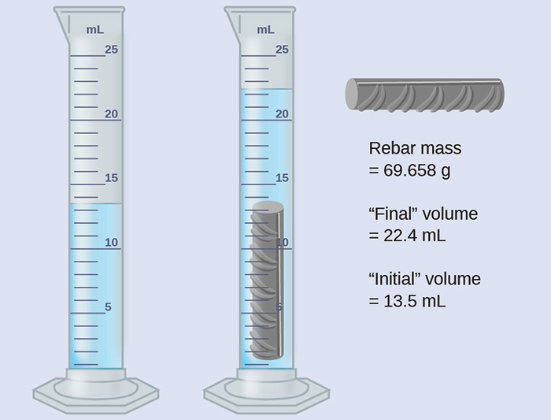
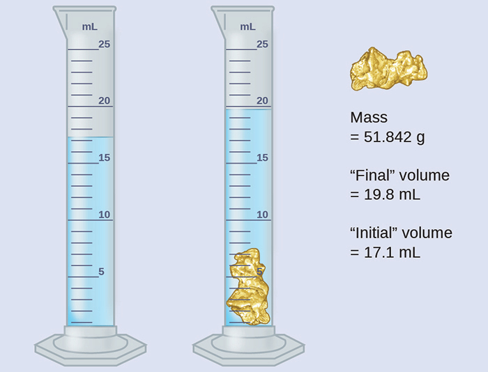

## 1.5 Óvissa, hittni og nákvæmni í mælingum

:::note
### Námsmarkmið

Í lok þessa kafla muntu geta:

-   Skilgreint hittni og nákvæmni
-   Greint á milli nákvæmra og ónákvæmra talna
-   Sýnt óvissu í stærðum á réttan hátt með markverðum stöfum
-   Beitt réttum námundunarreglum á útreiknaðar stærðir
:::

Talning er eina mælingin sem er laus við óvissu, að því gefnu að fjöldi
hluta sem verið er að telja breytist ekki á meðan talningin fer fram.
Niðurstaða slíkrar talningar er dæmi um nákvæma tölu. Með því að telja
eggin í eggjabakka er hægt að ákvarða *nákvæmlega* hversu mörg egg hann
inniheldur. Tölur skilgreindra stærða eru einnig nákvæmar. Samkvæmt
skilgreiningu er 1 fet nákvæmlega 12 tommur, 1 tomma er nákvæmlega 2,54
sentimetrar og 1 gramm er nákvæmlega 0,001 kílógramm. Stærðir sem
fengnar eru úr öðrum mælingum en talningu eru hins vegar misnákvæmar
vegna hagnýtra takmarkana á mælingarferlinu sem notað er.

### Markverðir stafir í mælingum

Tölur mældra stærða, ólíkt skilgreindum eða töldum stærðum, eru ekki
nákvæmar. Til að mæla rúmmál vökva í mæliglasi ættir þú að lesa af neðst
á bjúgfletinum, lægsta punkti á bogadregnu yfirborði vökvans.

  

Mynd 1.26 Til að mæla rúmmál vökva í þessu mæliglasi verður þú að skipta
fjarlægðinni milli 21 og 22 ml merkja í huganum í tíundu úr millilítra
og lesa síðan af (áætla) neðst á bjúgfletinum.

Skoðaðu skýringarmyndina á [mynd 1.26](#fs-idm337865984). Neðsti hluti
bjúgflatarins í þessu tilfelli liggur greinilega á milli 21 og 22
merkinganna, sem þýðir að rúmmál vökvans er *örugglega* meira en 21 ml
en minna en 22 ml. Bjúgflöturinn virðist vera aðeins nær 22 ml merkinu
en 21 ml merkinu og því væri raunhæft mat á rúmmáli vökvans 21,6 ml. Í
tölunni 21,6 eru tölustafirnir 2 og 1 því öruggir en 6 er áætlun. Sumir
gætu metið stöðu bjúgflatarins jafn langt frá hvorri merkingu og áætlað
síðasta tölustafinn sem 5, á meðan aðrir gætu haldið að hann væri nær 22
ml merkinu og áætlað þennan tölustaf sem 7. Athugaðu að það væri
tilgangslaust að reyna að áætla hvaða tala kæmi á eftir þeirri síðustu,
þar sem sú síðasta er þegar óviss. Almennt séð munu talnakvarðar eins og
þessi á mæliglasinu leyfa mælingar með nákvæmni upp á einn tíunda af
minnsta bili kvarðans. Kvarðinn í þessu tilfelli hefur 1 ml bil og því
má mæla rúmmál með nákvæmni upp á 0,1 ml.

Þetta gildir um allar mælingar, jafnvel þótt giskir ekki á síðasta
stafinn. Ef þú setur fimmtíu króna pening á venjulega rafræna vog
gætirðu fengið aflestur upp á 8,25 g. Tölustafirnir 8 og 2 eru öruggir
og 5 gefur til kynna að massi peningsins sé líklega á milli 8,24 og 8,26
grömm. Peningurinn vegur *um það bil* 8,25 grömm, með nafnóvissu í
mælingunni upp á ± 0,01 gramm. Ef peningurinn er veginn á næmari vog
gæti massinn verið 8,253 g. Þetta þýðir að massi hans liggur á milli
8,252 og 8,254 grömm, sem er óvissa upp á 0,001 gramm. Sérhver mæling
hefur einhverja óvissu, sem fer eftir tækinu sem notað er (og hæfni
notandans). Allir tölustafir í mælingu, þar með talinn óvissi síðasti
tölustafurinn, eru kallaðir markverðir stafir eða markverðar tölur.
Athugaðu að núll getur verið mælt gildi; til dæmis, ef þú stendur á vog
sem sýnir þyngd með nákvæmni upp á næsta pund og hún sýnir „120", þá eru
1 (hundruð), 2 (tugir) og 0 (einingar) öll markverð (mæld) gildi.

Niðurstaða mælingar er rétt skráð þegar markverðir stafir hennar
endurspegla nákvæmlega vissu mælingarferlisins. En hvað ef þú værir að
greina uppgefið gildi og reyna að ákvarða hvað er markvert og hvað ekki?
Jæja, til að byrja með eru allir tölustafir sem ekki eru núll markverðir
og það eru aðeins núll sem krefjast umhugsunar. Við munum nota hugtökin
„núll á undan", „núll á eftir" og „núll á milli" fyrir núllin og skoða
hvernig eigi að meðhöndla þau.

Byrjaðu á fyrsta tölustafnum sem ekki er núll vinstra megin, teldu
þennan tölustaf og alla tölustafi sem eftir eru til hægri. Þetta er
fjöldi markverðra stafa í mælingunni nema síðasti tölustafurinn sé núll
á eftir sem liggur vinstra megin við kommu.

Núll á milli eru afleiðing mælinga og eru því alltaf markverð. Núll á
undan eru hins vegar aldrei markverð --- þau segja okkur aðeins hvar
komman er staðsett.

Núllin á undan í þessu dæmi eru ekki markverð. Við gætum notað
staðalform (eins og lýst er í [viðauka
B](http://openstax.org/books/chemistry-2e/pages/b-essential-mathematics))
og sett töluna fram sem 8,32407 $\times$ 10^−3^; þá inniheldur talan
8,32407 alla markverðu stafina og 10^−3^ staðsetur kommuna.

Fjöldi markverðra stafa er óviss í tölu sem endar á núlli vinstra megin
við kommustaðsetningu. Núllin í mælingunni 1.300 grömm gætu verið
markverð eða þau gætu einfaldlega gefið til kynna hvar komman er
staðsett. Hægt er að leysa tvíræðnina með notkun veldisvísismerkis: 1,3
$\times$ 10^3^ (tveir markverðir stafir), 1,30 $\times$ 10^3^ (þrír
markverðir stafir ef tugasætið var mælt) eða 1,300 $\times$ 10^3^
(fjórir markverðir stafir ef einingasætið var einnig mælt). Í tilfellum
þar sem aðeins talan á aukastafsformi er tiltæk er skynsamlegt að gera
ráð fyrir að öll núll á eftir séu ekki markverð.

Þegar markverðir stafir eru ákvarðaðir er mikilvægt að gefa gaum að
uppgefnum gildum og hugsa um mælinguna og markverða stafi með tilliti
til þess hvað er sanngjarnt eða líklegt þegar metið er hvort gildið sé
rökrétt. Til dæmis, í opinberu manntali í janúar 2014 var íbúafjöldi
Bandaríkjanna sagður vera 317.297.725. Telur þú að íbúafjöldi
Bandaríkjanna hafi verið réttilega ákvarðaður með níu markverðum stöfum,
það er nákvæmlega upp á hvern einstakling? Fólk fæðist, deyr eða flytur
til eða frá landinu stöðugt og gert er ráð fyrir fjölda fólks sem er í
raun ekki talið. Vegna þessarar óvissu gæti verið sanngjarnara að búast
við því að við þekkjum íbúafjöldann með um milljón manna skekkjumörkum,
en þá ætti að gefa íbúafjöldann upp sem 3,17 × $\times$ 10^8^ manns.

### Markverðir stafir í útreikningum

Önnur mikilvæg meginregla um óvissu er sú að niðurstöður sem reiknaðar
eru út frá mælingu eru að minnsta kosti jafn óvissar og mælingin sjálf.
Taktu tillit til óvissu í mælingum til að forðast að gefa ranga mynd af
óvissu í reiknuðum niðurstöðum. Ein leið til þess er að gefa upp
niðurstöðu útreiknings með réttum fjölda markverðra stafa, sem er
ákvarðaður af eftirfarandi þremur reglum um námundun talna:

1.  1\. Þegar tölur eru lagðar saman eða dregnar frá, námundaðu
    niðurstöðuna að sama fjölda aukastafa og talan með fæsta aukastafi
    (ónákvæmasta gildið hvað varðar samlagningu og frádrátt).
2.  2\. Þegar tölur eru margfaldaðar eða þeim deilt, námundaðu
    niðurstöðuna að sama fjölda tölustafa og talan með fæsta fjölda
    markverðra stafa (ónákvæmasta gildið hvað varðar margföldun og
    deilingu).
3.  3\. Ef tölustafurinn sem á að fella brott (sá sem er strax hægra
    megin við tölustafinn sem á að halda) er minni en 5, „námundaðu
    niður" og láttu tölustafinn sem haldið er óbreyttan; ef hann er
    meiri en 5, „námundaðu upp" og hækkaðu tölustafinn sem haldið er
    um 1. Ef tölustafurinn sem er felldur brott er 5 og hann er
    annaðhvort síðasti tölustafurinn í tölunni eða á eftir honum koma
    aðeins núll, námundaðu upp eða niður, hvort sem gefur slétta tölu
    fyrir tölustafinn sem haldið er. Ef einhverjir tölustafir aðrir en
    núll fylgja á eftir 5 sem er felldur brott, námundaðu upp. (Síðasti
    hluti þessarar reglu kann að virðast svolítið undarlegur, en hún
    byggir á áreiðanlegri tölfræði og miðar að því að forðast hlutdrægni
    þegar tölustafnum „5" er sleppt, þar sem hann er jafn nálægt báðum
    mögulegum gildum tölustafsins sem haldið er.)

Eftirfarandi dæmi sýna notkun þessarar reglu við námundun nokkurra
mismunandi talna að þremur markverðum stöfum:

-   0,028675 er námundað „upp" í 0,0287 (tölustafurinn sem er felldur
    brott, 7, er stærri en 5)
-   18,3384 er námundað „niður" í 18,3 (tölustafurinn 3, sem er felldur
    brott, er minni en 5)
-   6,8752 er námundað „upp" í 6,88 (tölustafurinn sem er felldur brott
    er 5 og á eftir honum kemur tölustafur sem er ekki núll)
-   92,85 er námundað „niður" í 92,8 (tölustafurinn sem er felldur brott
    er 5 og tölustafurinn sem er haldið er slétt tala)

Við skulum vinna með þessar reglur með nokkrum dæmum.

:::example
### Dæmi 1.3

#### Námundun talna

Námundaðu eftirfarandi að tilgreindum fjölda markverðra stafa:

\(a\) 31,57 (að tveimur markverðum stöfum)

\(b\) 8,1649 (að þremur markverðum stöfum)

\(c\) 0,051065 (að fjórum markverðum stöfum)

\(d\) 0,90275 (að fjórum markverðum stöfum)

**Lausn**

\(a\) 31,57 er námundað „upp" í 32 (tölustafurinn sem er felldur brott
er 5 og tölustafurinn sem haldið er er slétt tala)

\(b\) 8,1649 er námundað „niður" í 8,16 (tölustafurinn sem er felldur
brott, 4, er minni en 5)

\(c\) 0,051065 er námundað „niður" í 0,05106 (tölustafurinn sem er
felldur brott er 5 og tölustafurinn sem haldið er er slétt tala)

\(d\) 0,90275 er námundað „upp" í 0,9028 (tölustafurinn sem er felldur
brott er 5 og tölustafurinn sem haldið er er slétt tala)

:::practice-problem
#### Kannaðu þekkingu þína

Námundaðu eftirfarandi að tilgreindum fjölda markverðra stafa:

\(a\) 0,424 (að tveimur markverðum stöfum)

\(b\) 0,0038661 (að þremur markverðum stöfum)

\(c\) 421,25 (að fjórum markverðum stöfum)

\(d\) 28.683,5 (að fimm markverðum stöfum)

:::answer
\(a\) 0,42; (b) 0,00387; (c) 421,2; (d) 28.684
:::
:::
:::

 

:::example
### Dæmi 1.4

#### Samlagning og frádráttur með markverðum stöfum

Regla: Þegar tölur eru lagðar saman eða dregnar frá er niðurstaðan
námunduð að sama fjölda aukastafa og talan með fæsta aukastafi (þ.e.a.s.
ónákvæmasta gildið hvað varðar samlagningu og frádrátt).

\(a\) Leggðu saman 1,0023 g og 4,383 g.

\(b\) Dragðu 421,23 g frá 486 g.

**Lausn**

Svarið er 5,385 g (námundað að þúsundasta sæti; þrír aukastafir)

Svarið er 65 g (námundað að einingarsæti; engir aukastafir)

:::practice-problem
#### Kannaðu þekkingu þína

\(a\) Leggðu saman 2,334 ml og 0,31 ml.

\(b\) Dragðu 55,8752 m frá 56,533 m.

:::answer
\(a\) 2,64 ml; (b) 0,658 m
:::
:::
:::

 

:::example
### Dæmi 1.5

#### Margföldun og deiling með markverðum stöfum

Regla: Þegar tölur eru margfaldaðar eða þeim deilt er niðurstaðan
námunduð að sama fjölda tölustafa og talan með fæsta markverða stafi
(ónákvæmasta gildið hvað varðar margföldun og deilingu).

\(a\) Margfaldaðu 0,6238 cm með 6,6 cm.

\(b\) Deildu 421,23 g með 486 ml.

**Lausn**

:::practice-problem
#### Kannaðu þekkingu þína

\(a\) Margfaldaðu 2,334 cm og 0,320 cm.

\(b\) Deildu 55,8752 m með 56,53 s.

:::answer
\(a\) 0,747 cm^2^ (b) 0,9884 m/s
:::
:::
:::

Í öllum þessum tæknilegu atriðum er mikilvægt að hafa í huga ástæðuna
fyrir þessum reglum um markverða stafi og námundun -- að tákna nákvæmni
gildanna sem gefin eru upp rétt og tryggja að útreiknuð niðurstaða sé
ekki sett fram sem nákvæmari en ónákvæmasta gildið sem notað var í
útreikningnum.

:::example
### Dæmi 1.6

#### Útreikningur með markverðum stöfum

Algengt baðkar er 13,44 dm á lengd, 5,920 dm á breidd og 2,54 dm á dýpt.
Gerðu ráð fyrir að baðkarið sé rétthyrnt og reiknaðu út rúmmál þess í
lítrum.

**Lausn**

:::practice-problem
#### Kannaðu þekkingu þína

Hver er eðlismassi vökva með massann 31,1415 g og rúmmálið 30,13 cm^3^?

:::answer
1,034 g/ml
:::
:::
:::

 

:::example
### Dæmi 1.7

#### Ákvörðun eðlismassa með tilraun sem byggir á tilfærslu vatns

Steypustyrktarjárn er vegið og síðan sökkt í mæliglas sem er að hluta
fyllt með vatni, með niðurstöðum eins og sýnt er. 

\(a\) Notaðu þessi gildi til að ákvarða eðlismassa þessa
steypustyrktarjárns.

\(b\) Steypustyrktarjárn er að mestu leyti úr járni. Styður niðurstaða
þín í (a) þessa staðhæfingu? Hvernig?

**Lausn**

Rúmmál steypustyrktarjárnsins er jafnt rúmmáli vatnsins sem það ryður
frá sér:

$\text{volume} = \text{22.4 mL} - \text{13.5 mL} = \text{8.9 mL} = \text{8.9 cm}^{3}$

(námundað að næsta 0,1 ml, samkvæmt reglunni um samlagningu og frádrátt)

Eðlismassinn er hlutfallið milli massa og rúmmáls:

$\text{density} = \ \frac{\text{mass}}{\text{volume}}\  = \ \frac{\text{69.658 g}}{\text{8.9 cm}^{3}} = \text{7.8 g/cm}^{3}$

(námundað að tveimur markverðum stöfum, samkvæmt reglunni um margföldun
og deilingu)

Í [töflu
1.4](http://openstax.org/books/chemistry-2e/pages/1-4-measurements#fs-idm45639696)
er eðlismassi járns 7,9 g/cm^3^, sem er mjög nálægt eðlismassa
steypustyrktarjárns, sem styður þá staðreynd að steypustyrktarjárn er að
mestu leyti járn.

:::practice-problem
#### Kannaðu þekkingu þína

Óreglulega lagaður bútur af glansandi, gulleitu efni er vigtaður og
síðan sökkt í mæliglas, með þeim niðurstöðum sem sýndar eru. 

\(a\) Notaðu þessi gildi til að ákvarða eðlismassa þessa efnis.

\(b\) Hefurðu einhverjar raunhæfar ágiskanir um hvaða efni þetta er?
Útskýrðu rökstuðning þinn.

:::answer
\(a\) 19 g/cm^3^; (b) Það er líklega gull; útlitið passar við gull og
eðlismassinn er mjög nálægt þeim eðlismassa sem gefinn er fyrir gull í
[töflu
1.4](http://openstax.org/books/chemistry-2e/pages/1-4-measurements#fs-idm45639696).
:::
:::
:::

### Hittni og nákvæmni

Vísindamenn gera yfirleitt endurteknar mælingar á stærð til að tryggja
gæði niðurstaðna sinna og til að meta bæði nákvæmni og hittni
niðurstaðna sinna. Mælingar eru sagðar vera nákvæmar ef þær gefa mjög
svipaðar niðurstöður þegar þær eru endurteknar á sama hátt. Mæling er
talin hittin ef hún gefur niðurstöðu sem er mjög nálægt sönnu eða
viðurkenndu gildi. Nákvæm gildi stemma saman; hittin gildi stemma við
raunverulegt gildi. Þessar skilgreiningar má yfirfæra á annað samhengi,
svo sem niðurstöður í bogfimisamkeppni ([mynd 1.27](#fs-idm1827280)).

  

Mynd 1.27 (a) Þessar örvar eru bæði nálægt miðjunni og hver annarri,
þannig að þær eru bæði hittnar og nákvæmar. (b) Þessar örvar eru nálægt
hver annarri en ekki nálægt skotmarkinu, þannig að þær eru nákvæmar en
ekki hittnar. (c) Þessar örvar eru hvorki á skotmarkinu né nálægt hver
annarri, þannig að þær eru hvorki hittnar né nákvæmar.

Gerum ráð fyrir að efnafræðingur í gæðaeftirliti hjá lyfjafyrirtæki fái
það verkefni að kanna hittni og nákvæmni þriggja mismunandi véla sem
eiga að skammta 10 únsur (296 ml) af hóstasaft í flöskur. Hún notar
hverja vél til að fylla fimm flöskur og ákvarðar síðan vandlega
raunverulegt rúmmál sem skammtað var og fær niðurstöðurnar sem sýndar
eru í [töflu 1.5](#fs-idp31780400).

Rúmmál (ml) hóstasaftar skammtað af 10 únsu (296 ml) skömmturum

  -----------------------------------------------------------------------
  Skammtari #1            Skammtari #2            Skammtari #3
  ----------------------- ----------------------- -----------------------
  283,3                   298,3                   296,1

  284,1                   294,2                   295,9

  283,9                   296,0                   296,1

  284,0                   297,8                   296,0

  284,1                   293,9                   296,1
  -----------------------------------------------------------------------

Tafla 1.5

Miðað við þessar niðurstöður mun hún skrá að skammtari nr. 1 sé nákvæmur
(gildin öll nálægt hvert öðru, innan nokkurra tíundu úr millilítra) en
ekki hittinn (ekkert af gildunum er nálægt markgildinu 296 ml, hvert
þeirra er meira en 10 ml of lágt). Niðurstöður fyrir skammtara nr. 2
sýna aukna hittni (hvert rúmmál er minna en 3 ml frá 296 ml) en verri
nákvæmni (rúmmál sveiflast um meira en 4 ml). Að lokum getur hún skráð
að skammtari nr. 3 virki vel og skammti hóstasaft með bæði hittni (öll
rúmmál innan 0,1 ml frá markrúmmáli) og nákvæmni (rúmmál víkja ekki
meira en 0,2 ml frá hvert öðru).
