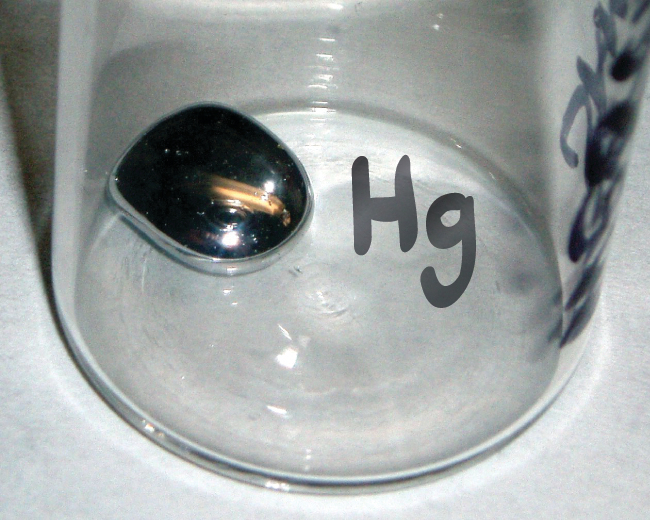

## 2.3 Bygging atóma og táknmál

:::learning-objectives

Í lok þessa kafla munt þú geta:

-   Skrifað og túlkað tákn sem sýna sætistölu, massatölu og hleðslu atóms eða jónar
-   Skilgreint atómmassaeiningu og meðalatómmassa
-   Reiknað út meðalatómmassa og hlutfallslegt magn samsæta

:::

Þróun nútíma atómkenningar leiddi margt í ljós um innri byggingu atóma. Í ljós kom að atóm inniheldur mjög lítinn kjarna sem samanstendur af jákvætt hlöðnum róteindum og óhlöðnum nifteindum, umkringdan mun stærra rúmmáli sem inniheldur neikvætt hlaðnar rafeindir. Kjarninn inniheldur meirihluta massa atómsins vegna þess að róteindir og nifteindir eru mun þyngri en rafeindir, en rafeindir taka nánast allt rúmmál atómsins. Þvermál atóms er í stærðargráðunni 10^−10^ m, en þvermál kjarnans er um það bil 10^−15^ m --- um 100.000 sinnum minna. Til að fá hugmynd um hlutfallslega stærð þeirra má íhuga þetta: Ef kjarninn væri á stærð við bláber, væri atómið á stærð við fótboltaleikvang ([mynd 2.11](#CNX_Chem_02_03_AtomSize)).

Mynd 2.11 Ef hægt væri að stækka atóm upp í stærð fótboltaleikvangs væri kjarninn á stærð við eitt bláber. (heimild miðja: breyting á verki eftir „babyknight"/Wikimedia Commons; heimild hægri: breyting á verki eftir Paxson Woelber)

Atóm --- og róteindirnar, nifteindirnar og rafeindirnar sem þau samanstanda af --- eru afar smá. Til dæmis vegur kolefnisatóm minna en 2 $\times$ 10^−23^ g og rafeind hefur hleðslu sem er minni en 2 $\times$ 10^−19^ C (kúlomb). Þegar eiginleikum smárra hluta eins og atóma er lýst notum við viðeigandi litlar mælieiningar, svo sem sameinaða atómmassaeiningu (u) og grunneiningu hleðslu (e). Sameinaða atómmassaeiningin er skilgreind sem nákvæmlega 1/12 af massa eins atóms af kolefni-12 samsætunni (nánar um samsætur síðar í þessum kafla) og jafngildir 1,6605 $\times$ 10^−24^ g. Dalton (Da) er önnur massaeining sem jafngildir u. Margar heimildir, þar á meðal þessi texti, nota eldra hugtakið atómmassaeining (amu) þegar vísað er til u eða Da. Grunneining hleðslu (einnig kölluð frumhleðsla) jafngildir stærð hleðslu rafeindar (e) þar sem e = 1,602 $\times$ 10^−19^ C.

Róteind hefur massa upp á 1,0073 amu og hleðslu 1+. Nifteind er örlítið þyngri eind með massa 1,0087 amu og hleðslu núll; eins og nafnið gefur til kynna er hún hlutlaus. Rafeindin hefur hleðslu 1− og er mun léttari eind með massa um 0,00055 amu (það þyrfti um 1800 rafeindir til að jafna massa einnar róteindar). Eiginleikar þessara grundvallareinda eru teknir saman í [töflu 2.2](#fs-idp90857696). (Glöggur nemandi gæti tekið eftir því að summa öreinda atóms jafngildir ekki raunverulegum massa atómsins: Heildarmassi sex róteinda, sex nifteinda og sex rafeinda er 12,0993 amu, örlítið meira en 12,00 amu. Þessi „týndi" massi er þekktur sem massagalli og þú munt læra um hann í kaflanum um kjarnaefnafræði.)

Eiginleikar öreinda

| Heiti | Staðsetning | Hleðsla (C) | Einingahleðsla | Massi (amu) | Massi (g) |
|---|---|---|---|---|---|
| Rafeind | utan kjarna | −1.602 $\times$ 10^−19^ | 1− | 0,00055 | 0,00091 $\times$ 10^−24^ |
| róteind | kjarni | −1.602 $\times$`<!-- -->`{=html}10^−19^ | 1+ | 1,00727 | 1.67262 $\times$ 10^−24^ |
| nifteind | kjarni | 0 | 0 | 1,00866 | 1,67493 $\times$ 10^−24^ |

Tafla 2.2

Fjöldi róteinda í kjarna atóms er sætistala þess (Z). Þessi eiginleiki skilgreinir frumefnið: Gildi þess segir okkur hvaða frumefni þetta er. Til dæmis er hvert atóm sem inniheldur sex róteindir frumefnið kolefni og hefur sætistöluna 6, óháð því hversu margar nifteindir eða rafeindir það kann að hafa. Óhlaðið atóm verður að innihalda jafnmargar jákvæðar og neikvæðar hleðslur, þannig að fjöldi róteinda jafngildir fjölda rafeinda. Þess vegna gefur sætistalan einnig til kynna fjölda rafeinda í atómi. Heildarfjöldi róteinda og nifteinda í atómi er kallaður massatala þess (A). Fjöldi nifteinda er því mismunurinn á massatölu og sætistölu: A -- Z = fjöldi nifteinda.

$$
\text{sætistala (Z)} = \text{fjöldi róteinda} \quad\quad \text{massatala (A)} = \text{fjöldi róteinda} + \text{fjöldi nifteinda}
$$

Atóm eru rafhlutlaus (óhlaðin) ef þau innihalda jafnmargar jákvætt hlaðnar róteindir og neikvætt hlaðnar rafeindir. Þegar fjöldi þessara öreinda er *ekki* jafn hefur atómið rafhleðslu (er hlaðið) og kallast jón. Hleðsla atóms er skilgreind sem hér segir:

Hleðsla atóms = fjöldi róteinda − fjöldi rafeinda

Eins og fjallað verður nánar um síðar í þessum kafla fá atóm (og sameindir) venjulega hleðslu með því að fá eða missa rafeindir. Atóm sem fær eina eða fleiri rafeindir mun sýna neikvæða hleðslu og kallast anjón. Jákvætt hlaðin atóm sem kallast katjónir myndast þegar atóm missir eina eða fleiri rafeindir. Til dæmis hefur hlutlaust natríumatóm (Z = 11) 11 rafeindir. Ef þetta atóm missir eina rafeind verður það að katjón með 1+ hleðslu (11 − 10 = 1+). Hlutlaust súrefnisatóm (Z = 8) hefur átta rafeindir og ef það fær tvær rafeindir verður það að anjón með 2− hleðslu (8 − 10 = 2−).

:::example
### Dæmi 2.3: Samsetning atóms

Joð er nauðsynlegt snefilefni í fæðunni okkar; það er nauðsynlegt til að framleiða skjaldkirtilshormón. Of lítið joð í fæðunni getur leitt til skjaldkirtilsauka, þ.e. skjaldkirtillinn stækkar ([mynd 2.12](#CNX_Chem_02_03_Iodine)).

Mynd 2.12 (a) Of lítið joð í fæðunni getur valdið stækkun skjaldkirtilsins sem kallast skjaldkirtilsauki. (b) Örlítil viðbót af joði í salt, sem kemur í veg fyrir myndun skjaldkirtilsauka, hefur hjálpað til við að útrýma þessu vandamáli í Bandaríkjunum þar sem saltneysla er mikil. (heimild a: breyting á verki eftir „Almazi"/Wikimedia Commons; heimild b: breyting á verki eftir Mike Mozart)

Með því að bæta við örlitlu joði í matarsalt (joðbætt salt) hefur þessu heilbrigðisvandamáli í Bandaríkjunum í raun verið útrýmt, en allt að 40% jarðarbúa eru enn í hættu á joðskorti. Joðatómum er bætt við sem anjónum og hver þeirra hefur 1− hleðslu og massatöluna 127. Ákvarðaðu fjölda róteinda, nifteinda og rafeinda í einni af þessum joðanjónum.

**Lausn**

Sætistala joðs (53) segir okkur að hlutlaust joðatóm inniheldur 53 róteindir í kjarna sínum og 53 rafeindir utan kjarnans. Þar sem summa fjölda róteinda og nifteinda er jöfn massatölunni, 127, er fjöldi nifteinda 74 (127 − 53 = 74). Þar sem joðinu er bætt við sem 1− anjón er fjöldi rafeinda 54 \[53 -- (1--) = 54\].

:::

:::practice-problem
**Kannaðu þekkingu þína**

Jón platínu hefur massatöluna 195 og inniheldur 74 rafeindir. Hversu margar róteindir og nifteindir inniheldur hún og hver er hleðsla hennar?

:::answer
78 róteindir; 117 nifteindir; hleðslan er 4+

:::

### Efnatákn

Efnatákn er skammstöfun sem við notum til að tákna frumefni eða atóm frumefnis. Til dæmis er táknið fyrir kvikasilfur Hg ([mynd 2.13](#CNX_Chem_02_03_SiSymbol)). Við notum sama tákn til að tákna eitt kvikasilfursatóm (smásætt svið) eða til að merkja ílát með mörgum atómum frumefnisins kvikasilfurs (stórsætt svið).

Mynd 2.13 Táknið Hg táknar frumefnið kvikasilfur óháð magni; það gæti táknað eitt kvikasilfursatóm eða mikið magn af kvikasilfri.

Táknin fyrir nokkur algeng frumefni og atóm þeirra eru sýnd í [töflu 2.3](#fs-idm36686800). Sum tákn eru dregin af almennu heiti frumefnisins; önnur eru skammstafanir á heitinu á öðru tungumáli. Flest tákn hafa einn eða tvo stafi, en þriggja stafa tákn hafa verið notuð til að lýsa sumum frumefnum sem hafa sætistölu hærri en 112. Til að forðast rugling við annan rithátt er aðeins fyrsti stafur táknsins hástafur. Til dæmis er Co táknið fyrir frumefnið kóbalt, en CO er rithátturinn fyrir efnasambandið kolmónoxíð, sem inniheldur atóm frumefnanna kolefnis (C) og súrefnis (O). Öll þekkt frumefni og tákn þeirra eru í lotukerfinu á [mynd 2.26](http://openstax.org/books/chemistry-2e/pages/2-5-the-periodic-table#CNX_Chem_02_05_PerTable1) (einnig að finna í [viðauka A](http://openstax.org/books/chemistry-2e/pages/a-the-periodic-table#fs-idm379479808)).

Nokkur algeng frumefni og tákn þeirra

| Frumefni | Tákn | Frumefni | Tákn |
|---|---|---|---|
| ál | Al | járn | Fe (frá *ferrum*) |
| bróm | Br | blý | Pb (frá *plumbum*) |
| kalsíum | Ca | magnesíum | Mg |
| kolefni | C (frá carbon) | kvikasilfur | Hg (frá *hydrargyrum*) |
| klór | Cl | nitur | N |
| króm | Cr | súrefni | O (frá oxygen) |
| kóbalt | Co | kalíum | K |
| kopar | Cu (frá *cuprum*) | kísill | Si (frá silicon) |
| flúor | F | silfur | Ag (frá *argentum*) |
| gull | Au (frá *aurum*) | natríum | Na |
| helíum | He | brennisteinn | S (frá sulfur) |
| vetni | H (frá hydrogen) | tin | Sn (frá *stannum*) |
| joð | I (frá iodine) | sink | Zn |

Tafla 2.3

Hefð er fyrir því að þau sem uppgötva nýtt frumefni gefi því nafn. Hins vegar er nafn nýja frumefnisins til bráðabirgða byggt á latneska orðinu/orðunum fyrir sætistölu þess, þar til formlegt nafn hefur verið viðurkennt af Alþjóðasambandi um hreina og hagnýta efnafræði (IUPAC). Til dæmis var frumefni 106 kallað unnilhexíum (Unh), frumefni 107 var kallað unnilseptíum (Uns) og frumefni 108 var kallað unniloktíum (Uno) í nokkur ár. Þessi frumefni eru nú nefnd eftir vísindamönnum (eða stundum stöðum); til dæmis er frumefni 106 nú þekkt sem *seaborgíum* (Sg) til heiðurs Glenn Seaborg, Nóbelsverðlaunahafa sem kom að uppgötvun nokkurra þungra frumefna. Frumefni 109 var nefnt til heiðurs Lise Meitner, sem uppgötvaði kjarnaklofnun, fyrirbæri sem átti eftir að breyta heiminum; Meitner lagði einnig sitt af mörkum til uppgötvunar nokkurra mikilvægra samsæta, sem fjallað er um hér á eftir.

:::

:::link-to-material

Farðu á þessa [síðu](http://openstax.org/l/16IUPAC) til að læra meira um IUPAC, Alþjóðasamband um hreina og hagnýta efnafræði, og skoðaðu lotukerfi þess.

:::

### Samsætur

Táknið fyrir tiltekna samsætu hvers frumefnis er skrifað með því að setja massatöluna sem háskrift vinstra megin við frumefnistáknið ([mynd 2.14](#CNX_Chem_02_03_AtomSym)). Sætistalan er stundum skrifuð sem lágskrift á undan tákninu, en þar sem þessi tala skilgreinir auðkenni frumefnisins, eins og tákn þess gerir, er henni oft sleppt. Til dæmis er magnesíum til sem efnablanda þriggja samsæta, hver með sætistöluna 12 og með massatölurnar 24, 25 og 26, í sömu röð. Þessar samsætur má auðkenna sem ^24^Mg, ^25^Mg og ^26^Mg. Þessi samsætutákn eru lesin sem „frumefni, massatala" og hægt er að tákna þau í samræmi við þennan lestur. Til dæmis er ^24^Mg lesið sem „magnesíum 24" og hægt er að skrifa það sem „magnesíum-24" eða „Mg-24". ^25^Mg er lesið sem „magnesíum 25" og hægt er að skrifa það sem „magnesíum-25" eða „Mg-25". Öll magnesíum atóm hafa 12 róteindir í kjarna sínum. Eini munurinn á þeim er að ^24^Mg atóm hefur 12 nifteindir í kjarna sínum, ^25^Mg atóm hefur 13 nifteindir og ^26^Mg hefur 14 nifteindir.

Mynd 2.14 Táknið fyrir atóm gefur til kynna frumefnið með venjulegu tveggja stafa tákni þess, massatöluna sem vinstri háskrift, sætistöluna sem vinstri lágskrift (stundum sleppt) og hleðsluna sem hægri háskrift.

Upplýsingar um náttúrulegar samsætur frumefna með sætistölur 1 til 10 eru gefnar í [töflu 2.4](#fs-idm87646592). Athugið að auk staðlaðra nafna og tákna er oft vísað til samsæta vetnis með algengum nöfnum og tilheyrandi táknum. Vetni-2, táknað ^2^H, er einnig kallað tvívetni (deuterium) og stundum táknað D. Vetni-3, táknað ^3^H, er einnig kallað þrívetni (tritium) og stundum táknað T.

Samsetning kjarna atóma mjög léttra frumefna

| Frumefni | Tákn | Sætistala | Fjöldi róteinda | Fjöldi nifteinda | Massi (amu) | \% í náttúrunni |
|---|---|---|---|---|---|---|
| vetni | $_{1}^{1}\text{H}$\ (einvetni/prótíum) | 1 | 1 | 0 | 1,0078 | 99,989 |
|  | $_{1}^{2}\text{H}$\ (tvívetni) | 1 | 1 | 1 | 2,0141 | 0,0115 |
|  | $_{1}^{3}\text{H}$\ (þrívetni) | 1 | 1 | 2 | 3,01605 | --- (snefilmagn) |
| helíum | $_{2}^{3}\text{He}$ | 2 | 2 | 1 | 3,01603 | 0,00013 |
|  | $_{2}^{4}\text{He}$ | 2 | 2 | 2 | 4,0026 | 100 |
| litíum | $_{3}^{6}\text{Li}$ | 3 | 3 | 3 | 6,0151 | 7,59 |
|  | $_{3}^{7}\text{Li}$ | 3 | 3 | 4 | 7,0160 | 92,41 |
| beryllíum | $_{4}^{9}\text{Be}$ | 4 | 4 | 5 | 9,0122 | 100 |
| bór | $_{\;\, 5}^{10}\text{B}$ | 5 | 5 | 5 | 10,0129 | 19,9 |
|  | $_{\;\, 5}^{11}\text{B}$ | 5 | 5 | 6 | 11,0093 | 80,1 |
| kolefni | $_{\;\, 6}^{12}\text{C}$ | 6 | 6 | 6 | 12,0000 | 98,89 |
|  | $_{\;\, 6}^{13}\text{C}$ | 6 | 6 | 7 | 13,0034 | 1,11 |
|  | $_{\;\, 6}^{14}\text{C}$ | 6 | 6 | 8 | 14,0032 | --- (snefilmagn) |
| nitur | $_{\;\, 7}^{14}\text{N}$ | 7 | 7 | 7 | 14,0031 | 99,63 |
|  | $_{\;\, 7}^{15}\text{N}$ | 7 | 7 | 8 | 15,0001 | 0,37 |
| súrefni | $_{\;\, 8}^{16}\text{O}$ | 8 | 8 | 8 | 15,9949 | 99,757 |
|  | $_{\;\, 8}^{17}\text{O}$ | 8 | 8 | 9 | 16,9991 | 0,038 |
|  | $_{\;\, 8}^{18}\text{O}$ | 8 | 8 | 10 | 17,9992 | 0,205 |
| flúor | $_{\;\, 9}^{19}\text{F}$ | 9 | 9 | 10 | 18,9984 | 100 |
| neon | $_{10}^{20}\text{Ne}$ | 10 | 10 | 10 | 19,9924 | 90,48 |
|  | $_{10}^{21}\text{Ne}$ | 10 | 10 | 11 | 20,9938 | 0,27 |
|  | $_{10}^{22}\text{Ne}$ | 10 | 10 | 12 | 21,9914 | 9,25 |

Tafla 2.4

:::link-to-material

Notaðu þennan [hermi](http://openstax.org/l/16PhetAtomBld) til að smíða atóm fyrstu 10 frumefnanna, sjáðu hvaða samsætur eru til, athugaðu stöðugleika kjarna og öðlastu reynslu af samsætutáknum.

:::

### Atómmassi

Vegna þess að hver róteind og hver nifteind leggja um það bil eitt amu til massa atóms, og hver rafeind leggur mun minna til, er atómmassi eins atóms um það bil jafn massatölu þess (heil tala). Hins vegar eru meðalmassar atóma flestra frumefna ekki heilar tölur vegna þess að flest frumefni eru náttúrulega til sem efnablöndur tveggja eða fleiri samsæta.

Massi frumefnis sem sýndur er í lotukerfi eða skráður í töflu yfir atómmassa er vegið meðaltal massa allra samsæta sem eru til staðar í náttúrulegu sýni af því frumefni. Þetta er jafnt summu massa hverrar einstakrar samsætu margfaldað með hlutfallslegri gnægð hennar.

$\text{average mass} = \sum_{i}^{}\left( \text{fractional abundance}\  \times \ \text{isotopic mass} \right)_{i}$

Til dæmis er frumefnið bór samsett úr tveimur samsætum: Um 19,9% allra bóratóma eru ^10^B með massann 10,0129 amu og hin 80,1% eru ^11^B með massann 11,0093 amu. Meðalatómmassi bórs er reiknaður út sem:

$$
\text{meðalmassi bórs} = (0{,}199 \times 10{,}0129\text{ amu}) + (0{,}801 \times 11{,}0093\text{ amu}) = 10{,}81\text{ amu}
$$

Það er mikilvægt að skilja að ekkert eitt bóratóm vegur nákvæmlega 10,8 amu; 10,8 amu er meðalmassi allra bóratóma og einstök bóratóm vega annaðhvort um það bil 10 amu eða 11 amu.

:::example
### Dæmi 2.4: Útreikningur á meðalatómmassa

Loftsteinn sem fannst í miðri Indiana inniheldur snefil af eðalgasinu neon sem hann tók upp úr sólvindinum á ferð sinni um sólkerfið. Greining á sýni af gasinu sýndi að það samanstóð af 91,84% ^20^Ne (massi 19,9924 amu), 0,47% ^21^Ne (massi 20,9940 amu) og 7,69% ^22^Ne (massi 21,9914 amu). Hver er meðalmassi neonsins í sólvindinum?

**Lausn**

$$
\begin{aligned}
\text{meðalmassi} &= (0{,}9184 \times 19{,}9924\text{ amu}) + (0{,}0047 \times 20{,}9940\text{ amu}) + (0{,}0769 \times 21{,}9914\text{ amu}) \\
&= 18{,}36\text{ amu} + 0{,}099\text{ amu} + 1{,}69\text{ amu} \\
&= 20{,}15\text{ amu}
\end{aligned}
$$

Meðalmassi neonatóms í sólvindinum er 20,15 amu. (Meðalmassi neonatóms á jörðu niðri er 20.1796 amu. Þessi niðurstaða sýnir að við gætum fundið smávægilegan mun á náttúrulegri gnægð samsæta, allt eftir uppruna þeirra.)

:::

:::practice-problem
**Kannaðu þekkingu þína**

Sýni af magnesíum inniheldur 78,70% af ^24^Mg atómum (massi 23,98 amu), 10,13% af ^25^Mg atómum (massi 24,99 amu) og 11,17% af ^26^Mg atómum (massi 25,98 amu). Reiknaðu meðalmassa Mg atóms.

:::answer
24,31 amu

Við getum líka gert afbrigði af þessari tegund útreikninga, eins og sýnt er í næsta dæmi.

:::

:::

:::example
### Dæmi 2.5: Útreikningur á hlutfallslegri gnægð

Klór sem finnst í náttúrunni samanstendur af ^35^Cl (massi 34,96885 amu) og ^37^Cl (massi 36,96590 amu), með meðalmassa 35,453 amu. Hver er prósentusamsetning Cl með tilliti til þessara tveggja samsæta?

**Lausn**

Meðalmassi klórs er sá hluti sem er ^35^Cl sinnum massi ^35^Cl ásamt þeim hluta sem er ^37^Cl sinnum massi ^37^Cl.

$\text{average mass} = \left( \text{fraction of}\ ^{35}\text{Cl}\  \times \ \text{mass of}\ ^{35}\text{Cl} \right) + \left( \text{fraction of}\ ^{37}\text{Cl}\  \times \ \text{mass of}\ ^{37}\text{Cl} \right)$

Ef við látum *x* tákna hlutann sem er ^35^Cl, þá er hlutinn sem er ^37^Cl táknaður með 1,00 − *x*.

(Hlutinn sem er ^35^Cl + hlutinn sem er ^37^Cl verða að vera samtals 1, þannig að hlutinn ^37^Cl verður að vera jafn og 1,00 − hlutinn ^35^Cl.)

Ef við setjum þetta inn í jöfnuna fyrir meðalmassa fáum við:

$$
35{,}45\text{ amu} = (x \times 34{,}97\text{ amu}) + ((1 - x) \times 36{,}97\text{ amu})
$$

Lausnin gefur: *x* = 0,7576, sem þýðir að 1,00 − 0,7576 = 0,2424. Klór samanstendur því af 75,76% ^35^Cl og 24,24% ^37^Cl.

:::

:::practice-problem
**Kannaðu þekkingu þína**

Kopar sem finnst í náttúrunni samanstendur af ^63^Cu (massi 62,9296 amu) og ^65^Cu (massi 64,9278 amu), með meðalmassa 63,546 amu. Hver er prósentusamsetning Cu með tilliti til þessara tveggja samsæta?

:::answer
69,15% Cu-63 og 30,85% Cu-65

:::

 

:::

:::link-to-material

Farðu á þessa [síðu](http://openstax.org/l/16PhetAtomMass) til að búa til efnablöndur af helstu samsætum fyrstu 18 frumefnanna, öðlast reynslu af meðalatómmassa og kanna náttúruleg samsætuhlutföll með því að nota herminn Isotopes and Atomic Mass.

:::

Eins og þú munt læra eru samsætur mikilvægar í náttúrunni og sérstaklega í skilningi mannsins á vísindum og læknisfræði. Lítum aðeins á eina náttúrulega, stöðuga samsætu: Súrefni-18, sem er nefnd í töflunni hér að ofan og er kölluð ein af umhverfissamsætunum. Hún er mikilvæg í forloftslagsfræði, til dæmis, vegna þess að vísindamenn geta notað hlutfallið milli súrefnis-18 og súrefnis-16 í ískjarna til að ákvarða hitastig úrkomu yfir tíma. Súrefni-18 var einnig mikilvægt við uppgötvun efnaskiptaferla og hvarfganga ensíma. Mildred Cohn var frumkvöðull í notkun þessara samsæta sem snefilefna, svo að rannsakendur gætu fylgst með ferli þeirra í gegnum efnahvörf og öðlast betri skilning á því sem er að gerast. Ein af fyrstu uppgötvunum hennar veitti innsýn í fosfórun glúkósa sem á sér stað í hvatberum. Og aðferðirnar við að nota samsætur fyrir þessar rannsóknir lögðu grunn að heilum fræðasviðum.

Hægt er að ákvarða tilvist og náttúrulega gnægð samsæta með tilraunum með því að nota tæki sem kallast massagreinir. Massagreining (MS) er mikið notuð í efnafræði, réttarvísindum, læknisfræði, umhverfisvísindum og mörgum öðrum sviðum til að greina og hjálpa til við að bera kennsl á efnin í sýni. Í dæmigerðum massagreini ([mynd 2.15](#CNX_Chem_02_03_MassSpec)) er sýnið látið gufa upp og verða fyrir háorku rafeindageisla sem veldur því að atóm (eða sameindir) sýnisins verða rafhlaðin, venjulega með því að missa eina eða fleiri rafeindir. Þessar katjónir fara síðan í gegnum (breytilegt) raf- eða segulsvið sem beygir braut hverrar katjónar að því marki sem er háð bæði massa hennar og hleðslu (svipað og braut stórrar stálkúlu sem veltur framhjá segli beygist í minna mæli en braut lítillar stálkúlu). Jónirnar eru greindar og gert er línurit yfir hlutfallslegan fjölda jóna sem myndast á móti massa-hleðsluhlutfalli þeirra (*massaróf*). Hæð hvers lóðrétts þáttar eða topps í massarófi er í réttu hlutfalli við brot katjóna með tilgreint massa-hleðsluhlutfall. Frá fyrstu notkun þess við þróun nútíma atómkenningar hefur massagreining þróast í að verða öflugt tæki til efnagreiningar í fjölmörgum notkunartilvikum.

![The left diagram shows how a mass spectrometer works, which is primarily a large tube that bends downward at its midpoint. The sample enters on the left side of the tube. A heater heats the sample, causing it to vaporize. The sample is also hit with a beam of electrons as it is being vaporized. Charged particles from the sample, called ions, are then accelerated and pass between two magnets. The magnetic field deflects the lightest ions most. The deflection of the ions is measured by a detector located on the right side of the tube. The graph to the right of the spectrometer shows a mass spectrum of zirconium. The relative abundance, as a percentage from 0 to 100, is graphed on the y axis, and the mass to charge ratio is graphed on the x axis. The sample contains five different isomers of zirconium. Z R 90, which has a mass to charge ratio of 90, is the most abundant isotope at about 51 percent relative abundance. Z R 91 has a mass to charge ratio of 91 and a relative abundance of about 11 percent. Z R 92 has a mass to charge ratio of 92 and a relative abundance of about 18 percent. Z R 94 has a mass to charge ratio of 94 and a relative abundance of about 18 percent. Z R 96, which has a mass to charge ratio of 96, is the least abundant zirconium isotope with a relative abundance of about 2 percent.](./images/media/rId86.jpg)

Mynd 2.15 Greining á sirkoni í massagreini býr til massaróf með toppum sem sýna mismunandi samsætur Zr.

:::link-to-material

Sjáðu [hreyfimynd](http://openstax.org/l/16MassSpec) sem útskýrir massagreiningu. Horfðu á þetta [myndband](http://openstax.org/l/16RSChemistry) frá Royal Society for Chemistry til að fá stutta lýsingu á grundvallaratriðum massagreiningar.

:::
