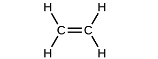
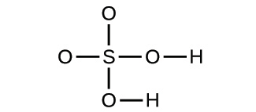
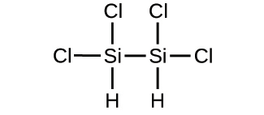
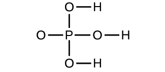

## Æfingar

### 2.1 Fyrstu hugmyndir atómkenningarinnar

[1](http://openstax.org/books/chemistry-2e/pages/chapter-2#fs-idp69222896-solution).

Á eftirfarandi teikningu tákna grænu kúlurnar atóm ákveðins frumefnis. Fjólubláu kúlurnar tákna atóm af öðru frumefni. Ef kúlur af mismunandi frumefnum snertast eru þær hluti af einni einingu efnasambands. Efnahvarfið sem sýnt er með þessum kúlum gæti brotið í bága við eina af hugmyndum atómkenningar Daltons. Hverja?

2\.

Hvaða fullyrðing í kenningu Daltons er í samræmi við eftirfarandi athugun varðandi þyngd hvarfefna og myndefna? Þegar 100 grömm af föstu kalsíumkarbónati eru hituð myndast 44 grömm af koldíoxíði og 56 grömm af kalsíumoxíði.

[3](http://openstax.org/books/chemistry-2e/pages/chapter-2#fs-idm83132240-solution).

Tilgreindu hvaða fullyrðingu í kenningu Daltons er brotin með eftirfarandi athugunum: 59,95% af einu sýni af títandíoxíði er títan; 60,10% af öðru sýni af títandíoxíði er títan.

4\.

Sýni af efnasamböndunum X, Y og Z eru greind og niðurstöðurnar eru sýndar hér.

| Efnasamband | Lýsing | Massi kolefnis | Massi vetnis |
|---|---|---|---|
| X | glær, litlaus vökvi með sterkri lykt | 1,776 g | 0,148 g |
| Y | glær, litlaus vökvi með sterkri lykt | 1,974 g | 0,329 g |
| Z | glær, litlaus vökvi með sterkri lykt | 7,812 g | 0,651 g |

Eru þessi gögn dæmi um lögmálið um föst hlutföll, lögmálið um margföld hlutföll, hvorugt eða bæði? Hvað segja þessi gögn þér um efnasamböndin X, Y og Z?

### 2.2 Þróun atómkenningarinnar

[5](http://openstax.org/books/chemistry-2e/pages/chapter-2#fs-idp107697296-solution).

Tilvist samsæta brýtur í bága við eina af upprunalegu hugmyndum atómkenningar Daltons. Hverja?

6\.

Hvað er líkt með rafeindum og róteindum? Hvað er ólíkt?

[7](http://openstax.org/books/chemistry-2e/pages/chapter-2#fs-idm21866144-solution).

Hvað er líkt með róteindum og nifteindum? Hvað er ólíkt?

8\.

Sjáðu fyrir og prófaðu hegðun alfaeinda sem skotið er á atóm samkvæmt plómubúðingslíkaninu.

\(a\) Spáðu fyrir um feril alfaeinda sem skotið er á atóm með plómubúðingslíkani Thomsons. Útskýrðu hvers vegna þú býst við að alfaeindirnar fari þennan feril.

\(b\) Ef alfaeindum með meiri orku en í (a) er skotið á plómubúðingsatóm, spáðu fyrir um hvernig ferill þeirra mun vera frábrugðinn ferli alfaeinda með minni orku. Útskýrðu rökstuðning þinn.

\(c\) Prófaðu nú spár þínar úr (a) og (b). Opnaðu [Rutherford-dreifingarherminn](http://openstax.org/l/16PhetScatter) og veldu flipann „Plum Pudding Atom". Stilltu „Alpha Particles Energy" á „min" og veldu „show traces". Smelltu á byssuna til að byrja að skjóta alfaeindum. Passar þetta við spá þína úr (a)? Ef ekki, útskýrðu hvers vegna raunverulegur ferill væri sá sem sýndur er í herminum. Ýttu á pásuhnappinn eða „Reset All". Stilltu „Alpha Particles Energy" á „max" og byrjaðu að skjóta alfaeindum. Stemmir þetta við spá þína úr (b)? Ef ekki, útskýrðu áhrif aukinnar orku á raunverulegan feril eins og sýnt er í herminum.

[9](http://openstax.org/books/chemistry-2e/pages/chapter-2#fs-idm61727056-solution).

Sjáðu fyrir og prófaðu hegðun alfaeinda sem skotið er á atóm samkvæmt atómlíkani Rutherfords.

\(a\) Spáðu fyrir um feril alfaeinda sem skotið er á atóm með atómlíkani Rutherfords. Útskýrðu hvers vegna þú býst við að alfaeindirnar fari þennan feril.

\(b\) Ef alfaeindum með meiri orku en í (a) er skotið á Rutherford-atóm, spáðu fyrir um hvernig ferill þeirra mun vera frábrugðinn ferli alfaeinda með minni orku. Útskýrðu rökstuðning þinn.

\(c\) Spáðu fyrir um hvernig ferill alfaeindanna mun breytast ef þeim er skotið á Rutherford-atóm annarra frumefna en gulls. Hvaða þáttur telur þú að valdi þessum mun á ferli og hvers vegna?

\(d\) Prófaðu nú spár þínar úr (a), (b) og (c). Opnaðu [Rutherford-dreifingarherminn](http://openstax.org/l/16PhetScatter) og veldu flipann „Rutherford Atom". Vegna stærðar hermisins er best að byrja með lítinn kjarna, svo veldu „20" fyrir bæði róteindir og nifteindir, „min" fyrir orku, veldu „show traces" og byrjaðu svo að skjóta alfaeindum. Passar þetta við spá þína úr (a)? Ef ekki, útskýrðu hvers vegna raunverulegur ferill væri sá sem sýndur er í herminum. Gerðu hlé eða endurstilltu, stilltu orku á „max" og byrjaðu að skjóta alfaeindum. Stemmir þetta við spá þína úr (b)? Ef ekki, útskýrðu áhrif aukinnar orku á raunverulegan feril eins og sýnt er í herminum. Gerðu hlé eða endurstilltu, veldu „40" fyrir bæði róteindir og nifteindir, „min" fyrir orku, veldu „show traces" og skjóttu. Stemmir þetta við spá þína úr (c)? Ef ekki, útskýrðu hvers vegna raunverulegur ferill væri sá sem sýndur er í herminum. Endurtaktu þetta með hærri fjölda róteinda og nifteinda. Hvaða alhæfingu getur þú gert varðandi gerð atóms og áhrif á feril alfaeinda? Vertu skýr og nákvæmur.

### 2.3 Bygging atóma og táknmál

10

Á hvaða hátt eru samsætur tiltekins frumefnis alltaf ólíkar? Á hvaða hátt/hætti eru þær alltaf eins?

[11](http://openstax.org/books/chemistry-2e/pages/chapter-2#fs-idm174365776-solution).

Skrifaðu tákn fyrir hverja eftirfarandi jóna:

\(a\) jón með 1+ hleðslu, sætistölu 55 og massatölu 133

\(b\) jón með 54 rafeindir, 53 róteindir og 74 nifteindir

\(c\) jón með sætistölu 15, massatölu 31 og 3− hleðslu

\(d\) jón með 24 rafeindir, 30 nifteindir og 3+ hleðslu

12\.

Skrifaðu tákn fyrir hverja eftirfarandi jóna:

\(a\) jón með 3+ hleðslu, 28 rafeindir og massatölu 71

\(b\) jón með 36 rafeindir, 35 róteindir og 45 nifteindir

\(c\) jón með 86 rafeindir, 142 nifteindir og 4+ hleðslu

\(d\) jón með 2+ hleðslu, sætistölu 38 og massatölu 87

[13](http://openstax.org/books/chemistry-2e/pages/chapter-2#fs-idm164758784-solution).

Opnaðu herminn [„Byggðu atóm"](http://openstax.org/l/16PhetAtomBld) og smelltu á atóm-táknið.

\(a\) Veldu eitt af fyrstu 10 frumefnunum sem þú vilt byggja og tilgreindu tákn þess.

\(b\) Dragðu róteindir, nifteindir og rafeindir yfir á atómsniðmátið til að búa til atóm af frumefninu þínu.\
Tilgreindu fjölda róteinda, nifteinda og rafeinda í atóminu þínu, ásamt heildarhleðslu og massatölu.

\(c\) Smelltu á „Heildarhleðsla" og „Massatala", athugaðu svörin þín við (b) og leiðréttu ef þörf krefur.

\(d\) Spáðu fyrir um hvort atómið þitt verði stöðugt eða óstöðugt. Rökstyddu svarið.

\(e\) Hakaðu í reitinn „Stöðugt/óstöðugt". Var svar þitt við (d) rétt? Ef ekki, spáðu fyrst fyrir um hvað þú getur gert til að búa til stöðugt atóm af frumefninu þínu, gerðu það síðan og athugaðu hvort það virkar. Útskýrðu rökstuðning þinn.

14\.

Opnaðu herminn [„Byggðu atóm"](http://openstax.org/l/16PhetAtomBld).

\(a\) Dragðu róteindir, nifteindir og rafeindir yfir á atómsniðmátið til að búa til hlutlaust atóm af súrefni-16 og gefðu upp samsætutákn fyrir þetta atóm.

\(b\) Bættu nú við tveimur rafeindum í viðbót til að búa til jón og gefðu upp tákn fyrir jónina sem þú hefur búið til.

[15](http://openstax.org/books/chemistry-2e/pages/chapter-2#fs-idm103886288-solution).

Opnaðu herminn [„Byggðu atóm"](http://openstax.org/l/16PhetAtomBld).

\(a\) Dragðu róteindir, nifteindir og rafeindir yfir á atómsniðmátið til að búa til hlutlaust atóm af litíum-6 og gefðu upp samsætutákn fyrir þetta atóm.

\(b\) Fjarlægðu nú eina rafeind til að búa til jón og gefðu upp tákn fyrir jónina sem þú hefur búið til.

16\.

Ákvarðaðu fjölda róteinda, nifteinda og rafeinda í eftirfarandi samsætum sem eru notaðar við sjúkdómsgreiningar:

\(a\) sætistala 9, massatala 18, hleðsla 1−

\(b\) sætistala 43, massatala 99, hleðsla 7+

\(c\) sætistala 53, atómmassatala 131, hleðsla 1−

\(d\) sætistala 81, atómmassatala 201, hleðsla 1+

\(e\) Nefndu frumefnin í liðum (a), (b), (c) og (d).

[17](http://openstax.org/books/chemistry-2e/pages/chapter-2#fs-idm187202528-solution).

Eftirfarandi eru eiginleikar samsæta tveggja frumefna sem eru nauðsynleg í mataræði okkar. Ákvarðaðu fjölda róteinda, nifteinda og rafeinda í hvorri og nefndu þær.

\(a\) sætistala 26, massatala 58, hleðsla 2+

\(b\) sætistala 53, massatala 127, hleðsla 1−

18\.

Gefðu upp fjölda róteinda, rafeinda og nifteinda í hlutlausum atómum hverrar eftirfarandi samsætu:

\(a\) $_{\;\, 5}^{10}\text{B}$

\(b\) $_{\;\, 80}^{199}\text{Hg}$

\(c\) $_{29}^{63}\text{Cu}$

\(d\) $_{\;\, 6}^{13}\text{C}$

\(e\) $_{34}^{77}\text{Se}$

[19](http://openstax.org/books/chemistry-2e/pages/chapter-2#fs-idm80933584-solution).

Gefðu upp fjölda róteinda, rafeinda og nifteinda í hlutlausum atómum hverrar eftirfarandi samsætu:

\(a\) $_{3}^{7}\text{Li}$

\(b\) $_{\;\, 52}^{125}\text{Te}$

\(c\) $_{\;\, 47}^{109}\text{Ag}$

\(d\) $_{\;\, 7}^{15}\text{N}$

\(e\) $_{15}^{31}\text{P}$

20\.

Smelltu á [síðuna](http://openstax.org/l/16PhetAtomMass) og veldu flipann „Mix Isotopes", feldu reitina „Percent Composition" og „Average Atomic Mass" og veldu síðan frumefnið bór.

\(a\) Skrifaðu tákn þeirra samsæta bórs sem sýndar eru sem náttúrulegar í marktæku magni.

\(b\) Spáðu fyrir um hlutfallslegt magn (prósentur) þessara bórsamsæta sem finnast í náttúrunni. Útskýrðu rökin á bak við val þitt.

\(c\) Bættu samsætum í svarta kassann til að búa til efnablöndu sem passar við spá þína í (b). Þú getur dregið samsætur úr ílátum þeirra eða smellt á „More" og fært síðan sleðana að viðeigandi magni.

\(d\) Sýndu reitina „Percent Composition" og „Average Atomic Mass". Hversu vel passar efnablandan þín við spá þína? Ef nauðsyn krefur, aðlagaðu magn samsætanna til að passa við spá þína.

\(e\) Veldu „Nature's" efnablöndu af samsætum og berðu hana saman við spá þína. Hversu vel stenst spá þín samanburð við náttúrulega efnablöndu? Útskýrðu. Ef nauðsyn krefur, aðlagaðu magnið þitt til að það passi sem best við magnið í „Nature's".

[21](http://openstax.org/books/chemistry-2e/pages/chapter-2#fs-idm112612912-solution).

Endurtaktu [æfingu 2.20](#fs-idm28786800) með frumefni sem hefur þrjár náttúrulegar samsætur.

22\.

Frumefni hefur eftirfarandi náttúrulega gnægð og samsætumassa: 90,92% gnægð með 19,99 amu, 0,26% gnægð með 20,99 amu og 8,82% gnægð með 21,99 amu. Reiknaðu meðalatómmassa þessa frumefnis.

[23](http://openstax.org/books/chemistry-2e/pages/chapter-2#fs-idp165798448-solution).

Meðalatómmassar sem IUPAC gefur upp eru byggðir á rannsókn á niðurstöðum tilrauna. Bróm hefur tvær samsætur, ^79^Br og ^81^Br, en massar þeirra (78,9183 og 80,9163 amu, í sömu röð) og gnægð (50,69% og 49,31%, í sömu röð) voru ákvarðaðir í fyrri tilraunum. Reiknaðu meðalatómmassa bróms út frá þessum tilraunum.

24\.

Breytingar á meðalatómmassa má sjá hjá frumefnum sem fengin eru úr mismunandi uppsprettum. Litíum er dæmi um þetta. Samsætusamsetning litíums úr náttúrulegum steinefnum er 7,5% ^6^Li og 92,5% ^7^Li, sem hafa massana 6,01512 amu og 7,01600 amu, í sömu röð. Litíum úr verslunaruppsprettu, endurunnið úr hernaðarlegri uppsprettu, var 3,75% ^6^Li (og restin ^7^Li). Reiknaðu meðalatómmassagildi fyrir hvora þessara tveggja uppspretta.

[25](http://openstax.org/books/chemistry-2e/pages/chapter-2#fs-idm95116240-solution).

Meðalatómmassar sumra frumefna geta verið breytilegir, allt eftir uppruna málmgrýtis þeirra. Náttúrulegt bór samanstendur af tveimur samsætum með nákvæmlega þekkta massa (^10^B, 10,0129 amu og ^11^B, 11,00931 amu). Raunverulegur atómmassi bórs getur verið breytilegur frá 10,807 til 10,819, allt eftir því hvort steinefnauppsprettan er frá Tyrklandi eða Bandaríkjunum. Reiknaðu prósentugnægðina sem leiðir til tveggja gilda meðalatómmassa bórs frá þessum tveimur löndum.

26\.

Gnægðarhlutfallið ^18^O:^16^O í sumum loftsteinum er hærra en það sem notað er til að reikna meðalatómmassa súrefnis á jörðinni. Er meðalmassi súrefnisatóms í þessum loftsteinum meiri en, minni en eða jafn og massi súrefnisatóms á jörðinni?

### 2.4 Efnaformúlur

[27](http://openstax.org/books/chemistry-2e/pages/chapter-2#fs-idm188711792-solution).

Útskýrðu hvers vegna táknið fyrir atóm frumefnisins súrefnis og formúlan fyrir sameind súrefnis eru ólík.

28\.

Útskýrðu hvers vegna táknið fyrir frumefnið brennistein og formúlan fyrir sameind brennisteins eru ólík

[29](http://openstax.org/books/chemistry-2e/pages/chapter-2#fs-idm157365408-solution).

Skrifaðu sameindaformúlur og reynsluformúlur eftirfarandi efnasambanda:

\(a\)

\(b\)

\(c\)

\(d\)

30\.

Skrifaðu sameindaformúlur og reynsluformúlur eftirfarandi efnasambanda:

\(a\)

![Figure A shows a structural diagram of four carbon atoms bonded together into a chain. The two carbon atoms on the left form a double bond with each other. All of the remaining carbon atoms form single bonds with each other. The leftmost carbon also forms single bonds with two hydrogen. The second carbon in the chain forms a single bond with a hydrogen atom. The third carbon in the chain forms a single bond with two hydrogen atoms each. The rightmost carbon forms a single bond with three hydrogen atoms each.](./images/media/rId127.jpg)

\(b\)

\(c\)

\(d\)

[31](http://openstax.org/books/chemistry-2e/pages/chapter-2#fs-idm64843712-solution).

Ákvarðaðu reynsluformúlur eftirfarandi efnasambanda:

\(a\) koffín, C~8~H~10~N~4~O~2~

\(b\) súkrósi, C~12~H~22~O~11~

\(c\) vetnisperoxíð, H~2~O~2~

\(d\) glúkósi, C~6~H~12~O~6~

\(e\) askorbínsýra (C-vítamín), C~6~H~8~O~6~

32\.

Ákvarðaðu reynsluformúlur eftirfarandi efnasambanda:

\(a\) ediksýra, C~2~H~4~O~2~

\(b\) sítrónusýra, C~6~H~8~O~7~

\(c\) hýdrasín, N~2~H~4~

\(d\) nikótín, C~10~H~14~N~2~

\(e\) bútan, C~4~H~10~

[33](http://openstax.org/books/chemistry-2e/pages/chapter-2#fs-idp2601824-solution).

Skrifaðu reynsluformúlur eftirfarandi efnasambanda:

\(a\)

\(b\)

![Figure B shows a structural diagram containing a leftmost carbon that forms single bonds to three hydrogen atoms each. This leftmost carbon also forms a single bond to a second carbon atom. The second carbon atom forms a double bond with an oxygen atom. The second carbon also forms a single bond to a second oxygen atom. This oxygen atom forms a single bond to a third carbon atom. This third carbon atom forms single bonds with two hydrogen atoms each as well as a single bond with another carbon atom. The rightmost carbon atom forms a single bond with three hydrogen atoms each.](./images/media/rId155.jpg)

34\.

Opnaðu herminn [„Byggðu sameind"](http://openstax.org/l/16molbuilding) og veldu flipann „Stærri sameindir". Veldu viðeigandi „atómabúnað" til að byggja sameind með tveimur kolefnisatómum og sex vetnisatómum. Dragðu atóm inn á svæðið fyrir ofan „búnaðinn" til að búa til sameind. Nafn birtist þegar þú hefur búið til raunverulega sameind sem er til (jafnvel þótt það sé ekki sú sem þú vilt). Þú getur notað skærin til að aðskilja atóm ef þú vilt breyta tengingunum. Smelltu á „3D" til að sjá sameindina og skoðaðu bæði rúmfyllingar- og kúlu-og-pinna-möguleikana.

\(a\) Teiknaðu byggingarformúlu þessarar sameindar og gefðu upp nafn hennar.

\(b\) Geturðu raðað þessum atómum á einhvern annan hátt til að búa til annað efnasamband?

[35](http://openstax.org/books/chemistry-2e/pages/chapter-2#fs-idm57514192-solution).

Notaðu herminn [„Byggðu sameind"](http://openstax.org/l/16molbuilding) til að endurtaka [æfingu 2.34](#fs-idm75792016), en byggðu sameind með tveimur kolefnisatómum, sex vetnisatómum og einu súrefnisatómi.

\(a\) Teiknaðu byggingarformúlu þessarar sameindar og gefðu upp nafn hennar.

\(b\) Geturðu raðað þessum atómum til að búa til aðra sameind? Ef svo er, teiknaðu byggingarformúlu hennar og gefðu upp nafn hennar.

\(c\) Hvernig eru sameindirnar sem teiknaðar eru í (a) og (b) eins? Hvernig eru þær ólíkar? Hvað kallast þær (tegund sambands milli þessara sameinda, ekki nöfn þeirra)?

36\.

Notaðu herminn [„Byggðu sameind"](http://openstax.org/l/16molbuilding) til að endurtaka [æfingu 2.34](#fs-idm75792016), en byggðu sameind með þremur kolefnisatómum, sjö vetnisatómum og einu klóratómi.

\(a\) Teiknaðu byggingarformúlu þessarar sameindar og gefðu upp nafn hennar.

\(b\) Geturðu raðað þessum atómum til að búa til aðra sameind? Ef svo er, teiknaðu byggingarformúlu hennar og gefðu upp nafn hennar.

\(c\) Hvernig eru sameindirnar sem teiknaðar eru í (a) og (b) eins? Hvernig eru þær ólíkar? Hvað kallast þær (tegund sambands milli þessara sameinda, ekki nöfn þeirra)?

### 2.5 Lotukerfið

[37](http://openstax.org/books/chemistry-2e/pages/chapter-2#fs-idm319896576-solution).

Notaðu lotukerfið til að flokka hvert eftirfarandi frumefna sem málm eða málmleysingja og flokkaðu þau síðan frekar sem aðalflokkafrumefni, hliðarmálm eða innri hliðarmálm:

\(a\) úran

\(b\) bróm

\(c\) strontíum

\(d\) neon

\(e\) gull

\(f\) ameríkín

\(g\) ródín

\(h\) brennisteinn

\(i\) kolefni

\(j\) kalíum

38\.

Notaðu lotukerfið til að flokka hvert eftirfarandi frumefna sem málm eða málmleysingja og flokkaðu þau síðan frekar sem aðalflokkafrumefni, hliðarmálm eða innri hliðarmálm:

\(a\) kóbalt

\(b\) evrópíum

\(c\) joð

\(d\) indíum

\(e\) litíum

\(f\) súrefni

\(g\) kadmíum

\(h\) terbíum

\(i\) reníum

[39](http://openstax.org/books/chemistry-2e/pages/chapter-2#fs-idm419056816-solution).

Notaðu lotukerfið til að finna léttasta frumefnið í hverjum eftirfarandi flokka:

\(a\) eðalgös

\(b\) jarðalkalímálmar

\(c\) alkalímálmar

\(d\) kalkógen

40\.

Notaðu lotukerfið til að finna þyngsta frumefnið í hverjum eftirfarandi flokka:

\(a\) alkalímálmar

\(b\) kalkógen

\(c\) eðalgös

\(d\) jarðalkalímálmar

[41](http://openstax.org/books/chemistry-2e/pages/chapter-2#fs-idm415648752-solution).

Notaðu lotukerfið til að gefa upp nafn og tákn fyrir hvert eftirfarandi frumefna:

\(a\) eðalgasið í sömu lotu og germaníum

\(b\) jarðalkalímálmurinn í sömu lotu og selen

\(c\) halógenið í sömu lotu og litíum

\(d\) kalkógenið í sömu lotu og kadmíum

42\.

Notaðu lotukerfið til að gefa upp nafn og tákn fyrir hvert eftirfarandi frumefna:

\(a\) halógenið í sömu lotu og alkalímálmurinn með 11 róteindir

\(b\) jarðalkalímálmurinn í sömu lotu og hlutlausa eðalgasið með 18 rafeindir

\(c\) eðalgasið í sömu röð og samsæta með 30 nifteindir og 25 róteindir

\(d\) eðalgasið í sömu lotu og gull

[43](http://openstax.org/books/chemistry-2e/pages/chapter-2#fs-idm430165648-solution).

Skrifaðu tákn fyrir hverja eftirfarandi hlutlausra samsæta. Láttu sætistölu og massatölu fylgja með fyrir hverja.

\(a\) alkalímálmurinn með 11 róteindir og massatöluna 23

\(b\) eðalgasfrumefnið með 75 nifteindir í kjarna sínum og 54 rafeindir í hlutlausa atóminu

\(c\) samsætan með 33 róteindir og 40 nifteindir í kjarna sínum

\(d\) jarðalkalímálmurinn með 88 rafeindir og 138 nifteindir

44\.

Skrifaðu tákn fyrir hverja eftirfarandi hlutlausra samsæta. Láttu sætistölu og massatölu fylgja með fyrir hverja.

\(a\) kalkógenið með massatöluna 125

\(b\) halógenið þar sem langlífasta samsætan er geislavirk

\(c\) eðalgasið, notað í lýsingu, með 10 rafeindir og 10 nifteindir

\(d\) léttasti alkalímálmurinn með þrjár nifteindir

### 2.6 Jóna- og sameindaefni

[45](http://openstax.org/books/chemistry-2e/pages/chapter-2#fs-idp298677568-solution).

Notaðu lotukerfið til að spá fyrir um hvort eftirfarandi klóríð eru jónaefni eða sameindaefni: KCl, NCl~3~,ICl, MgCl~2~, PCl~5~ og CCl~4~.

46\.

Notaðu lotukerfið til að spá fyrir um hvort eftirfarandi klóríð eru jónaefni eða sameindaefni: SiCl~4~, PCl~3~, CaCl~2~, CsCl, CuCl~2~ og CrCl~3~.

[47](http://openstax.org/books/chemistry-2e/pages/chapter-2#fs-idp221295264-solution).

Fyrir hvert eftirfarandi efnasambanda, tilgreindu hvort það sé jónískt eða samgilt. Ef það er jónískt, skrifaðu táknin fyrir jónirnar sem í hlut eiga:

\(a\) NF~3~

\(b\) BaO

\(c\) (NH~4~)~2~CO~3~

\(d\) Sr(H~2~PO~4~)~2~

\(e\) IBr

\(f\) Na~2~O

48\.

Fyrir hvert eftirfarandi efnasambanda, tilgreindu hvort það sé jónískt eða samgilt, og ef það er jónískt, skrifaðu táknin fyrir jónirnar sem í hlut eiga:

\(a\) KClO~4~

\(b\) Mg(C~2~H~3~O~2~)~2~

\(c\) H~2~S

\(d\) Ag~2~S

e\) N~2~Cl~4~

\(f\) Co(NO~3~)~2~

[49](http://openstax.org/books/chemistry-2e/pages/chapter-2#fs-idp178456496-solution).

Fyrir hvert eftirfarandi jónapara, skrifaðu formúlu efnasambandsins sem þau mynda:

\(a\) Ca^2+^, S^2−^

\(b\) $\text{NH}_{4}^{+}\text{,}$ $\text{SO}_{4}^{2 -}$

\(c\) Al^3+^, Br^−^

\(d\) Na^+^, $\text{HPO}_{4}^{2 -}$

\(e\) Mg^2+^, $\text{PO}_{4}^{3 -}$

50\.

Fyrir hvert eftirfarandi jónapara, skrifaðu formúlu efnasambandsins sem þau mynda:

\(a\) K^+^, O^2−^

\(b\) $\text{NH}_{4}^{+}\text{,}$ $\text{PO}_{4}^{3 -}$

\(c\) Al^3+^, O^2−^

\(d\) Na^+^, $\text{CO}_{3}^{2 -}$

\(e\) Ba^2+^, $\text{PO}_{4}^{3 -}$

### 2.7 Nafnakerfi efnafræðinnar

[51](http://openstax.org/books/chemistry-2e/pages/chapter-2#fs-idp282297472-solution).

Nefndu eftirfarandi efnasambönd:

\(a\) CsCl

\(b\) BaO

\(c\) K~2~S

\(d\) BeCl~2~

\(e\) HBr

\(f\) AlF~3~

52\.

Nefndu eftirfarandi efnasambönd:

\(a\) NaF

\(b\) Rb~2~O

\(c\) BCl~3~

\(d\) H~2~Se

e\) P~4~O~6~

\(f\) ICl~3~

[53](http://openstax.org/books/chemistry-2e/pages/chapter-2#fs-idm250352-solution).

Skrifaðu efnaformúlur eftirfarandi efnasambanda:

\(a\) rúbidíumbrómíð

\(b\) magnesíumseleníð

\(c\) natríumoxíð

\(d\) kalsíumklóríð

\(e\) vetnisflúoríð

\(f\) gallíumfosfíð

\(g\) álbrómíð

\(h\) ammóníumsúlfat

54\.

Skrifaðu efnaformúlur eftirfarandi efnasambanda:

\(a\) litíumkarbónat

\(b\) natríumperklórat

\(c\) baríumhýdroxíð

\(d\) ammóníumkarbónat

\(e\) brennisteinssýra

\(f\) kalsíumasetat

\(g\) magnesíumfosfat

\(h\) natríumsúlfít

[55](http://openstax.org/books/chemistry-2e/pages/chapter-2#fs-idp268321696-solution).

Skrifaðu efnaformúlur eftirfarandi efnasambanda:

\(a\) klórdíoxíð

\(b\) tvíköfnunarefnistetraoxíð

\(c\) kalíumfosfíð

\(d\) silfursúlfíð

\(e\) álflúoríðtríhýdrat

\(f\) kísildíoxíð

56\.

Skrifaðu efnaformúlur eftirfarandi efnasambanda:

\(a\) baríumklóríð

\(b\) magnesíumnítríð

\(c\) brennisteinsdíoxíð

\(d\) köfnunarefnistríklóríð

\(e\) tvíköfnunarefnistríoxíð

\(f\) tin(IV)klóríð

[57](http://openstax.org/books/chemistry-2e/pages/chapter-2#fs-idp279515392-solution).

Hvert eftirfarandi efnasambanda inniheldur málm sem getur haft fleiri en eina jónahleðslu. Nefndu þessi efnasambönd:

\(a\) Cr~2~O~3~

\(b\) FeCl~2~

\(c\) CrO~3~

\(d\) TiCl~4~

\(e\) CoCl~2~·6H~2~O

\(f\) MoS~2~

58\.

Hvert eftirfarandi efnasambanda inniheldur málm sem getur haft fleiri en eina jónahleðslu. Nefndu þessi efnasambönd:

\(a\) NiCO~3~

\(b\) MoO~3~

\(c\) Co(NO~3~)~2~

\(d\) V~2~O~5~

e\) MnO~2~

\(f\) Fe~2~O~3~

[59](http://openstax.org/books/chemistry-2e/pages/chapter-2#fs-idp268365168-solution).

Eftirfarandi jónaefni er að finna í algengum heimilisvörum. Skrifaðu efnaformúlur fyrir hvert efnasamband:

\(a\) kalíumfosfat

\(b\) kopar(II)súlfat

\(c\) kalsíumklóríð

\(d\) títan(IV)oxíð

\(e\) ammóníumnítrat

\(f\) natríumbísúlfat (almennt heiti yfir natríumvetnissúlfat)

60\.

Eftirfarandi jónaefni er að finna í algengum heimilisvörum. Nefndu hvert efnasamband:

\(a\) Ca(H~2~PO~4~)~2~

\(b\) FeSO~4~

\(c\) CaCO~3~

\(d\) MgO

\(e\) NaNO~2~

\(f\) KI

[61](http://openstax.org/books/chemistry-2e/pages/chapter-2#fs-idp268310912-solution).

Hver eru IUPAC-heiti eftirfarandi efnasambanda?

\(a\) mangandíoxíð

\(b\) kvikasilfursklóríð (Hg~2~Cl~2~)

\(c\) járn(III)nítrat \[Fe(NO~3~)~3~\]

\(d\) títantetraklóríð

\(e\) kopar(II)brómíð (CuBr~2~)
