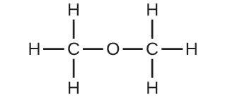

## Kafli 2

[1](http://openstax.org/books/chemistry-2e/pages/2-exercises#fs-idp69222896).

Hvarfefnin samanstanda af einni grænni kúlu og tveimur fjólubláum kúlum. Myndefnin samanstanda af tveimur grænum kúlum og tveimur fjólubláum kúlum. Þetta brýtur í bága við kenningu Daltons um að atóm verði ekki til við efnabreytingu, heldur endurraðist aðeins.

[3](http://openstax.org/books/chemistry-2e/pages/2-exercises#fs-idm83132240).

Þessi staðhæfing brýtur í bága við fjórðu kenningu Daltons: Í tilteknu efnasambandi er fjöldi atóma af hverri gerð (og þar með einnig hundraðshlutinn) alltaf í sama hlutfalli.

[5](http://openstax.org/books/chemistry-2e/pages/2-exercises#fs-idp107697296).

Dalton taldi upphaflega að öll atóm tiltekins frumefnis hefðu sömu eiginleika, þar á meðal massa. Því var hugmyndin um samsætur, þar sem frumefni hefur mismunandi massa, brot á upphaflegu hugmyndinni. Til að gera grein fyrir tilvist samsæta var annarri kenningu atómkenningar hans breytt þannig að hún segði að atóm sama frumefnis yrðu að hafa sömu efnafræðilegu eiginleikana.

[7](http://openstax.org/books/chemistry-2e/pages/2-exercises#fs-idm21866144).

Báðar eru öreindir sem eru í kjarna atóms. Báðar hafa um það bil sama massa. Róteindir eru jákvætt hlaðnar en nifteindir eru óhlaðnar.

[9](http://openstax.org/books/chemistry-2e/pages/2-exercises#fs-idm61727056).

\(a\) Rutherford-atómið hefur lítinn, jákvætt hlaðinn kjarna, þannig að flestar α-eindir fara í gegnum tómarúm langt frá kjarnanum og sveigja ekki af leið. Þær α-eindir sem fara nálægt kjarnanum sveigja af leið vegna fráhrindikrafts milli jákvæðra hleðsla. Því beinna sem α-eindirnar stefna á kjarnann, því stærra verður sveigjuhornið. (b) Orkuríkari α-eindir sem fara nálægt kjarnanum munu enn sveigja af leið, en því hraðar sem þær fara, því minna er væntanlegt sveigjuhorn. (c) Ef kjarninn er minni er jákvæða hleðslan minni og væntanleg sveigja er minni -- bæði hvað varðar hversu nálægt α-eindirnar fara kjarnanum án þess að sveigja af leið og stærð sveigjuhornsins. Ef kjarninn er stærri er jákvæða hleðslan stærri og væntanleg sveigja er meiri -- fleiri α-eindir munu sveigja af leið og sveigjuhornin verða stærri. (d) Ferlar α-eindanna samsvara spánum úr (a), (b) og (c).

[11](http://openstax.org/books/chemistry-2e/pages/2-exercises#fs-idm174365776).

\(a\) ^133^Cs^+^; (b) ^127^I^−^; (c) ^31^P^3−^; (d) ^57^Co^3+^

[13](http://openstax.org/books/chemistry-2e/pages/2-exercises#fs-idm164758784).

\(a\) Kolefni-12, ^12^C; (b) Þetta atóm inniheldur sex róteindir og sex nifteindir. Það eru sex rafeindir í hlutlausu ^12^C atómi. Nettóhleðsla slíks hlutlauss atóms er núll og massatalan er 12. (c) Fyrri svör eru rétt. (d) Atómið verður stöðugt þar sem C-12 er stöðug samsæta kolefnis. (e) Fyrra svar er rétt. Önnur svör við þessu verkefni eru möguleg ef annað frumefni eða samsæta er valin.

[15](http://openstax.org/books/chemistry-2e/pages/2-exercises#fs-idm103886288).

\(a\) Litíum-6 inniheldur þrjár róteindir, þrjár nifteindir og þrjár rafeindir. Samsætutáknið er ^6^Li eða $_{3}^{6}\text{Li}.$ (b) ^6^Li^+^ eða $_{3}^{6}\text{Li}^{+}$

[17](http://openstax.org/books/chemistry-2e/pages/2-exercises#fs-idm187202528).

\(a\) Járn, 26 róteindir, 24 rafeindir og 32 nifteindir; (b) joð, 53 róteindir, 54 rafeindir og 74 nifteindir

[19](http://openstax.org/books/chemistry-2e/pages/2-exercises#fs-idm80933584).

\(a\) 3 róteindir, 3 rafeindir, 4 nifteindir; (b) 52 róteindir, 52 rafeindir, 73 nifteindir; (c) 47 róteindir, 47 rafeindir, 62 nifteindir; (d) 7 róteindir, 7 rafeindir, 8 nifteindir; (e) 15 róteindir, 15 rafeindir, 16 nifteindir

[21](http://openstax.org/books/chemistry-2e/pages/2-exercises#fs-idm112612912).

Notum neon sem dæmi. Þar sem það eru þrjár samsætur er engin leið að vera viss um að spá nákvæmlega fyrir um hlutföllin til að fá heildarmeðalatómmassann 20,18 amu. Giskum á að hlutföllin séu 9% Ne-22, 91% Ne-20 og aðeins snefill af Ne-21. Meðalmassinn yrði 20,18 amu. Þegar náttúruleg blanda samsæta er skoðuð kemur í ljós að hlutföllin eru 90,48% Ne-20, 9,25% Ne-22 og 0,27% Ne-21, svo það þarf að aðlaga giskuðu hlutföllin örlítið.

[23](http://openstax.org/books/chemistry-2e/pages/2-exercises#fs-idp165798448).

79,90 amu

[25](http://openstax.org/books/chemistry-2e/pages/2-exercises#fs-idm95116240).

Tyrknesk uppspretta: 20,3% (af 10,0129 amu samsætu); bandarísk uppspretta: 19,1% (af 10,0129 amu samsætu)

[27](http://openstax.org/books/chemistry-2e/pages/2-exercises#fs-idm188711792).

Táknið fyrir frumefnið súrefni, O, táknar bæði frumefnið og eitt súrefnisatóm. Súrefnissameind, O~2~, inniheldur tvö súrefnisatóm; nota verður neðanskriftina 2 í formúlunni til að greina tvíatóma sameindina frá tveimur stökum súrefnisatómum.

[29](http://openstax.org/books/chemistry-2e/pages/2-exercises#fs-idm157365408).

\(a\) sameinda CO~2~, reynslu CO~2~; (b) sameinda C~2~H~2~, reynslu CH; (c) sameinda C~2~H~4~, reynslu CH~2~; (d) sameinda H~2~SO~4~, reynslu H~2~SO~4~

[31](http://openstax.org/books/chemistry-2e/pages/2-exercises#fs-idm64843712).

\(a\) C~4~H~5~N~2~O; (b) C~12~H~22~O~11~; (c) HO; (d) CH~2~O; (e) C~3~H~4~O~3~

[33](http://openstax.org/books/chemistry-2e/pages/2-exercises#fs-idp2601824).

\(a\) CH~2~O; (b) C~2~H~4~O

[35](http://openstax.org/books/chemistry-2e/pages/2-exercises#fs-idm57514192).

\(a\) etanól

\(b\) metoxýmetan, betur þekkt sem dímetýleter

\(c\) Þessar sameindir hafa sömu efnasamsetningu (gerð og fjölda atóma) en ólíka efnafræðilega byggingu. Þær eru byggingarhverfur.

[37](http://openstax.org/books/chemistry-2e/pages/2-exercises#fs-idm319896576).

\(a\) málmur, innri hliðarmálmur; (b) málmleysingi, aðalflokkafrumefni; (c) málmur, aðalflokkafrumefni; (d) málmleysingi, aðalflokkafrumefni; (e) málmur, hliðarmálmur; (f) málmur, innri hliðarmálmur; (g) málmur, hliðarmálmur; (h) málmleysingi, aðalflokkafrumefni; (i) málmleysingi, aðalflokkafrumefni; (j) málmur, aðalflokkafrumefni

[39](http://openstax.org/books/chemistry-2e/pages/2-exercises#fs-idm419056816).

\(a\) He; (b) Be; (c) Li; (d) O

[41](http://openstax.org/books/chemistry-2e/pages/2-exercises#fs-idm415648752).

\(a\) krypton, Kr; (b) kalsíum, Ca; (c) flúor, F; (d) tellúr, Te

[43](http://openstax.org/books/chemistry-2e/pages/2-exercises#fs-idm430165648).

\(a\) $_{11}^{23}\text{Na}$; (b) $_{\;\, 54}^{129}\text{Xe}$; (c) $_{33}^{73}\text{As}$; (d) $_{\;\, 88}^{226}\text{Ra}$

[45](http://openstax.org/books/chemistry-2e/pages/2-exercises#fs-idp298677568).

Jóna: KCl, MgCl~2~; Samgild: NCl~3~, ICl, PCl~5~, CCl~4~

[47](http://openstax.org/books/chemistry-2e/pages/2-exercises#fs-idp221295264).

\(a\) samgilt; (b) jónískt, Ba^2+^, O^2−^; (c) jónískt, $\text{NH}_{4}^{+}\text{,}$ $\text{CO}_{3}^{2 -};$ (d) jónískt, Sr^2+^, $\text{H}_{2}\text{PO}_{4}^{-};$ (e) samgilt; (f) jónískt, Na^+^, O^2−^

[49](http://openstax.org/books/chemistry-2e/pages/2-exercises#fs-idp178456496).

\(a\) CaS; (b) (NH~4~)~2~SO~4~; (c) AlBr~3~; (d) Na~2~HPO~4~; (e) Mg~3~ (PO~4~)~2~

[51](http://openstax.org/books/chemistry-2e/pages/2-exercises#fs-idp282297472).

\(a\) sesíumklóríð; (b) baríumoxíð; (c) kalíumsúlfíð; (d) beryllíumklóríð; (e) vetnisbrómíð; (f) álflúoríð

[53](http://openstax.org/books/chemistry-2e/pages/2-exercises#fs-idm250352).

\(a\) RbBr; (b) MgSe; (c) Na~2~O; (d) CaCl~2~; (e) HF; (f) GaP; (g) AlBr~3~; (h) (NH~4~)~2~SO~4~

[55](http://openstax.org/books/chemistry-2e/pages/2-exercises#fs-idp268321696).

\(a\) ClO~2~; (b) N~2~O~4~; (c) K~3~P; (d) Ag~2~S; (e) AIF~3~·3H~2~O; (f) SiO~2~

[57](http://openstax.org/books/chemistry-2e/pages/2-exercises#fs-idp279515392).

\(a\) króm(III)oxíð; (b) járn(II)klóríð; (c) króm(VI)oxíð; (d) títan(IV)klóríð; (e) kóbalt(II)klóríðhexahýdrat; (f) mólýbden(IV)súlfíð

[59](http://openstax.org/books/chemistry-2e/pages/2-exercises#fs-idp268365168).

\(a\) K~3~PO~4~; (b) CuSO~4~; (c) CaCl~2~; (d) TiO~2~; (e) NH~4~NO~3~; (f) NaHSO~4~

[61](http://openstax.org/books/chemistry-2e/pages/2-exercises#fs-idp268310912).

\(a\) mangan(IV)oxíð; (b) kvikasilfur(I)klóríð; (c) járn(III)nítrat; (d) títan(IV)klóríð; (e) kopar(II)brómíð
