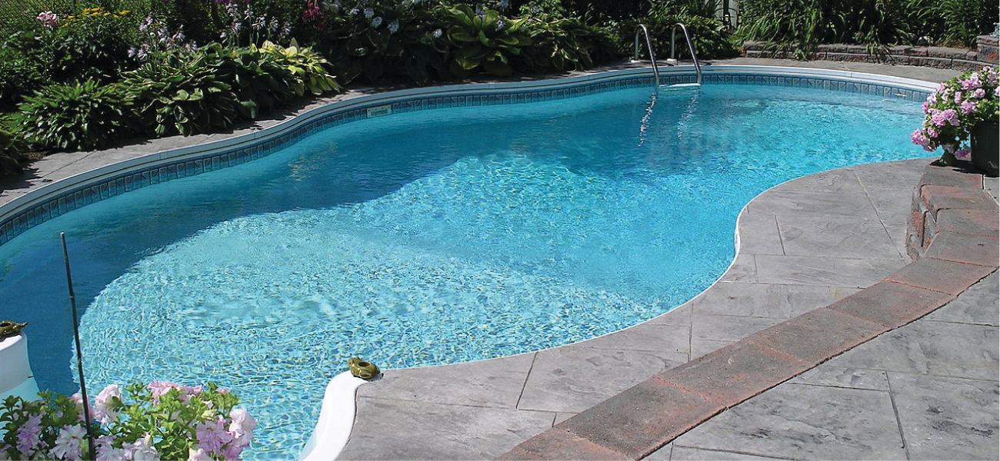

Mynd 3.1 Vatnið í sundlaug er flókin efnablanda efna sem þarf að viðhalda hlutfallslegu magni þeirra af nákvæmni til að tryggja heilsu og þægindi fólks sem notar laugina. (heimild: breyting á verki eftir Vic Brincat)

### Yfirlit kafla

[3.1 Formúlumassi og mólhugtakið](http://openstax.org/books/chemistry-2e/pages/3-1-formula-mass-and-the-mole-concept)

[3.2 Ákvörðun reynsluformúla og sameindaformúla](http://openstax.org/books/chemistry-2e/pages/3-2-determining-empirical-and-molecular-formulas)

[3.3 Mólstyrkur](http://openstax.org/books/chemistry-2e/pages/3-3-molarity)

[3.4 Aðrar einingar fyrir styrk lausna](http://openstax.org/books/chemistry-2e/pages/3-4-other-units-for-solution-concentrations)

## Inngangur

Sundlaugar hafa lengi verið vinsæl afþreying, líkamsrækt og sjúkraþjálfun. Þar sem það er óraunhæft að fylla stórar laugar oft með fersku vatni er laugarvatnið reglulega meðhöndlað með efnum til að koma í veg fyrir vöxt skaðlegra baktería og þörunga. Rétt viðhald laugar krefst þess að ýmsum efnasamböndum sé bætt reglulega út í vatnið í vandlega mældu magni. Til dæmis þarf að viðhalda hlutfallslegu magni kalsíumjónarinnar, Ca^2+^, í vatninu innan ákveðinna marka til að koma í veg fyrir augnertingu og skemmdir á laugarbotninum og lögnum. Til að viðhalda réttu kalsíummagni er kalsíumkatjónum bætt út í vatnið í formi jónaefnis sem inniheldur einnig anjónir. Því er nauðsynlegt að þekkja bæði hlutfallslegt magn Ca^2+^ í efnasambandinu og rúmmál vatnsins í lauginni til að ná réttu kalsíummagni. Magnbundnir þættir í samsetningu efna (eins og kalsíuminnihaldandi efnasambandsins) og efnablandna (eins og laugarvatnsins) eru efni þessa kafla.
