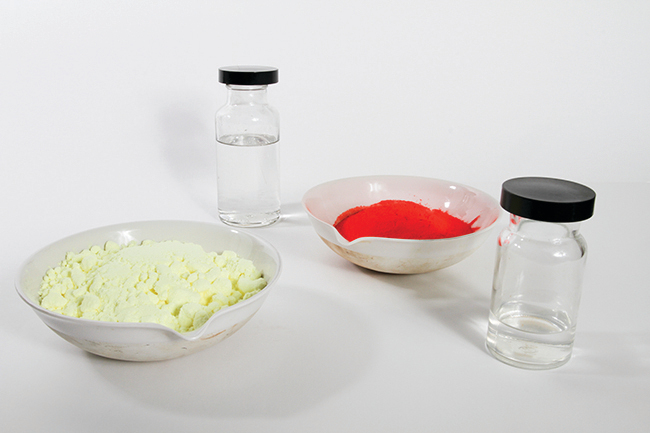
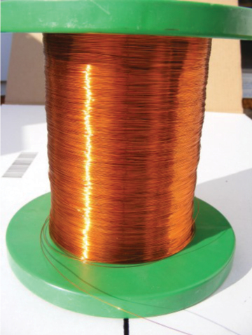

## 3.1 Formúlumassi og mólhugtakið

:::learning-objectives

Í lok þessa kafla muntu geta:

-   Reiknað formúlumassa fyrir samgild og jónísk efnasambönd
-   Skilgreint magnseininguna mól og skylda stærð, tölu Avogadrosar
-   Útskýrt sambandið milli massa, móla og fjölda atóma eða sameinda og framkvæmt útreikninga til að leiða þessar stærðir hverja af annarri

:::

Margir halda því fram að nútímaefnafræði hafi hafist þegar vísindamenn fóru að kanna magnbundna þætti efnafræðinnar jafnt og þá þáttbundnu. Til dæmis var atómkenning Daltons tilraun til að útskýra niðurstöður mælinga sem gerðu honum kleift að reikna út hlutfallslegan massa frumefna sem sameinuðust í ýmsum efnasamböndum. Skilningur á sambandi milli massa atóma og efnaformúla efnasambanda gerir okkur kleift að lýsa samsetningu efna á magnbundinn hátt.

### Formúlumassi

Í fyrri kafla þessa texta var lýst þróun atómmassaeiningarinnar, hugtakinu um meðalatómmassa og notkun efnaformúla til að tákna frumefnasamsetningu efna. Hægt er að útvíkka þessar hugmyndir til að reikna út formúlumassa efnis með því að leggja saman meðalatómmassa allra atóma sem táknuð eru í formúlu efnisins.

#### Formúlumassi fyrir samgild efni

Fyrir samgild efni táknar formúlan fjölda og gerðir atóma sem mynda eina sameind efnisins; því má réttilega vísa til formúlumassans sem sameindamassa. Lítum á klóróform (CHCl~3~), samgilt efnasamband sem eitt sinn var notað sem svæfingarlyf við skurðaðgerðir og er nú aðallega notað við framleiðslu á tetraflúoretýleni, byggingareiningunni fyrir „viðloðunarfríu" fjölliðuna Teflon. Sameindaformúla klóróforms gefur til kynna að ein sameind innihaldi eitt kolefnisatóm, eitt vetnisatóm og þrjú klóratóm. Meðalsameindamassi klóróformsameindar er því jafn summu meðalatómmassa þessara atóma. [Mynd 3.2](#CNX_Chem_03_01_chloroform) sýnir útreikningana sem notaðir eru til að leiða út sameindamassa klóróforms, sem er 119,37 amu.

![A table and diagram are shown. The table is made up of six columns and five rows. The header row reads: "Element," "Quantity," a blank space, "Average atomic mass (a m u)," a blank space, and "Subtotal (a m u)." The first column contains the symbols "C," "H," "C l" and a blank, merged cell that runs the width of the first five columns. The second column contains the numbers "1," "1," and "3" as well as the merged cell. The third column contains the multiplication symbol in each cell except for the last, merged cell. The fourth column contains the numbers "12.01," "1.008," and "35.45" as well as the merged cell. The fifth column contains the symbol "=" in each cell except for the last, merged cell. The sixth column contains the values "12.01," "1.008," "106.35," and "119.37." There is a thick black line below the number 106.35. The merged cell under the first five columns reads "Molecular mass." To the left of the table is a diagram of a molecule. Three green spheres are attached to a slightly smaller black sphere, which is also attached to a smaller white sphere. The green spheres lie beneath and to the sides of the black sphere while the white sphere is located straight up from the black sphere.](./images/media/rId22.jpg)

Mynd 3.2 Meðalmassi klóróformsameindar, CHCl~3~, er 119,37 amu, sem er summa meðalatómmassa hvers atóms sem hún er gerð úr. Líkanið sýnir sameindabyggingu klóróforms.

Sömuleiðis er sameindamassi aspirínsameindar, C~9~H~8~O~4~, summa atómmassa níu kolefnisatóma, átta vetnisatóma og fjögurra súrefnisatóma, sem nemur 180,15 amu ([mynd 3.3](#CNX_Chem_03_01_aspirin)).

![A table and diagram are shown. The table is made up of six columns and five rows. The header row reads: "Element," "Quantity," a blank space, "Average atomic mass (a m u)," a blank space, and "Subtotal (a m u)." The first column contains the symbols "C," "H," "O," and a merged cell. The merged cell runs the length of the first five columns. The second column contains the numbers "9," "8," and "4" as well as the merged, cell. The third column contains the multiplication symbol in each cell except for the last, merged cell. The fourth column contains the numbers "12.01," "1.008," and "16.00" as well as the merged cell. The fifth column contains the symbol "=" in each cell except for the last, merged cell. The sixth column contains the values: "108.09," "8.064," "64.00," and "180.15." There is a thick black line below the number 64.00. The merged cell under the first five columns reads "Molecular mass." To the left of the table is a diagram of a molecule. Six black spheres are located in a six-sided ring and connected by alternating double and single black bonds. Attached to each of the four black spheres is one smaller white sphere. Attached to the farthest right black sphere is a red sphere, connected to two more black spheres, all in a row. Attached to the last black sphere of that row are two more white spheres. Attached to the first black sphere of that row is another red sphere. A black sphere, attached to two red spheres and a white sphere is attached to the black sphere on the top right of the six-sided ring.](./images/media/3-1-formula-mass-and-the-mole-concept-rId26.jpg)

Mynd 3.3 Meðalmassi aspirínsameindar er 180,15 amu. Líkanið sýnir sameindabyggingu aspiríns, C~9~H~8~O~4~.

:::example
### Dæmi 3.1

#### Útreikningur á sameindamassa fyrir samgilt efnasamband

Íbúprófen, C~13~H~18~O~2~, er samgilt efnasamband og virka efnið í nokkrum vinsælum lausasöluverkjalyfjum, svo sem Advil og Motrin. Hver er sameindamassi (amu) þessa efnasambands?

**Lausn**

Sameindir þessa efnasambands eru samsettar úr 13 kolefnisatómum, 18 vetnisatómum og 2 súrefnisatómum. Samkvæmt aðferðinni sem lýst er hér að ofan er meðalsameindamassi þessa efnasambands því: ![A table is shown that is made up of six columns and five rows. The header row reads: "Element," "Quantity," a blank space, "Average atomic mass (a m u)," a blank space, and "Subtotal (a m u)." The first column contains the symbols "C," "H," "O," and a merged cell. The merged cell runs the length of the first five columns. The second column contains the numbers "13," "8," and "2" as well as the merged cell. The third column contains the multiplication symbol in each cell except for the last, merged cell. The fourth column contains the numbers "12.01," "1.008," and "16.00" as well as the merged cell. The fifth column contains the symbol "=" in each cell except for the last, merged cell. The sixth column contains the values "156.13," "18.114," "32.00," and "206.27." There is a thick black line below the number 32.00. The merged cell under the first five columns reads "Molecular mass." To the right is a ball-and-stick model of the structure. At the center, it shows six black spheres arranged in a six-sided ring with alternating double bonds. The two black spheres at the top and bottom of the six-sided ring are each bonded to one, smaller, white sphere. The black sphere on the left side of the six-sided ring is connect to another black sphere. This sphere is connected to two smaller, white spheres and another black sphere. This black sphere is connected to one, smaller white sphere, and two other black spheres. Each of these last two black spheres is connected to two smaller, white spheres. The black sphere on the right side of the six-sided ring is connected to another black sphere. This black sphere is connected to one smaller, white sphere and two other black spheres. The black sphere that is connected to it and is situated to the top right is connected to two smaller, white spheres. The black sphere connected towards the bottom right is connected to two red spheres. It forms a double bond with one of these red spheres and the other red sphere is connected to a smaller, white sphere.](./images/media/3-1-formula-mass-and-the-mole-concept-rId30.jpg)

:::

:::practice-problem
#### Kannaðu þekkingu þína

Parasetamól, C~8~H~9~NO~2~, er samgilt efnasamband og virka efnið í nokkrum vinsælum lausasöluverkjalyfjum, svo sem Tylenol. Hver er sameindamassi (amu) þessa efnasambands?

:::answer
151,16 amu

:::

#### Formúlumassi fyrir jónaefni

Jónaefni eru samsett úr stökum katjónum og anjónum sem sameinast í hlutföllum til að mynda rafhlutlaust efni í heild. Formúlumassi fyrir jónaefni er reiknaður á sama hátt og formúlumassi fyrir samgild efnasambönd: með því að leggja saman meðalatómmassa allra atóma í formúlu efnasambandsins. Hafðu þó í huga að formúla fyrir jónaefni táknar ekki samsetningu stakrar sameindar, svo það er ekki rétt að vísa til hans sem „sameindamassa".

Sem dæmi má nefna natríumklóríð, NaCl, efnafræðilega heitið á venjulegu matarsalti. Natríumklóríð er jónaefni sem samanstendur af natríumkatjónum, Na^+^, og klóríðanjónum, Cl^−^, sameinuðum í hlutfallinu 1:1. Formúlumassi þessa efnasambands er reiknaður sem 58,44 amu (sjá [mynd 3.4](#CNX_Chem_03_01_saltMass)).

![A table and diagram are shown. The table is made up of six columns and four rows. The header row reads: "Element," "Quantity," a blank space, "Average atomic mass (a m u)," a blank space and "Subtotal (a m u)." The first column contains the symbols "N a", "C l," and a merged cell. The merged cell runs the length of the first five columns. The second column contains the numbers "1" and "1" as well as the merged cell. The third column contains the multiplication symbol in each cell except for the last, merged cell. The fourth column contains the numbers "22.99" and "35.45" as well as the merged cell. The fifth column contains the symbol "=" in each cell except for the last, merged cell. The sixth column contains the values "22.99," "35.45," and "58.44." There is a thick black line below the number "35.45." The merged cell under the first five columns reads "Formula mass." To the left of the table is a diagram of a chemical structure. The diagram shows green and purple spheres placed in an alternating pattern, making up the corners of eight stacked cubes to form one larger cube. The green spheres are slightly smaller than the purple spheres.](./images/media/rId38.jpg)

Mynd 3.4 Matarsalt, NaCl, inniheldur fylki af natríum- og klóríðjónum sem sameinast í hlutfallinu 1:1. Formúlumassi þess er 58,44 amu.

Athugaðu að meðalmassar hlutlausra natríum- og klóratóma voru notaðir í þessum útreikningi, frekar en massar natríumkatjóna og klóríðanjóna. Þessi aðferð er fullkomlega ásættanleg við útreikning á formúlumassa jónaefnis. Jafnvel þótt natríumkatjón hafi örlítið minni massa en natríumatóm (þar sem það vantar rafeind), mun þessi munur vega upp á móti því að klóríðanjón er örlítið massameiri en klóratóm (vegna auka rafeindarinnar). Þar að auki er massi rafeindar hverfandi lítill miðað við massa dæmigerðs atóms.. Jafnvel þegar massi stakrar jónar er reiknaður út má yfirleitt hunsa rafeindirnar sem vantar eða eru umfram, þar sem framlag þeirra til heildarmassans er hverfandi og endurspeglast aðeins í aukastöfum sem falla brott þegar reiknaður massi er námundaður rétt. Fáu undantekningarnar frá þessari viðmiðunarreglu eru mjög léttar jónir sem eru myndaðar úr frumefnum með nákvæmlega þekktan atómmassa.

:::

:::example
### Dæmi 3.2

#### Útreikningur á formúlumassa fyrir jónaefni

Álsúlfat, Al~2~(SO~4~)~3~, er jónaefni sem er notað við pappírsframleiðslu og í ýmsum vatnshreinsunarferlum. Hver er formúlumassi (amu) þessa efnasambands?

**Lausn**

Formúla þessa efnasambands gefur til kynna að það innihaldi Al^3+^ og SO~4~^2−^ jónir í hlutfallinu 2:3. Til að reikna út formúlumassa er gagnlegt að endurrita formúluna á einfaldara formi, Al~2~S~3~O~12~. Samkvæmt aðferðinni sem lýst er hér að ofan er formúlumassi þessa efnasambands reiknaður út á eftirfarandi hátt: ![A table is shown that is made up of six columns and five rows. The header row reads: "Element," "Quantity," a blank space, "Average atomic mass (a m u)," a blank space, and "Subtotal (a m u)." The first column contains the symbols "A l," "S," "O," and a merged cell. The merged cell runs the length of the first five columns. The second column contains the numbers "2," "3," and "12" as well as the merged cell. The third column contains the multiplication symbol in each cell except for the last, merged cell. The fourth column contains the numbers "26.98," "32.06," and "16.00" as well as the merged cell. The fifth column contains the symbol "=" in each cell except for the last, merged cell. The sixth column contains the values "53.96," "96.18," "192.00," and "342.14." There is a thick black line under the number 192.00. The merged cell under the first five columns reads "Formula mass." To the right of this table is a ball-and-stick structure. It shows yellow and grey sphere connected to red spheres in a complex pattern. The yellow and grey spheres are similar in size, but the red spheres appear to be smaller by comparison.](./images/media/rId42.jpg)

:::

:::practice-problem
#### Kannaðu þekkingu þína

Kalsíumfosfat, Ca~3~(PO~4~)~2~, er jónaefni og algengt kekkjavarnarefni sem bætt er í matvæli. Hver er formúlumassi (amu) kalsíumfosfats?

:::answer
310,18 amu

:::

### Mólið

Einkenni efnis ræðst ekki aðeins af gerð atóma eða jóna sem það inniheldur, heldur einnig af magni hverrar gerðar atóms eða jónar. Til dæmis eru vatn, H~2~O, og vetnisperoxíð, H~2~O~2~, lík að því leyti að sameindir þeirra eru samsettar úr vetnis- og súrefnisatómum. En vegna þess að vetnisperoxíðsameind inniheldur tvö súrefnisatóm, ólíkt vatnssameindinni sem hefur aðeins eitt, sýna efnin tvö mjög ólíka eiginleika. Í dag gera háþróuð tæki kleift að mæla þessa skilgreinandi smásæju eiginleika beint; þó voru sömu eiginleikar upphaflega leiddir út frá mælingum á stórsæjum eiginleikum (mössum og rúmmáli efna í lausu formi) með tiltölulega einföldum tækjum (vogum og mæliglösum). Þessi tilraunaaðferð krafðist þess að ný eining fyrir efnismagn yrði tekin upp, *mólið*, sem er enn ómissandi í nútímaefnafræði.

*Mólið* er magneining svipuð kunnuglegum einingum eins og par, tylft, gross o.s.frv. Það gefur ákveðna mælingu á *fjölda* atóma eða sameinda í sýni efnis. Ein latnesk merking orðsins „mole" er „stór massi" eða „magn", sem er í samræmi við notkun þess sem heiti á þessari einingu. Mólið myndar tengingu milli auðmælds stórsæs eiginleika, heildarmassa, og afar mikilvægs grundvallareiginleika, fjölda atóma, sameinda og svo framvegis. Eitt mól af efni er það magn sem inniheldur 6,02214076 $\times$ 10^23^ aðskildar einingar (atóm eða sameindir). Þessi stóra tala er grundvallarfasti sem er þekktur sem tala Avogadrosar (*~NA~*) eða Avogadrosarfastinn til heiðurs ítalska vísindamanninum Amedeo Avogadro. Þessi fasti er réttilega gefinn upp með skýrri einingu „á mól", en þægilega námunduð útgáfa er 6,022 $\times$ 10^23^/mól.

Í samræmi við skilgreiningu sína sem magneining inniheldur 1 mól af hvaða frumefni sem er sama fjölda atóma og 1 mól af hvaða öðru frumefni sem er. Massar 1 móls af mismunandi frumefnum eru hins vegar ólíkir, þar sem massar einstakra atóma eru verulega mismunandi. Mólmassi frumefnis (eða efnasambands) er massi í grömmum af 1 móli af því efni, eiginleiki sem er gefinn upp í einingunni grömm á mól (g/mól) (sjá [mynd 3.5](#CNX_Chem_03_02_moles)).

Mynd 3.5 Hvert sýni inniheldur 6,022 $\times$ 10^23^ atóm --- 1,00 mól af atómum. Frá vinstri til hægri (efri röð): 65,4 g sink, 12,0 g kolefni, 24,3 g magnesíum og 63,5 g kopar. Frá vinstri til hægri (neðri röð): 32,1 g brennisteinn, 28,1 g kísill, 207 g blý og 118,7 g tin. (heimild: breyting á vinnu eftir Mark Ott)

Mólmassi hvers efnis er tölulega jafngildur atóm- eða formúluþyngd þess í amu. Samkvæmt skilgreiningu á amu vegur eitt ^12^C atóm 12 amu (atómmassi þess er 12 amu). Eitt mól af ^12^C vegur 12 g (mólmassi þess er 12 g/mól). Þetta samband gildir fyrir öll frumefni, þar sem atómmassar þeirra eru mældir miðað við amu-viðmiðunarefnið, ^12^C. Með því að útvíkka þessa meginreglu er mólmassi efnasambands í grömmum sömuleiðis tölulega jafngildur formúlumassa þess í amu ([mynd 3.6](#CNX_Chem_03_02_compound)).

Mynd 3.6 Hvert sýni inniheldur 6,02 $\times$ 10^23^ sameindir eða formúlueiningar --- 1,00 mól af efnasambandinu eða frumefninu. Réttsælis frá efra vinstra horni: 130,2 g af C~8~H~17~OH (1-oktanól, formúlumassi 130,2 amu), 454,4 g af HgI~2~ (kvikasilfurs(II)joðíð, formúlumassi 454,4 amu), 32,0 g af CH~3~OH (metanól, formúlumassi 32,0 amu) og 256,5 g af S~8~ (brennisteinn, formúlumassi 256,5 amu). (heimild: Sahar Atwa)

| Frumefni | Atómmassaeining (amu) | Mólmassi (g/mól) | Atóm/Mól |
|---|---|---|---|
| C (frá carbon) | 12,01 | 12,01 | 6,022 $\times$ 10^23^ |
| H (frá hydrogen) | 1,008 | 1,008 | 6,022 $\times$ 10^23^ |
| O (frá oxygen) | 16\. | 16\. | 6,022 $\times$ 10^23^ |
| Na | 22,99 | 22,99 | 6,022 $\times$ 10^23^ |
| Cl | 35,45 | 35,45 | 6,022 $\times$ 10^23^ |

Þótt atómmassi og mólmassi séu tölulega jafngildir, hafðu í huga að þeir eru mjög ólíkir hvað varðar stærðargráðu, eins og sést á miklum mun á stærð viðkomandi eininga (amu á móti g). Til að átta sig á stærðargráðu mólsins má íhuga lítinn vatnsdropa sem vegur um 0,03 g (sjá [mynd 3.7](#CNX_Chem_03_02_water)). Þótt þetta sé aðeins örlítið brot af einu móli af vatni (~18 g) inniheldur það fleiri vatnssameindir en hægt er að ímynda sér. Ef sameindunum væri dreift jafnt á um það bil sjö milljarða manna á jörðinni myndi hver einstaklingur fá meira en 100 milljarða sameinda.

Mynd 3.7 Fjöldi sameinda í einum vatnsdropa er um það bil 100 milljörðum sinnum meiri en fjöldi fólks á jörðinni. (Heimild: „tanakawho"/Wikimedia commons)

:::

:::link-to-material

Mólið er notað í efnafræði til að tákna 6,022 $\times$ 10^23^ af einhverju, en það getur verið erfitt að skilja svo stóra tölu. Horfðu á þetta [myndband](http://openstax.org/l/16molevideo) og svaraðu síðan „Hugsaðu"-spurningunum sem fylgja. Kynntu þér mólið nánar með því að skoða upplýsingarnar undir „Kafaðu dýpra".

:::

Sambandið milli formúlumassa, mólsins og tölu Avogadros er hægt að nota til að reikna út ýmis magn sem lýsa samsetningu efna og efnasambanda, eins og sýnt er í næstu dæmum.

:::example
### Dæmi 3.3

#### Reikna mól út frá grömmum fyrir frumefni

Samkvæmt næringarleiðbeiningum frá landbúnaðarráðuneyti Bandaríkjanna er áætluð meðalþörf fyrir kalíum í fæðu 4,7 g. Hver er áætluð meðalþörf fyrir kalíum í mólum?

**Lausn**

Massi K er gefinn og beðið er um samsvarandi magn af K í mólum. Samkvæmt lotukerfinu er atómmassi K 39,10 amu og því er mólmassi þess 39,10 g/mól. Gefinn massi K (4,7 g) er aðeins meira en einn tíundi af mólmassanum (39,10 g), þannig að sanngjarnt „gróft" mat á fjölda móla væri aðeins meira en 0,1 mól.

Mólmagn efnis má reikna með því að deila massa þess (g) með mólmassa þess (g/mól):

Þáttamerkingaraðferðin styður þessa stærðfræðilegu nálgun þar sem einingin „g" styttist út og svarið hefur eininguna „mól":

$4.7\ \text{g}\ \text{K}\ \left( \frac{\text{mol K}}{39.10\ \text{g K}} \right)\  = \ 0.12\ \text{mol K}$

Reiknuð stærð (0,12 mól K) er í samræmi við grófa matið okkar, þar sem hún er aðeins meiri en 0,1 mól.

:::

:::practice-problem
#### Kannaðu þekkingu þína

Beryllíum er léttur málmur sem notaður er til að búa til gagnsæja röntgengeislaglugga fyrir læknisfræðileg myndgreiningartæki. Hversu mörg mól af Be eru í þunnri filmu sem vegur 3,24 g?

:::answer
0,360 mól

:::

:::

:::example
### Dæmi 3.4

#### Reikna grömm út frá mólum fyrir frumefni

Einn lítri af lofti inniheldur 9,2 $\times$ 10^−4^ mól af argoni. Hver er massi Ar í einum lítra af lofti?

**Lausn**

Mólmagn Ar er gefið og það á að nota til að finna samsvarandi massa í grömmum. Þar sem magn Ar er minna en 1 mól verður massinn minni en massi 1 móls af Ar, sem er um 40 g. Mólmagnið sem um ræðir er um það bil einn þúsundasti (~10^−3^) úr móli og því ætti samsvarandi massi að vera um það bil einn þúsundasti af mólmassanum (~0,04 g): 

Í þessu tilfelli segir rökfræðin (og þáttamerkingaraðferðin styður) að margfalda gefið magn (mól) með mólmassanum (g/mól):

$9.2\  \times \ 10^{- 4}\ \text{mol}\ \text{Ar}\ \left( \frac{39.95\ \text{g Ar}}{\text{mol}\ \text{Ar}} \right)\  = \ 0.037\ \text{g Ar}$

Niðurstaðan er í samræmi við væntingar okkar, um 0,04 g Ar.

:::

:::practice-problem
#### Kannaðu þekkingu þína

Hver er massi 2,561 móls af gulli?

:::answer
504,4 g

:::

:::

:::example
### Dæmi 3.5

#### Reikna fjölda atóma út frá massa fyrir frumefni

Kopar er almennt notaður til að framleiða rafmagnsvír ([mynd 3.8](#CNX_Chem_03_02_copper)). Hversu mörg koparatóm eru í 5,00 g af koparvír?

Mynd 3.8 Koparvír er samsettur úr mörgum, mörgum atómum af Cu. (Heimild: Emilian Robert Vicol)

**Lausn**

Fjölda Cu-atóma í vírnum má á þægilegan hátt leiða út frá massa hans með tveggja þrepa útreikningi: fyrst er mólmagn Cu reiknað og síðan er tala Avogadrosar (*N~A~*) notuð til að breyta þessu mólmagni í fjölda Cu-atóma: 

Þar sem uppgefinn massi sýnisins (5,00 g) er aðeins minni en einn tíundi af massa 1 móls af Cu (~64 g), væri sanngjarnt mat á fjölda atóma í sýninu í kringum einn tíunda af *N~A~*, eða um það bil 10^22^ Cu-atóm. Tveggja þrepa útreikningurinn gefur:

$5.00\ \text{g}\ \text{Cu}\ \left( \frac{\text{mol}\ \text{Cu}}{63.55\ \text{g Cu}} \right)\left( \frac{6.022\  \times \ 10^{23}\ \text{Cu atoms}}{\text{mol Cu}} \right)\  = \ 4.74\  \times \ 10^{22}\text{Cu atoms}$

Einingagreining gefur tilætlaða styttingu eininga og útreiknuð niðurstaða er í stærðargráðunni 10^22^ eins og búist var við.

:::

:::practice-problem
#### Kannaðu þekkingu þína

Gullgrafari sem skolar gull í á safnar 15,00 g af hreinu gulli. Hversu mörg Au-atóm eru í þessu magni af gulli?

:::answer
4,586 $\times$ 10^22^ Au-atóm

:::

:::

:::example
### Dæmi 3.6

#### Útleiðsla móla úr grömmum fyrir efnasamband

Líkamar okkar mynda prótein úr amínósýrum. Ein þessara amínósýra er glýsín, sem hefur sameindaformúluna C~2~H~5~O~2~N. Hversu mörg mól af glýsínsameindum eru í 28,35 g af glýsíni?

**Lausn**

Leiddu út fjölda móla efnasambands út frá massa þess með sömu aðferð og notuð var fyrir frumefni í [dæmi 3.3](#fs-idp76540048): 

Mólmassi glýsíns er nauðsynlegur fyrir þennan útreikning og hann er reiknaður á sama hátt og sameindamassi þess. Eitt mól af glýsíni, C~2~H~5~O~2~N, inniheldur 2 mól af kolefni, 5 mól af vetni, 2 mól af súrefni og 1 mól af nitri:

![A table is shown that is made up of six columns and six rows. The header row reads: "Element," "Quantity (mol element / mol compound," a blank space, "Molar mass (g / mol element)," a blank space, and "Subtotal (a m u)." The first column contains the symbols "C," "H," "O," "N," and a merged cell. The merged cell runs the width of the first five columns. The second column contains the numbers "2," "5," "2," and "1" as well as the merged cell. The third column contains the multiplication symbol in each cell except for the last, merged cell. The fourth column contains the numbers "12.01," "1.008," "16.00," and "14.007" as well as the merged cell. The fifth column contains the symbol "=" in each cell except for the last, merged cell. The sixth column contains the values "24.02," "5.040," "32.00," "14.007," and "75.07." There is a thick black line under the number 14.007. The merged cell under the first five columns reads "Molar mass (g / mol compound). There is a ball-and-stick drawing to the right of this table. It shows a black sphere that forms a double bond with a slightly smaller red sphere, a single bond with another red sphere, and a single bond with another black sphere. The red sphere that forms a single bond with the black sphere also forms a single bond with a smaller, white sphere. The second black sphere forms a single bond with a smaller, white sphere and a smaller blue sphere. The blue sphere forms a single bond with two smaller, white spheres each.](./images/media/rId99.jpg)

Uppgefinn massi glýsíns (~28 g) er aðeins meira en þriðjungur af mólmassanum (~75 g/mól), þannig að búist er við að útreiknuð niðurstaða verði aðeins meiri en þriðjungur úr móli (~0,33 mól). Með því að deila massa efnasambandsins með mólmassa þess fæst:

$28.35\ \text{g}\ \text{glycine}\ \left( \frac{\text{mol glycine}}{75.07\ \text{g glycine}} \right)\  = \ 0.378\ \text{mol glycine}$

Þessi niðurstaða er í samræmi við grófa matið.

:::

:::practice-problem
#### Kannaðu þekkingu þína

Hversu mörg mól af súkrósa, C~12~H~22~O~11~, eru í 25 g sýni af súkrósa?

:::answer
0,073 mól

:::

:::

:::example
### Dæmi 3.7

#### Útleiðsla gramma úr mólum fyrir efnasamband

C-vítamín er samgilt efnasamband með sameindaformúluna C~6~H~8~O~6~. Ráðlagður dagskammtur af C-vítamíni fyrir börn á aldrinum 4--8 ára er 1,42 $\times$ 10^−4^ mól. Hver er massi þessa skammts í grömmum?

**Lausn**

Eins og fyrir frumefni er hægt að leiða massa efnasambands út frá mólmagni þess eins og sýnt er: 

Mólmassi þessa efnasambands er reiknaður 176,124 g/mól. Uppgefinn fjöldi móla er mjög lítið brot af móli (~10^−4^ eða einn tíuþúsundasti); því er búist við að samsvarandi massi sé um einn tíuþúsundasti af mólmassanum (~0,02 g). Útreikningurinn gefur:

$1.42\  \times \ 10^{- 4}\ \text{mol}\ \text{vitamin C}\ \left( \frac{176.124\ \text{g vitamin C}}{\text{mol}\ \text{vitamin C}} \right)\  = \ 0.0250\ \text{g vitamin C}$

Þetta er í samræmi við vænta niðurstöðu.

:::

:::practice-problem
#### Kannaðu þekkingu þína

Hver er massi 0,443 móla af hýdrasíni, N~2~H~4~?

:::answer
14,2 g

:::

:::

:::example
### Dæmi 3.8

#### Útreikningur á fjölda atóma og sameinda út frá massa efnasambands

Pakki af gervisætuefni inniheldur 40,0 mg af sakkaríni (C~7~H~5~NO~3~S), sem hefur byggingarformúluna: ![A diagram of a molecule is shown that is made up of two ring structures attached together. The left ring is hexagonal in shape with C atoms at each point of the ring and alternating single and double bonds. A double bond occurs between the C atom at the top vertex of the hexagon and the C atom down and to the left of it. The C atoms on the left, top, and bottom of the structure form a single bond to an H atom each. The two right C atoms make up one side of a pentagon and the other points of the pentagon are made up of a C atom, an N atom, and an S atom if read clockwise. The C atom forms a double bond with an O atom. The N atom forms a single bond with an H atom. The S atom forms two double bonds to two O atoms.](./images/media/rId113.jpg)

Að gefnu að sakkarín hefur mólmassa upp á 183,18 g/mól, hversu margar sakkarínsameindir eru í 40,0 mg (0,0400 g) sýni af sakkaríni? Hversu mörg kolefnisatóm eru í sama sýni?

**Lausn**

Fjöldi sameinda í tilteknum massa efnasambands er reiknaður út með því að finna fyrst fjölda móla, eins og sýnt er í [dæmi 3.6](#fs-idm1714048), og margfalda síðan með tölu Avogadrosar: ![A diagram of three boxes connected by a right-facing arrow in between each is shown. The box on the left contains the phrase, "Mass of C subscript seven H subscript five N O subscript three S ( g )," the middle box reads, "Moles of C subscript seven H subscript five N O subscript three S ( mol )," while the one on the right contains the phrase, "Number of C subscript seven H subscript five N O subscript three S molecules." There is a phrase under the left arrow that says, "Divide by molar mass (g / mol)," and under the right arrow it states, "Multiply by Avogadro's number ( mol superscript negative one)."](./images/media/rId117.jpg)

Með því að nota uppgefinn massa og mólmassa fyrir sakkarín fæst:

Formúla efnasambandsins sýnir að hver sameind inniheldur sjö kolefnisatóm og því er fjöldi C-atóma í sýninu:

$1.31\  \times \ 10^{20}\ \text{C}_{7}\text{H}_{5}\text{NO}_{3}\text{S molecules}\ \left( \frac{7\ \text{C atoms}}{1\ \text{C}_{7}\text{H}_{5}\text{NO}_{3}\text{S molecule}} \right)\  = \ 9.17\  \times \ 10^{20}\ \text{C atoms}$

:::

:::practice-problem
#### Kannaðu þekkingu þína

Hversu margar C~4~H~10~ sameindir eru í 9,213 g af þessu efnasambandi? Hversu mörg vetnisatóm?

:::answer
9,545 $\times$ 10^22^ sameindir C~4~H~10~; 9,545 $\times$ 10^23^ atóm H

:::

:::

:::how-science-connects

#### Að telja taugaboðefnissameindir í heilanum

Heilinn er stjórnstöð miðtaugakerfisins ([mynd 3.9](#CNX_Chem_03_01_brain)). Hann sendir og tekur á móti boðum til og frá vöðvum og öðrum innri líffærum til að fylgjast með og stjórna starfsemi þeirra; hann vinnur úr áreiti sem skynfæri nema til að stýra víxlverkun við umheiminn; og hann hýsir flókna lífeðlisfræðilega ferla sem gefa af sér vitsmuni okkar og tilfinningar. Hið víðfeðma svið taugavísinda spannar alla þætti byggingar og starfsemi miðtaugakerfisins, þar á meðal rannsóknir á líffærafræði og lífeðlisfræði heilans. Miklar framfarir hafa orðið í heilarannsóknum á síðustu áratugum og BRAIN-verkefnið, alríkisverkefni sem tilkynnt var um árið 2013, miðar að því að hraða og nýta þessar framfarir með samstilltu átaki ýmissa iðnaðar-, fræðasamfélags- og ríkisstofnana (nánari upplýsingar má finna á www.whitehouse.gov/share/brain-initiative).

Mynd 3.9 (a) Dæmigerður mannsheili vegur um 1,5 kg og tekur um 1,1 L rúmmál. (b) Upplýsingar berast í heilavef og um allt miðtaugakerfið með sérhæfðum frumum sem kallast taugafrumur (smásjármynd sýnir frumur við 1600× stækkun).

Sérhæfðar frumur sem kallast taugafrumur flytja upplýsingar milli mismunandi hluta miðtaugakerfisins með raf- og efnaboðum. Efnaboð eiga sér stað á mótum mismunandi taugafrumna þegar ein fruman losar sameindir (kallaðar taugaboðefni) sem dreifast yfir lítið bil milli frumnanna (kallað taugamót) og bindast yfirborði hinnar frumunnar. Þessar taugaboðefnissameindir eru geymdar í litlum innfrumubyggingum sem kallast seytibólur og renna saman við frumuhimnuna og opnast síðan til að losa innihald sitt þegar taugafruman er örvuð á viðeigandi hátt. Þetta ferli er kallað útfrumun (sjá [mynd 3.10](#CNX_Chem_03_01_exocytosis)). Eitt taugaboðefni sem hefur verið mjög mikið rannsakað er dópamín, C~8~H~11~NO~2~. Dópamín tekur þátt í ýmsum taugafræðilegum ferlum sem hafa áhrif á fjölbreytta mannlega hegðun. Truflanir í dópamínkerfum heilans liggja að baki alvarlegum taugasjúkdómum eins og Parkinsonsveiki og geðklofa.

![Two diagrams are shown. In the upper left corner of the left diagram, an oval with a darkened center that has five short, branching appendages and one long tail-like appendage is shown and connected by an arrow to another image. This image depicts a close-up view of the oval section and its interaction with the tail-like portion of a similar structure. The close up view is composed of a narrow tube labeled "neuron" leading down to a bulbous base that holds thirteen circles filled with small dots. These circles are labeled "vesicles." The base of the bulbous structure is next to a curved object labeled "neuron" and very small dots are emerging from the bulb's base and flowing toward the curved structure. The gap in between the two structures is labeled "synapse," and the small dots are labeled "neurotransmitters." The diagram on the right depicts a molecule composed of six black spheres connected by alternating double and single bonds in a hexagonal ring with other spheres attached to it. Three of the black spheres are connected to one smaller, white sphere each. Two of the black balls are connected to a smaller red sphere each. Each red sphere is connected to a smaller, white sphere. One black sphere is connected to another black sphere. It is connected to two smaller, white spheres and another black sphere. This second black sphere is connected to two smaller white spheres, and a slightly smaller blue sphere. The blue sphere is connected to two smaller, white spheres.](./images/media/rId132.jpg)

Mynd 3.10 (a) Efnaboð berast frá taugafrumum til annarra frumna með losun taugaboðefnissameinda í litlu bilin (taugamótin) milli frumnanna. (b) Dópamín, C~8~H~11~NO~2~, er taugaboðefni sem tekur þátt í ýmsum taugafræðilegum ferlum.

Einn mikilvægur þáttur í flóknum ferlum sem tengjast dópamínboðum er fjöldi taugaboðefnasameinda sem losna við útfrumun. Þar sem þessi fjöldi er lykilþáttur í að ákvarða taugasvörun (og síðari hugsun og athafnir manna) er mikilvægt að vita hvernig þessi fjöldi breytist við ákveðna stýrða örvun, svo sem lyfjagjöf. Einnig er mikilvægt að skilja hvarfganginn sem veldur breytingum á fjölda losaðra taugaboðefnasameinda -- til dæmis einhverja truflun á útfrumun, breytingu á fjölda blaðra í taugafrumunni eða breytingu á fjölda taugaboðefnasameinda í hverri blöðru.

Nýlega hafa orðið verulegar framfarir í beinum mælingum á fjölda dópamínsameinda sem geymdar eru í einstökum blöðrum og því magni sem raunverulega losnar þegar blaðran fer í gegnum útfrumun. Með því að nota smækkaða nema sem geta valið og greint dópamínsameindir í mjög litlu magni hafa vísindamenn komist að því að blöðrur í ákveðinni tegund taugafrumna í heila músa innihalda að meðaltali 30.000 dópamínsameindir í hverri blöðru (um $5\  \times \ 10^{- 20}$ mól eða 50 zmól). Greining á þessum taugafrumum úr músum sem fengu ýmsar lyfjameðferðir sýnir markverðar breytingar á meðalfjölda dópamínsameinda í einstökum blöðrum, sem jókst eða minnkaði allt að þrefalt, allt eftir því hvaða lyf var notað. Þessar rannsóknir benda einnig til þess að ekki losni allt dópamín úr tiltekinni blöðru við útfrumun, sem gefur til kynna að mögulegt gæti verið að stjórna þeim hluta sem losnar með lyfjameðferðum.[1](#fs-idp50539888)

1\.

Omiatek, Donna M., Amanda J. Bressler, Ann-Sofie Cans, Anne M. Andrews, Michael L. Heien og Andrew G. Ewing. „The Real Catecholamine Content of Secretory Vesicles in the CNS Revealed by Electrochemical Cytometry." *Scientific Report* 3 (2013): 1447, sótt 14. janúar 2015, doi:10.1038/srep01447.

:::
