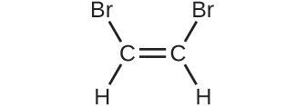
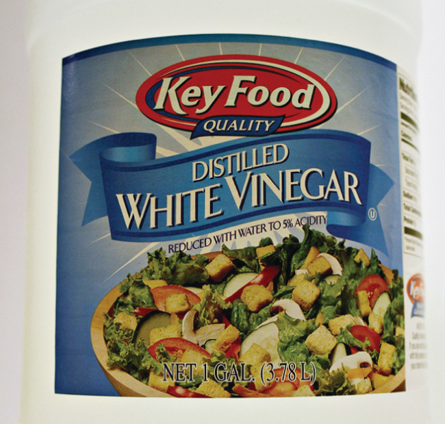
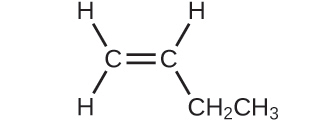
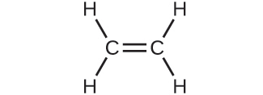

## 3.3 Mólstyrkur

:::learning-objectives

Í lok þessa kafla muntu geta:

-   Lýst grundvallareiginleikum lausna
-   Reiknað út styrk lausna með mólstyrk
-   Framkvæmt þynningarútreikninga með þynningarjöfnunni
:::

Fyrri kaflar þessarar bókar fjölluðu um samsetningu efna: sýni af efni sem innihalda aðeins eina tegund frumefnis eða efnasambands. Hins vegar eru efnablöndur -- sýni af efni sem innihalda tvö eða fleiri efni sem eru blönduð saman á eðlisfræðilegan hátt -- algengari í náttúrunni en hrein efni. Líkt og með hreint efni gegnir hlutfallsleg samsetning efnablöndu mikilvægu hlutverki við að ákvarða eiginleika hennar. Hlutfallslegt magn súrefnis í lofthjúpi plánetu ákvarðar getu hennar til að viðhalda loftháðu lífi. Hlutfallslegt magn járns, kolefnis, nikkels og annarra frumefna í stáli (efnablanda sem kallast „málmblanda") ákvarðar eðlisfræðilegan styrk þess og viðnám gegn tæringu. Hlutfallslegt magn virka efnisins í lyfi ákvarðar virkni þess við að ná fram tilætluðum lyfjafræðilegum áhrifum. Hlutfallslegt magn sykurs í drykk ákvarðar sætleika hans (sjá [mynd 3.14](#CNX_Chem_03_03_espresso)). Í þessum kafla verður lýst einni af algengustu aðferðunum til að magngreina hlutfallslega samsetningu efnablandna.

Mynd 3.14 Sykur er eitt af mörgum innihaldsefnum í þeirri flóknu efnablöndu sem kaffi er. Magn sykurs í tilteknu magni af kaffi er mikilvægur áhrifaþáttur í sætleika drykkjarins. (Heimild: Jane Whitney)

### Lausnir

Lausnir hafa áður verið skilgreindar sem einsleitar efnablöndur, sem þýðir að samsetning efnablöndunnar (og þar með eiginleikar hennar) er einsleit um allt rúmmál hennar. Lausnir eru algengar í náttúrunni og hafa einnig verið nýttar í margs konar tækni sem maðurinn hefur þróað. Nánari umfjöllun um eiginleika lausna er að finna í kaflanum um lausnir og dreifur, en hér er kynning á nokkrum af grundvallareiginleikum lausna.

Hlutfallslegt magn tiltekins innhaldsefnis í lausn er þekkt sem styrkur þess. Oft, þó ekki alltaf, inniheldur lausn eitt innhaldsefni með styrk sem er verulega meiri en allra annarra innihaldsefna. Þetta innihaldsefni er kallað leysir og má líta á það sem miðilinn sem hin innihaldsefnin dreifast eða leysast upp í. Lausnir þar sem vatn er leysirinn eru að sjálfsögðu mjög algengar á reikistjörnunni okkar. Lausn þar sem vatn er leysirinn er kölluð vatnslausn.

Uppleyst efni er innihaldsefni í lausn sem er venjulega til staðar í mun lægri styrk en leysirinn. Styrk uppleystra efna er oft lýst með eigindlegum hugtökum eins og þynnt (af tiltölulega lágum styrk) og óþynnt (af tiltölulega háum styrk).

Hægt er að meta styrk magngreint með ýmsum mælieiningum, sem hver um sig hentar fyrir tiltekin not. Mólstyrkur (*M*) er gagnleg styrkleining fyrir mörg not í efnafræði. Mólstyrkur er skilgreindur sem fjöldi móla af uppleystu efni í nákvæmlega 1 lítra (1 L) af lausninni:

$M = \ \frac{\text{mol solute}}{\text{L solution}}\ $

:::example
### Dæmi 3.14: Útreikningur á mólstyrk

355 ml sýni af gosdrykk inniheldur 0,133 mól af súkrósa (borðsykri). Hver er mólstyrkur súkrósa í drykknum?

**Lausn**

Þar sem bæði mólmagn uppleysta efnisins og rúmmál lausnarinnar eru gefin er hægt að reikna mólstyrkinn með skilgreiningu á mólstyrk. Samkvæmt þessari skilgreiningu verður að breyta rúmmáli lausnarinnar úr ml í L:

$M = \ \frac{\text{mol solute}}{\text{L solution}}\  = \ \frac{0.133\ \text{mol}}{355\ \text{mL}\  \times \ \frac{1\ \text{L}}{1000\ \text{mL}}\ }\  = 0.375\ M$
:::

:::practice-problem
**Kannaðu þekkingu þína**

Ein teskeið af borðsykri inniheldur um 0,01 mól af súkrósa. Hver er mólstyrkur súkrósa ef teskeið af sykri hefur verið leyst upp í tebolla með rúmmáli 200 ml?

:::answer
0,05 *M*
:::

 

:::

:::example
### Dæmi 3.15: Útleiðsla á mólum og rúmmáli úr mólstyrk

Hversu mikið af sykri (mól) er í litlum sopa (\~10 ml) af gosdrykknum úr [dæmi 3.14](#fs-idm98982768)?

**Lausn**

Endurraðaðu skilgreiningunni á mólstyrk til að einangra stærðina sem leitað er að, mól af sykri, og settu síðan inn gildið fyrir mólstyrk sem leitt var út í [dæmi 3.14](#fs-idm98982768), 0,375 *M*:

:::

:::practice-problem
**Kannaðu þekkingu þína**

Hvert er rúmmálið (ml) af sykraða teinu sem lýst er í [dæmi 3.14](#fs-idm98982768) inniheldur sama magn af sykri (mól) og 10 ml af gosdrykknum í þessu dæmi?

:::answer
80 ml
:::

 

:::

:::example
### Dæmi 3.16: Útreikningur á mólstyrk út frá massa uppleysts efnis

Eimað borðedik ([mynd 3.15](#CNX_Chem_03_04_vinegar)) er lausn af ediksýru, CH~3~CO~2~H, í vatni. 0,500 L ediklausn inniheldur 25,2 g af ediksýru. Hver er styrkur ediksýrulausnarinnar í mólstyrk?

Mynd 3.15 Eimað borðedik er lausn af ediksýru í vatni.

**Lausn**

Eins og í fyrri dæmum er skilgreiningin á mólstyrk aðaljafnan sem notuð er til að reikna út stærðina sem leitað er að. Þar sem massi uppleysta efnisins er gefinn í stað mólmagns þess skal nota mólmassa uppleysta efnisins til að fá magn uppleysta efnisins í mólum:

$M = \ \frac{\text{mol solute}}{\text{L solution}}\  = \ \frac{25.2\ g\ \text{CH}_{3}\text{CO}_{2}\text{H}\  \times \ \frac{1\ \text{mol CH}_{3}\text{CO}_{2}\text{H}}{\text{60.052 g CH}_{3}\text{CO}_{2}\text{H}}\ }{\text{0.500 L solution}}\  = 0.839\ M$

:::

:::practice-problem
**Kannaðu þekkingu þína**

Reiknaðu mólstyrk 6,52 g af CoCl~2~ (128,9 g/mól) sem er leyst upp í vatnslausn með heildarrúmmáli 75,0 ml.

:::answer
0,674 *M*
:::

 

:::

:::example
### Dæmi 3.17: Ákvörðun á massa uppleysts efnis í tilteknu rúmmáli lausnar

Hversu mörg grömm af NaCl eru í 0,250 L af 5,30*M* lausn?

**Lausn**

Rúmmál og mólstyrkur lausnarinnar eru tilgreind, þannig að magn (mól) uppleysta efnisins er auðveldlega reiknað út eins og sýnt er í [dæmi 3.15](#fs-idm64107376):

Að lokum er þetta mólmagn notað til að leiða út massa NaCl:

$\text{1.325 mol NaCl}\  \times \ \frac{58.44\ \text{g NaCl}}{\text{mol NaCl}}\  = 77.4\ \text{g NaCl}$
:::

:::practice-problem
**Kannaðu þekkingu þína**

Hversu mörg grömm af CaCl~2~ (110,98 g/mól) eru í 250,0 ml af 0,200*M* lausn af kalsíumklóríði?

:::answer
5,55 g CaCl~2~
:::

Þegar útreikningar eru framkvæmdir í skrefum, eins og í [dæmi 3.17](#fs-idm104693104), er mikilvægt að forðast að námunda niðurstöður millireikninga, þar sem það getur leitt til námundunarvillna í lokaniðurstöðunni. Í [dæmi 3.17](#fs-idm104693104) væri mólmagn NaCl sem reiknað var út í fyrsta skrefi, 1,325 mól, réttilega námundað í 1,32 mól ef það ætti að vera gefið upp; þó, þrátt fyrir að síðasti tölustafurinn (5) sé ekki marktækur, verður að halda honum sem varðtölu í millireikningnum. Ef varðtölunni hefði ekki verið haldið, hefði lokareikningurinn fyrir massa NaCl verið 77,1 g, sem er 0,3 g munur.

Auk þess að halda varðtölu fyrir millireikninga er einnig hægt að forðast námundunarvillur með því að framkvæma útreikninga í einu skrefi (sjá [dæmi 3.18](#fs-idm88061984)). Þetta útilokar milliskref þannig að aðeins lokaniðurstaðan er námunduð.

:::

:::example
### Dæmi 3.18: Ákvörðun á rúmmáli lausnar sem inniheldur tiltekinn massa uppleysts efnis

Í [dæmi 3.16](#fs-idm81897840) var styrkur ediksýru í borðediki ákvarðaður sem 0,839 *M*. Hvaða rúmmál af ediki inniheldur 75,6 g af ediksýru?

**Lausn**

Fyrst skaltu nota mólmassann til að reikna út mól af ediksýru út frá gefnum massa:

$\text{g solute}\  \times \ \frac{\text{mol solute}}{\text{g solute}}\  = \text{mol solute}$

Notaðu síðan mólstyrk lausnarinnar til að reikna út rúmmál lausnarinnar sem inniheldur þetta mólmagn af uppleystu efni:

$\text{mol solute}\  \times \ \frac{\text{L solution}}{\text{mol solute}}\  = \text{L solution}$

Ef þessi tvö skref eru sameinuð í eitt fæst:

$\text{g solute}\  \times \ \frac{\text{mol solute}}{\text{g solute}}\  \times \ \frac{\text{L solution}}{\text{mol solute}}\  = \text{L solution}$

$75.6\ \text{g}\ \text{CH}_{3}\text{CO}_{2}\text{H}\ \left( \frac{\text{mol}\ \text{CH}_{3}\text{CO}_{2}\text{H}\ }{60.05\ \text{g}} \right)\ \left( \frac{\text{L solution}}{0.839\ \text{mol}\ \text{CH}_{3}\text{CO}_{2}\text{H}} \right)\  = \ 1.50\ \text{L solution}$
:::

:::practice-problem
**Kannaðu þekkingu þína**

Hvert er rúmmál 1,50 *M* KBr-lausnar sem inniheldur 66,0 g af KBr?

:::answer
0,370 L
:::

### Þynning lausna

Þynning er ferli þar sem styrkur lausnar er minnkaður með því að bæta við leysi. Til dæmis þynnist íste smám saman þegar ísinn bráðnar. Vatnið úr bráðnandi ísnum eykur rúmmál leysisins (vatnsins) og heildarrúmmál lausnarinnar (ísteiðsins) og minnkar þar með hlutfallslegan styrk uppleystu efnanna sem gefa drykknum bragð ([mynd 3.16](#CNX_Chem_03_04_dilution)).

Mynd 3.16 Báðar lausnirnar innihalda sama massa af koparnítrati. Lausnin til hægri er þynntari vegna þess að koparnítratið er leyst upp í meiri leysi. (heimild: Mark Ott)

Þynning er einnig algeng aðferð til að útbúa lausnir með æskilegum styrk. Með því að bæta leysi við mældan skammt af sterkri *stofnlausn* er hægt að útbúa lausn með minni styrk. Til dæmis eru varnarefni í atvinnuskyni yfirleitt seld sem lausnir þar sem virku innihaldsefnin eru mun þéttari en hentar til notkunar. Áður en hægt er að nota þau á uppskeru verður að þynna varnarefnin. Þetta er einnig mjög algeng aðferð við undirbúning ýmissa algengra hvarfefna á rannsóknarstofu.

Hægt er að nota einfalt stærðfræðilegt samband til að tengja saman rúmmál og styrk lausnar fyrir og eftir þynningarferlið. Samkvæmt skilgreiningu á mólstyrk er fjöldi móla af uppleystu efni í lausn (*n*) jafn margfeldi mólstyrks lausnarinnar (*M*) og rúmmáls hennar í lítrum (*L*):

$n = ML$

Hægt er að skrifa svipaðar jöfnur fyrir lausn fyrir og eftir að hún er þynnt:

$n_{1} = M_{1}L_{1}$

$n_{2} = M_{2}L_{2}$

þar sem neðanskriftirnar „1" og „2" vísa til lausnarinnar fyrir og eftir þynningu. Þar sem þynningarferlið *breytir ekki magni leysis í lausninni,* er *n*~1~ = *n*~2~. Því má setja þessar tvær jöfnur jafnar hvor annarri:

$M_{1}L_{1} = M_{2}L_{2}$

Þetta samband er almennt kallað þynningarjafnan. Þótt þessi jafna noti mólstyrk sem einingu fyrir styrk og lítra sem einingu fyrir rúmmál má nota aðrar einingar fyrir styrk og rúmmál svo lengi sem einingarnar styttast út rétt samkvæmt þáttabreytingaraðferðinni. Til að endurspegla þennan sveigjanleika er þynningarjafnan oft skrifuð á almennara formi:

$C_{1}V_{1} = C_{2}V_{2}$

þar sem *C* og *V* eru styrkur og rúmmál, í sömu röð.

:::

:::link-to-material

Notaðu [hermunina](http://openstax.org/l/16Phetsolvents) til að kanna sambandið milli magns uppleysts efnis, rúmmáls lausnar og styrks og til að staðfesta þynningarjöfnuna.
:::

 

:::example
### Dæmi 3.19: Að ákvarða styrk þynntrar lausnar

Ef 0,850 L af 5,00 *M* lausn af koparnítrati, Cu(NO~3~)~2~, er þynnt í 1,80 L rúmmál með álagningu vatns, hver er þá mólstyrkur þynntu lausnarinnar?

**Lausn**

Stofnstyrkurinn, *C*~1~, og rúmmálið, *V*~1~, eru gefin ásamt rúmmáli þynntu lausnarinnar, *V*~2~. Endurraðaðu þynningarjöfnunni til að einangra óþekkta eiginleikann, styrk þynntu lausnarinnar, *C*~2~:

Þar sem stofnlausnin er þynnt meira en tvöfalt (rúmmál er aukið úr 0,85 L í 1,80 L) er búist við að styrkur þynntu lausnarinnar sé minni en helmingur af 5 *M*. Þetta grófa mat verður borið saman við útreiknaða niðurstöðu til að athuga hvort um grófar villur í útreikningum sé að ræða (til dæmis, eins og rangt skiptihvarf á gefnum stærðum). Með því að setja inn gefin gildi fyrir liðina hægra megin í þessari jöfnu fæst:

$C_{2} = \ \frac{0.850\ \text{L}\  \times \ 5.00\ \frac{\text{mol}}{\text{L}}\ }{1.80\ L}\  = 2.36\ M$

Þessi niðurstaða stenst vel miðað við grófa matið okkar (hún er aðeins minni en helmingur af styrk stofnlausnarinnar, 5 *M*).
:::

:::practice-problem
**Kannaðu þekkingu þína**

Hver er styrkur lausnarinnar sem fæst með því að þynna 25,0 ml af 2,04 *M* lausn af CH~3~OH í 500,0 ml?

:::answer
0,102 *M* CH~3~OH
:::

 

:::

:::example
### Dæmi 3.20: Rúmmál þynntrar lausnar

Hvaða rúmmál af 0,12 *M* HBr er hægt að útbúa úr 11 ml (0,011 L) af 0,45 *M* HBr?

**Lausn**

Gefið er rúmmál og styrkur stofnlausnar, *V*~1~ og *C*~1~, og styrkur þynntu lausnarinnar sem fæst, *C*~2~. Finndu rúmmál þynntu lausnarinnar, *V*~2~, með því að endurraða þynningarjöfnunni til að einangra *V*~2~:

Þar sem þynnti styrkurinn (0,12 *M*) er aðeins meira en fjórðungur af upprunalega styrknum (0,45 *M*), er búist við að rúmmál þynntu lausnarinnar sé um það bil fjórum sinnum meira en upprunalega rúmmálið, eða um 44 ml. Með því að setja inn gefin gildi og leysa fyrir óþekkta rúmmálið fæst:

Rúmmál 0,12 *M* lausnarinnar er 0,041 L (41 ml). Niðurstaðan er sanngjörn og stenst vel við grófa matið.
:::

:::practice-problem
**Kannaðu þekkingu þína**

Í tilraun á rannsóknarstofu þarf 0,125 *M* HNO~3~. Hvaða rúmmál af 0,125 *M* HNO~3~ er hægt að útbúa úr 0,250 L af 1,88 *M*HNO~3~?

:::answer
3,76 L
:::

 

:::

:::example
### Dæmi 3.21: Rúmmál óþynntrar lausnar sem þarf til þynningar

Hvaða rúmmál af 1,59 *M* KOH þarf til að útbúa 5,00 L af 0,100 *M* KOH?

**Lausn**

Gefinn er styrkur stofnlausnar, *C*~1~, og rúmmál og styrkur þynntu lausnarinnar sem fæst, *V*~2~ og *C*~2~. Finndu rúmmál stofnlausnarinnar, *V*~1~, með því að endurraða þynningarjöfnunni til að einangra *V*~1~:

Þar sem styrkur þynntu lausnarinnar 0,100 *M* er um það bil einn sextándi af styrk stofnlausnarinnar (1,59 *M*), er búist við að rúmmál stofnlausnarinnar sé um það bil einn sextándi af rúmmáli þynntu lausnarinnar, eða um 0,3 lítrar. Með því að setja inn gefin gildi og leysa fyrir óþekkta rúmmálið fæst:

Þannig þarf 0,314 L af 1,59 *M* lausninni til að útbúa lausnina sem óskað er eftir. Þessi niðurstaða er í samræmi við grófa matið.
:::

:::practice-problem
**Kannaðu þekkingu þína**

Hvaða rúmmál af 0,575 *M* lausn af glúkósa, C~6~H~12~O~6~, er hægt að útbúa úr 50,00 ml af 3,00 *M* glúkósalausn?

:::answer
0,261 L
:::

:::
