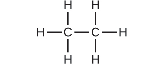

## Verkefni

### 3.1 Formúlumassi og mólhugtakið

[1](http://openstax.org/books/chemistry-2e/pages/chapter-3#fs-idp14760336-solution).

Hver er heildarmassi (amu) kolefnis í hverri eftirfarandi sameinda?

\(a\) CH~4~

\(b\) CHCl~3~

\(c\) C~12~H~10~O~6~

\(d\) CH~3~CH~2~CH~2~CH~2~CH~3~

2\.

Hver er heildarmassi vetnis í hverri sameindanna?

\(a\) CH~4~

\(b\) CHCl~3~

\(c\) C~12~H~10~O~6~

\(d\) CH~3~CH~2~CH~2~CH~2~CH~3~

[3](http://openstax.org/books/chemistry-2e/pages/chapter-3#fs-idp14091664-solution).

Reiknaðu sameinda- eða formúlumassa hvers eftirfarandi:

\(a\) P~4~

\(b\) H~2~O

\(c\) Ca(NO~3~)~2~

\(d\) CH~3~CO~2~H (ediksýra)

e\) C~12~H~22~O~11~ (súkrósi, reyrsykur)

4\.

Ákvarðaðu sameindamassa eftirfarandi efnasambanda:

\(a\)

{width="1.625in" height="0.625in"}

\(b\)

{width="1.625in" height="0.155in"}

\(c\)

{width="1.625in" height="0.585in"}

\(d\)

{width="1.625in" height="0.68in"}

[5](http://openstax.org/books/chemistry-2e/pages/chapter-3#fs-idp20009152-solution).

Ákvarðaðu sameindamassa eftirfarandi efnasambanda:

\(a\)

{width="1.625in" height="0.61in"}

\(b\)

{width="1.625in" height="0.67in"}

\(c\)

{width="1.625in" height="0.67in"}

\(d\)

{width="1.625in" height="0.675in"}

6\.

Hvaða sameind hefur sameindamassa upp á 28,05 amu?

\(a\)

{width="1.625in" height="0.18in"}

\(b\)

{width="1.625in" height="0.59in"}

\(c\)

{width="1.625in" height="0.665in"}

[7](http://openstax.org/books/chemistry-2e/pages/chapter-3#fs-idp17737968-solution).

Skrifaðu setningu sem lýsir því hvernig ákvarða má fjölda móla af efnasambandi í þekktum massa efnasambandsins með því að nota sameindaformúlu þess.

8\.

Berðu saman 1 mól af H~2~, 1 mól af O~2~ og 1 mól af F~2~.

\(a\) Hvað hefur stærsta fjölda sameinda? Útskýrðu hvers vegna.

\(b\) Hvað hefur mesta massann? Útskýrðu hvers vegna.

[9](http://openstax.org/books/chemistry-2e/pages/chapter-3#fs-idp50267072-solution).

Hvað inniheldur mesta súrefnismassann: 0,75 mól af etanóli (C~2~H~5~OH), 0,60 mól af maurasýru (HCO~2~H) eða 1,0 mól af vatni (H~2~O)? Útskýrðu hvers vegna.

10\.

Hvað inniheldur mesta fjölda móla af súrefnisatómum: 1 mól af etanóli (C~2~H~5~OH), 1 mól af maurasýru (HCO~2~H) eða 1 mól af vatni (H~2~O)? Útskýrðu hvers vegna.

[11](http://openstax.org/books/chemistry-2e/pages/chapter-3#fs-idp23072-solution).

Hvernig eru sameindamassi og mólmassi efnasambands svipaðir og hvernig eru þeir ólíkir?

12\.

Reiknaðu mólmassa hvers eftirfarandi efnasambands:

\(a\) vetnisflúoríð, HF

\(b\) ammoníak, NH~3~

\(c\) saltpéturssýra, HNO~3~

\(d\) silfursúlfat, Ag~2~SO~4~

\(e\) bórsýra, B(OH)~3~

[13](http://openstax.org/books/chemistry-2e/pages/chapter-3#fs-idp51968592-solution).

Reiknaðu mólmassa eftirfarandi:

\(a\) S~8~

\(b\) C~5~H~12~

\(c\) Sc~2~(SO~4~)~3~

\(d\) CH~3~COCH~3~ (aseton)

e\) C~6~H~12~O~6~ (glúkósi)

14\.

Reiknaðu reynsluformúlu- eða sameindaformúlumassa og mólmassa eftirfarandi steinefna:

\(a\) kalksteinn, CaCO~3~

\(b\) halít, NaCl

\(c\) berýl, Be~3~Al~2~Si~6~O~18~

\(d\) malakít, Cu~2~(OH)~2~CO~3~

e\) túrkís, CuAl~6~(PO~4~)~4~(OH)~8~(H~2~O)~4~

[15](http://openstax.org/books/chemistry-2e/pages/chapter-3#fs-idp56656128-solution).

Reiknaðu mólmassa eftirfarandi:

\(a\) svæfingahalótan, C~2~HBrClF~3~

\(b\) illgresiseyðirinn paraquat, C~12~H~14~N~2~Cl~2~

\(a\) koffín, C~8~H~10~N~4~O~2~

\(d\) þvagefni, CO(NH~2~)~2~

e\) dæmigerð sápa, C~17~H~35~CO~2~Na

16\.

Ákvarðaðu fjölda móla af efnasambandinu og fjölda móla af hverri atómtegund í eftirfarandi:

\(a\) 25,0 g af própýleni, C~3~H~6~

\(b\) 3,06 $\times$ 10^−3^ g af amínósýrunni glýsíni, C~2~H~5~NO~2~

\(c\) 25 pund af illgresiseyðinum Treflan, C~13~H~16~N~2~O~4~F (1 lb = 454 g)

\(d\) 0,125 kg af skordýraeitrinu Paris Green, Cu~4~(AsO~3~)~2~(CH~3~CO~2~)~2~

e\) 325 mg af aspiríni, C~6~H~4~(CO~2~H)(CO~2~CH~3~)

[17](http://openstax.org/books/chemistry-2e/pages/chapter-3#fs-idp56804240-solution).

Ákvarðaðu massa eftirfarandi:

\(a\) 0,0146 mól KOH

\(b\) 10,2 mól etan, C~2~H~6~

\(c\) 1,6 $\times$ 10^−3^ mól Na~2~SO~4~

(d ) 6,854 $\times$ 10^3^ mól glúkósa, C~6~ H~12~O~6~

e\) 2,86 mól Co(NH~3~)~6~Cl~3~

18\.

Ákvarðaðu fjölda móla af efnasambandinu og fjölda móla af hverri atómtegund í eftirfarandi:

\(a\) 2,12 g af kalíumbrómíði, KBr

\(b\) 0,1488 g af fosfórsýru, H~3~PO~4~

\(c\) 23 kg af kalsíumkarbónati, CaCO~3~

\(d\) 78,452 g af álsúlfati, Al~2~(SO~4~)~3~

e\) 0,1250 mg af koffíni, C~8~H~10~N~4~O~2~

[19](http://openstax.org/books/chemistry-2e/pages/chapter-3#fs-idp50969136-solution).

Ákvarðaðu massa eftirfarandi:

\(a\) 2,345 mól LiCl

\(b\) 0,0872 mól asetýlen, C~2~H~2~

\(c\) 3,3 $\times$ 10^−2^ mól Na~2~CO~3~

\(d\) 1,23 $\times$ 10^3^ mól frúktósi, C~6~H~12~O~6~

\(e\) 0,5758 mól FeSO~4~(H~2~O)~7~

20\.

Áætluð lágmarks dagleg næringarþörf fyrir amínósýruna lefsín, C~6~H~13~NO~2~, er 1,1 g. Hver er þessi þörf í mólum?

[21](http://openstax.org/books/chemistry-2e/pages/chapter-3#fs-idp41416224-solution).

Ákvarðaðu massa í grömmum fyrir eftirfarandi:

\(a\) 0,600 mól af súrefnisatómum

\(b\) 0,600 mól af súrefnissameindum, O~2~

\(c\) 0,600 mól af ósonsameindum, O~3~

22\.

55 kg kona hefur 7,5 $\times$ 10^−3^ mól af blóðrauða (mólmassi = 64,456 g/mól) í blóði sínu. Hversu margar blóðrauðasameindir eru þetta? Hvert er þetta magn í grömmum?

[23](http://openstax.org/books/chemistry-2e/pages/chapter-3#fs-idp42864672-solution).

Ákvarðaðu fjölda atóma og massa sirkons, kísils og súrefnis sem finnast í 0,3384 mólum af sirkoni, ZrSiO~4~, sem er hálfeðalsteinn.

24\.

Ákvarðaðu hvað af eftirfarandi inniheldur mesta massa vetnis: 1 mól af CH~4~, 0,6 mól af C~6~H~6~ eða 0,4 mól af C~3~H~8~.

[25](http://openstax.org/books/chemistry-2e/pages/chapter-3#fs-idp40492096-solution).

Ákvarðaðu hvað af eftirfarandi inniheldur mestan massa áls: 122 g afAlPO~4~, 266gaf Al~2~Cl~6~ eða 225 g af Al~2~S~3~.

26\.

Demantur er eitt form frumefnisins kolefnis. Trúlofunarhringur inniheldur demant sem vegur 1,25 karöt (1 karat = 200 mg). Hversu mörg atóm eru í demantinum?

[27](http://openstax.org/books/chemistry-2e/pages/chapter-3#fs-idp41325184-solution).

Cullinan-demanturinn var stærsti náttúrulegi demantur sem fundist hefur (25. janúar 1905). Hann vó 3104 karöt (1 karat = 200 mg). Hversu mörg kolefnisatóm voru í steininum?

28\.

Einn 55 gramma skammtur af tilteknu morgunkorni gefur 270 mg af natríum, sem er 11% af ráðlögðum dagskammti. Hversu mörg mól og atóm af natríum eru í ráðlögðum dagskammti?

[29](http://openstax.org/books/chemistry-2e/pages/chapter-3#fs-idp71747216-solution).

Tiltekið hnetukurl inniheldur 11,0 grömm af sykri (súkrósa, C~12~H~22~O~11~) í hverjum 60,0 gramma skammti. Hversu marga skammta af þessu morgunkorni þarf að borða til að neyta 0,0278 móla af sykri?

30\.

Túpa af tannkremi inniheldur 0,76 g af natríummónóflúorfosfati (Na~2~PO~3~F) í 100 ml.

\(a\) Hver var massi flúoratómanna í mg?

\(b\) Hversu mörg flúoríðatóm voru til staðar?

[31](http://openstax.org/books/chemistry-2e/pages/chapter-3#fs-idp40890272-solution).

Hvað af eftirfarandi táknar fæstar sameindir?

\(a\) 20,0 g af H~2~O (18,02 g/mól)

\(b\) 77,0 g af CH~4~ (16,06 g/mól)

\(c\) 68,0 g af C~3~H~6~ (42,08 g/mól)

\(d\) 100,0 g af N~2~O (44,02 g/mól)

\(e\) 84,0 g af HF (20,01 g/mól)

### 3.2 Ákvörðun reynsluformúla og sameindaformúla

32\.

Hvaða upplýsingar þarf til að ákvarða sameindaformúlu efnasambands út frá reynsluformúlunni?

[33](http://openstax.org/books/chemistry-2e/pages/chapter-3#fs-idm130496608-solution).

Reiknaðu eftirfarandi með fjórum markverðum stöfum:

\(a\) prósentusamsetning ammóníaks, NH~3~

\(b\) prósentusamsetning framköllunarvökva fyrir ljósmyndir („hypo"), Na~2~S~2~O~3~

\(c\) hundraðshluti (prósenta) kalsíumjóna í Ca~3~(PO~4~)~2~

34\.

Ákvarðaðu eftirfarandi með fjórum markverðum stöfum:

\(a\) prósentusamsetning vetnisasíðsýru, HN~3~

\(b\) prósentusamsetning TNT, C~6~H~2~(CH~3~)(NO~2~)~3~

\(c\) hundraðshluti (prósenta) SO~4~^2-^ í Al~2~(SO~4~)~3~

[35](http://openstax.org/books/chemistry-2e/pages/chapter-3#fs-idp103798128-solution).

Ákvarðið hlutfall ammoníaks, NH~3~, í Co(NH~3~)~6~Cl~3~, með þremur markverðum stöfum.

36\.

Ákvarðið hlutfall vatns í CuSO~4~∙5H~2~O með þremur markverðum stöfum.

[37](http://openstax.org/books/chemistry-2e/pages/chapter-3#fs-idm2827872-solution).

Ákvarðaðu reynsluformúlur fyrir efnasambönd með eftirfarandi prósentusamsetningu:

\(a\) 15,8% kolefni og 84,2% brennisteinn

\(b\) 40,0% kolefni, 6,7% vetni og 53,3% súrefni

38\.

Ákvarðaðu reynsluformúlur fyrir efnasambönd með eftirfarandi prósentusamsetningu:

\(a\) 43,6% fosfór og 56,4% súrefni

\(b\) 28,7% K, 1,5% H, 22,8% P og 47,0% O

[39](http://openstax.org/books/chemistry-2e/pages/chapter-3#fs-idm108358432-solution).

Efnasamband kolefnis og vetnis inniheldur 92,3% C og hefur mólmassa 78,1 g/mól. Hver er sameindaformúla þess?

40\.

Díklóretan, efnasamband sem er oft notað í fatahreinsun, inniheldur kolefni, vetni og klór. Það hefur mólmassa 99 g/mól. Greining á sýni sýnir að það inniheldur 24,3% kolefni og 4,1% vetni. Hver er sameindaformúla þess?

[41](http://openstax.org/books/chemistry-2e/pages/chapter-3#fs-idm149528800-solution).

Ákvarðaðu reynsluformúlu og sameindaformúlu fyrir krýsótíl-asbest. Krýsótíl hefur eftirfarandi prósentusamsetningu: 28,03% Mg, 21,60% Si, 1,16% H og 49,21% O. Mólmassi krýsótíls er 520,8 g/mól.

42\.

Fjölliður eru stórar sameindir sem samanstanda af einföldum einingum sem endurteknar eru mörgum sinnum. Þess vegna hafa þær oft tiltölulega einfaldar reynsluformúlur. Reiknaðu reynsluformúlur eftirfarandi fjölliða:

\(a\) Lucite (Plexiglas); 59,9% C, 8,06% H, 32,0% O

\(b\) Saran; 24,8% C, 2,0% H, 73,1% Cl

\(c\) pólýetýlen; 86% C, 14% H

\(d\) pólýstýren; 92,3% C, 7,7% H

\(e\) Orlon; 67,9% C, 5,70% H, 26,4% N

[43](http://openstax.org/books/chemistry-2e/pages/chapter-3#fs-idp63104368-solution).

Stór framleiðandi á textíllitunarefnum þróaði nýtt gult litarefni. Litarefnið hefur prósentusamsetninguna 75,95% C, 17,72% N og 6,33% H miðað við massa og mólmassa um 240 g/mól. Ákvarðaðu sameindaformúlu litarefnisins.

### 3.3 Mólstyrkur

44\.

Útskýrðu hvað breytist og hvað helst óbreytt þegar 1,00 L af lausn af NaCl er þynnt í 1,80 L.

[45](http://openstax.org/books/chemistry-2e/pages/chapter-3#fs-idm66121488-solution).

Hvaða upplýsingar þarf til að reikna út mólstyrk brennisteinssýrulausnar?

46\.

200 ml sýni og 400 ml sýni af saltlausn hafa sama mólstyrk. Að hvaða leyti eru sýnin tvö eins? Að hvaða leyti eru þessi tvö sýni ólík?

[47](http://openstax.org/books/chemistry-2e/pages/chapter-3#fs-idm98103760-solution).

Ákvarðaðu mólstyrk fyrir hverja af eftirfarandi lausnum:

\(a\) 0,444 mól af CoCl~2~ í 0,654 L af lausn

\(b\) 98,0 g af fosfórsýru, H~3~PO~4~, í 1,00 L af lausn

\(c\) 0,2074 g af kalsíumhýdroxíði, Ca(OH)~2~, í 40,00 ml af lausn

\(d\) 10,5kg af Na~2~SO~4~·10H~2~O í 18,60 L af lausn

\(e\) 7,0 $\times$ 10^−3^ mól af I~2~ í 100,0 ml af lausn

\(f\) 1,8 $\times$ 10^4^ mg af HCl í 0,075 L af lausn

48\.

Ákvarðaðu mólstyrk hverrar af eftirfarandi lausnum:

\(a\) 1,457 mól KCl í 1,500 l af lausn

\(b\) 0,515 g af H~2~SO~4~ í 1,00 L af lausn

\(c\) 20,54 g af Al(NO~3~)~3~ í 1575 ml af lausn

\(d\) 2,76kg af CuSO~4~·5H~2~O í 1,45 L af lausn

\(e\) 0,005653 mól af Br~2~ í 10,00 ml af lausn

\(f\) 0,000889 g af glýsíni, C~2~H~5~NO~2~, í 1,05 ml af lausn

[49](http://openstax.org/books/chemistry-2e/pages/chapter-3#fs-idm62194192-solution).

Íhugaðu þessa spurningu: Hver er massi uppleysta efnisins í 0,500 L af 0,30 *M* glúkósa, C~6~H~12~O~6~, sem notaður er til inndælingar í bláæð?

\(a\) Lýstu skrefunum sem nauðsynleg eru til að svara spurningunni.

\(b\) Svaraðu spurningunni.

50\.

Íhugaðu þessa spurningu: Hver er massi uppleysta efnisins í 200,0 L af 1,556 *M* lausn af KBr?

\(a\) Lýstu skrefunum sem nauðsynleg eru til að svara spurningunni.

\(b\) Svaraðu spurningunni.

[51](http://openstax.org/books/chemistry-2e/pages/chapter-3#fs-idm62322112-solution).

Reiknaðu fjölda móla og massa uppleysta efnisins í hverri af eftirfarandi lausnum:

\(a\) 2,00 L af 18,5 *M* H~2~SO~4~, óblandaðri brennisteinssýru

\(b\) 100,0 ml af 3,8 $\times$ 10^−6^ *M* NaCN, lágmarks banvænn styrkur natríumsýaníðs í sermi

\(c\) 5,50 L af 13,3 *M* H~2~CO, formaldehýðið sem notað er til að „festa" vefjasýni

\(d\) 325 ml af 1,8 $\times$ 10^−6^ *M* FeSO~4~, lágmarksstyrkur járnsúlfats greinanlegur með bragði í drykkjarvatni

52\.

Reiknaðu fjölda móla og massa uppleysta efnisins í hverri af eftirfarandi lausnum:

\(a\) 325 ml af 8,23 $\times$ 10^−5^ *M* KI, joðgjafi í fæðu

\(b\) 75,0 ml af 2,2 $\times$ 10^−5^ *M* H~2~SO~4~, sýni af súru regni

\(c\) 0,2500 L af 0,1135 *M* K~2~CrO~4~, greiningarhvarfefni sem notað er í járngreiningum

\(d\) 10,5 L af 3,716 *M* (NH~4~)~2~SO~4~, fljótandi áburður

[53](http://openstax.org/books/chemistry-2e/pages/chapter-3#fs-idm26500064-solution).

Íhugaðu þessa spurningu: Hver er mólstyrkur KMnO~4~ þegar 0,0908 g af KMnO~4~ hafa verið leyst upp í 0,500 L af vatni?

\(a\) Lýstu skrefunum sem nauðsynleg eru til að svara spurningunni.

\(b\) Svaraðu spurningunni.

54\.

Íhugaðu þessa spurningu: Hver er mólstyrkur HCl ef 35,23 ml af lausn af HCl innihalda 0,3366 g af HCl?

\(a\) Lýstu skrefunum sem nauðsynleg eru til að svara spurningunni.

\(b\) Svaraðu spurningunni.

[55](http://openstax.org/books/chemistry-2e/pages/chapter-3#fs-idm26577792-solution).

Reiknaðu mólstyrk hverrar af eftirfarandi lausnum:

\(a\) 0,195 g af kólesteróli, C~27~H~46~O, í 0,100 L af sermi, meðalstyrkur kólesteróls í sermi manna

\(b\) 4,25 g af NH~3~ í 0,500 L af lausn, styrkur NH~3~ í ammoníaki til heimilisnota

\(c\) 1,49 kg af ísóprópýlalkóhóli, C~3~H~7~OH, í 2,50 L af lausn, styrkur ísóprópýlalkóhóls í sótthreinsandi spritti

\(d\) 0,029 g af I~2~ í 0,100 L af lausn, leysni I~2~ í vatni við 20 °C

56\.

Reiknaðu mólstyrk hverrar af eftirfarandi lausnum:

\(a\) 293 g af HCl í 666 ml af lausn, óblandaðri HCl-lausn

\(b\) 2,026 g af FeCl~3~ í 0,1250 L af lausn sem er notuð sem óþekkt efni í almennum efnafræðitilraunum

\(c\) 0,001 mg af Cd^2+^ í 0,100 L, leyfilegur hámarksstyrkur kadmíums í drykkjarvatni

\(d\) 0,0079 g af C~7~H~5~SNO~3~ í einni únsu (29,6 ml), styrkur sakkaríns í sykurlausum gosdrykk.

[57](http://openstax.org/books/chemistry-2e/pages/chapter-3#fs-idm26521728-solution).

Það er um það bil 1,0 g af kalsíum, sem Ca^2+^, í 1,0 L af mjólk. Hver er mólstyrkur Ca^2+^ í mjólk?

58\.

Hvaða rúmmál af 1,00 *M* Fe(NO~3~)~3~ lausn má þynna til að útbúa 1,00 L af lausn með styrkinn 0,250 *M*?

[59](http://openstax.org/books/chemistry-2e/pages/chapter-3#fs-idm27167936-solution).

Ef 0,1718 L af 0,3556 *M* C~3~H~7~OH-lausn er þynnt í styrkinn 0,1222 *M*, hvert er rúmmál lausnarinnar sem myndast?

60\.

Ef 4,12 L af 0,850 *M* H~3~PO~4~ lausn er þynnt í rúmmálið 10,00 L, hver er styrkur lausnarinnar sem myndast?

[61](http://openstax.org/books/chemistry-2e/pages/chapter-3#fs-idm27694256-solution).

Hvaða rúmmál af 0,33 *M* C~12~H~22~O~11~ lausn er hægt að þynna til að útbúa 25 ml af lausn með styrkinn 0,025 *M*?

62\.

Hver er styrkur NaCl-lausnarinnar sem myndast þegar 0,150 L af 0,556 *M* lausn fær að gufa upp þar til rúmmálið hefur minnkað í 0,105 L?

[63](http://openstax.org/books/chemistry-2e/pages/chapter-3#fs-idm27672496-solution).

Hver er mólstyrkur þynntu lausnarinnar þegar hver af eftirfarandi lausnum er þynnt í uppgefið lokarúmmál?

\(a\) 1,00 L af 0,250 *M* lausn af Fe(NO~3~)~3~ er þynnt í lokarúmmálið 2,00 L

\(b\) 0,5000 L af 0,1222 *M* lausn af C~3~H~7~OH er þynnt í lokarúmmálið 1,250 L

\(c\) 2,35 L af 0,350 *M* lausn af H~3~PO~4~ er þynnt í lokarúmmálið 4,00 L

\(d\) 22,50 ml af 0,025 *M* lausn af C~12~H~22~O~11~ eru þynntir í 100,0 ml

64\.

Hver er lokastyrkur lausnarinnar sem myndast þegar 225,5 ml af 0,09988 *M* lausn af Na~2~CO~3~ fær að gufa upp þar til rúmmál lausnarinnar hefur minnkað í 45,00 ml?

[65](http://openstax.org/books/chemistry-2e/pages/chapter-3#fs-idm27373392-solution).

Keypt var 2,00 L flaska af óblandaðri HCl-lausn fyrir almenna efnafræðitilraun. Lausnin innihélt 868,8 g af HCl. Hver er mólstyrkur lausnarinnar?

66\.

Í efnafræðitilraun á rannsóknarstofu þarf 2,00 *M* lausn af HCl. Hversu marga ml af 11,9 *M* HCl þyrfti til að búa til 250 ml af 2,00 *M* HCl?

[67](http://openstax.org/books/chemistry-2e/pages/chapter-3#fs-idm26483264-solution).

Hvaða rúmmál af 0,20 *M* K~2~SO~4~ lausn inniheldur 57 g af K~2~SO~4~?

68\.

Umhverfisstofnun Bandaríkjanna (EPA) setur takmarkanir á magn eitraðra efna sem má losa í fráveitukerfið. Takmarkanir hafa verið settar fyrir ýmis efni, þar á meðal sexgilt króm, sem er takmarkað við 0,50 mg/L. Ef iðnaður losar sexgilt króm sem kalíumdíkrómat (K~2~Cr~2~O~7~), hver er hámarksleyfilegur mólstyrkur þess efnis?

### 3.4 Aðrar einingar fyrir styrk lausna

[69](http://openstax.org/books/chemistry-2e/pages/chapter-3#fs-idp14147136-solution).

Íhugaðu þessa spurningu: Hver er massi óblandaðrar lausnar af saltpéturssýru (68,0% HNO~3~ miðað við massa) sem þarf til að útbúa 400,0 g af 10,0% lausn af HNO~3~ miðað við massa?

\(a\) Lýstu skrefunum sem nauðsynleg eru til að svara spurningunni.

\(b\) Svaraðu spurningunni.

70\.

Hver er massi 4,00% NaOH-lausnar miðað við massa sem inniheldur 15,0 g af NaOH?

[71](http://openstax.org/books/chemistry-2e/pages/chapter-3#fs-idm26523680-solution).

Hver er massi fasts efnis NaOH (97,0% NaOH miðað við massa) sem þarf til að útbúa 1,00 L af 10,0% lausn af NaOH miðað við massa? Eðlismassi 10,0% lausnarinnar er 1,109 g/ml.

72\.

Hver er massi HCl í 45,0 ml af HCl vatnslausn sem hefur eðlismassann 1,19 g cm^--3^ og inniheldur 37,21% HCl miðað við massa?

[73](http://openstax.org/books/chemistry-2e/pages/chapter-3#fs-idm5149536-solution).

Harka vatns (hörkutala) er venjulega gefin upp í milljónustu hlutum (miðað við massa) af CaCO~3~, sem jafngildir milligrömmum af CaCO~3~ á hvern lítra af vatni. Hver er mólstyrkur Ca^2+^ jóna í vatnssýni með hörkutalningu 175 mg CaCO~3~/L?

74\.

Grunur lék á að kvikasilfursmagn í læk væri yfir þeim mörkum sem talin eru örugg (1 milljarðshluti miðað við þyngd). Greining leiddi í ljós að styrkurinn var 0,68 milljarðshlutar. Gerðu ráð fyrir eðlismassa upp á 1,0 g/ml og reiknaðu út mólstyrk kvikasilfurs í læknum.

[75](http://openstax.org/books/chemistry-2e/pages/chapter-3#fs-idm39094144-solution).

Í Kanada og Bretlandi sýna tæki sem mæla blóðsykur gildi í millimólum á lítra. Ef mæling sýnir 5,3 m*M*, hver er styrkur glúkósa (C~6~H~12~O~6~) í mg/dL?

76\.

Hálsúði er 1,40% fenól, C~6~H~5~OH, miðað við massa í vatni. Ef lausnin hefur eðlismassann 0,9956 g/ml, reiknaðu þá út mólstyrk lausnarinnar.

[77](http://openstax.org/books/chemistry-2e/pages/chapter-3#fs-idm39075008-solution).

Kopar(I)joðíði (CuI) er oft bætt í matarsalt sem joðgjafi í fæðu. Hversu mörg mól af CuI eru í 1,00 lb (454 g) af matarsalti sem inniheldur 0,0100% CuI miðað við massa?

78\.

Hóstasaft inniheldur 5,0% etýlalkóhól, C~2~H~5~OH, miðað við massa. Ef eðlismassi lausnarinnar er 0,9928 g/ml, ákvarðaðu þá mólstyrk alkóhólsins í hóstasaftinni.

[79](http://openstax.org/books/chemistry-2e/pages/chapter-3#fs-idp67228256-solution).

D5W er lausn sem notuð er sem vökvi í æð. Hún er 5,0% lausn af dextrósa (C~6~H~12~O~6~) í vatni miðað við massa. Ef eðlismassi D5W er 1,029 g/ml, reiknaðu þá út mólstyrk dextrósa í lausninni.

80\.

Finndu mólstyrk 40,0% vatnslausnar af brennisteinssýru, H~2~SO~4~, miðað við massa, en eðlismassi hennar er 1,3057 g/ml.
