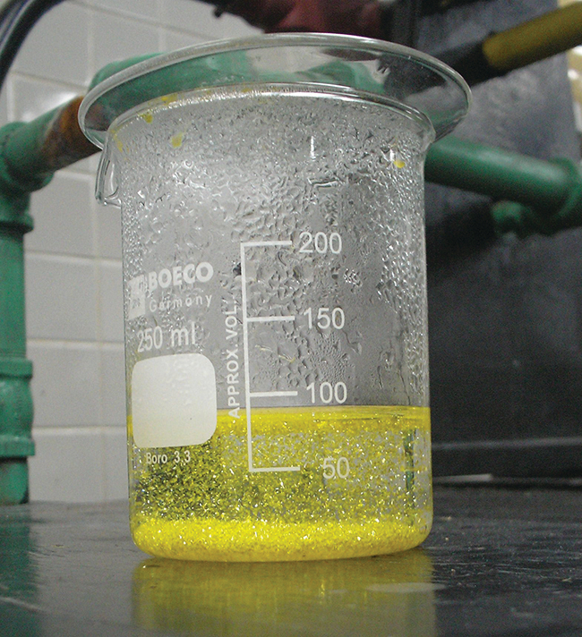

## 4.2 Flokkun efnahvarfa

:::note
### Námsmarkmið

Í lok þessa kafla muntu geta:

-   Skilgreint þrjár algengar gerðir efnahvarfa (útfellingu, sýru-basa og oxun-afoxun)
-   Flokkað efnahvörf sem eina af þessum þremur gerðum út frá viðeigandi lýsingum eða efnajöfnum
-   Þekkt algengar sýrur og basa
-   Spáð fyrir um leysni algengra ólífrænna efnasambanda með því að nota leysnireglur
-   Reiknað oxunartölur frumefna í efnasamböndum
:::

Fólk hefur samskipti sín á milli á margvíslegan og flókinn hátt og við flokkum þessi samskipti eftir algengum hegðunarmynstrum. Þegar tveir einstaklingar skiptast á upplýsingum segjum við að þeir séu í samskiptum. Þegar þeir skiptast á höggum með hnefum eða fótum segjum við að þeir séu að slást. Vísindamönnum hefur sömuleiðis þótt hentugt (eða jafnvel nauðsynlegt), þegar þeir standa frammi fyrir fjölbreyttri víxlverkun milli hreinna efna, að flokka efnahvörf með því að greina algeng mynstur hvarfgirni. Í þessum hluta verður kynning á þremur af algengustu gerðum efnahvarfa: útfellingu, sýru-basa og oxun-afoxun.

### Útfellingarhvörf og leysnireglur

Útfellingarhvarf er hvarf þar sem uppleyst efni hvarfast og mynda eina (eða fleiri) afurð á föstu formi. Mörg hvörf af þessari gerð fela í sér skipti á jónum milli jónaefna í vatnslausn og eru stundum kölluð *tvöföld skiptihvörf* eða *víxlun*. Þessi hvörf eru algeng í náttúrunni og bera ábyrgð á myndun kóralrifja í sjó og nýrnasteina í dýrum. Þau eru mikið notuð í iðnaði til framleiðslu á ýmsum almennum og sérhæfðum efnum. Útfellingarhvörf gegna einnig lykilhlutverki í mörgum efnafræðilegum greiningaraðferðum, þar á meðal dropaprófum sem notuð eru til að greina málmjónir og *þyngdarmælingaraðferðum* til að ákvarða samsetningu efnis (sjá síðasta hluta þessa kafla).

Að hve miklu leyti efni getur leyst upp í vatni, eða öðrum leysi, er magnbundið gefið upp sem leysni þess, sem er skilgreindur sem hámarksstyrkur efnis sem hægt er að ná við tilteknar aðstæður. Efni með tiltölulega mikla leysni eru sögð vera auðleyst. Efni myndar botnfall þegar aðstæður í lausninni eru þannig að styrkur þess fer yfir leysni þess. Efni með tiltölulega litla leysni eru sögð vera torleyst og þetta eru efnin sem falla auðveldlega út úr lausn. Nánari upplýsingar um þessi mikilvægu hugtök er að finna í síðari kafla um lausnir. Til að spá fyrir um hvaða föstu efni myndast við útfellingarhvörf má einfaldlega vísa til leysnimynstra sem hafa sést fyrir mörg jónaefni ([tafla 4.1](#fs-idp140132617697568)).

**Tafla 4.1: Leysnireglur fyrir algeng jónaefni**

| Leysni | Jónir | Undantekningar |
|---|---|---|
| **Auðleyst** | NH~4~^+^, katjónir úr flokki 1: Li^+^, Na^+^, K^+^, Rb^+^, Cs^+^ | ekkert |
| **Auðleyst** | Cl^-^, Br^-^, I^-^ | efnasambönd með Ag^+^, Hg~2~^2+^ og Pb^2+^ |
| **Auðleyst** | F^-^ | efnasambönd með málmkatjónir í flokki 2, Pb^2+^ og Fe^3+^ |
| **Auðleyst** | C~2~H~3~O~2~^-^, HCO~3~^-^, NO~3~^-^, ClO~3~^-^ | ekkert |
| **Auðleyst** | SO~4~^2-^ | efnasambönd með Ag^+^, Ba^2+^, Ca^2+^, Hg~2~^2+^, Pb^2+^ og Sr^2+^ |
| **Torleyst** | CO~3~^2-^, CrO~4~^2-^, PO~4~^3-^, S^2-^ | efnasambönd með katjónir í flokki 1 og NH~4~^+^ |
| **Torleyst** | OH^-^ | efnasambönd með katjónir í flokki 1 og Ba^2+^ |

Skýrt dæmi um botnfall sést þegar lausnum af kalíumjoðíði og blýnítrati er blandað saman, sem leiðir til myndunar á föstu blýjoðíði:

$2\text{KI}(aq) + \text{Pb}\left( \text{NO}_{3} \right)_{2}(aq)\  \rightarrow \ \text{PbI}_{2}(s) + 2\text{KNO}_{3}(aq)$

Þessi athugun er í samræmi við leysnireglurnar: Eina torleysta efnasambandið af öllum þeim sem koma við sögu er blýjoðíð, ein af undantekningunum frá almennri leysni joðíðsalta.

Nettójónajafnan sem táknar þetta hvarf er:

$\text{Pb}^{2 +}(aq) + 2\text{I}^{\text{−}}(aq)\  \rightarrow \ \text{PbI}_{2}(s)$

Blýjoðíð er skærgult fast efni sem áður var notað sem litarefni fyrir listamenn, þekkt sem joðgult ([mynd 4.4](#CNX_Chem_04_02_LeadIodide)). Eiginleikar hreinna PbI~2~ kristalla gera þá gagnlega til framleiðslu á nemum fyrir röntgengeisla og gammageisla.

Mynd 4.4 Botnfall af PbI~2~ myndast þegar lausnum sem innihalda Pb^2+^ og I^−^ er blandað saman (Heimild: Der Kreole/Wikimedia Commons)

Hægt er að nota leiðbeiningarnar um leysni í [töflu 4.1](#fs-idp140132617697568) til að spá fyrir um hvort útfellingarhvarf verði þegar lausnum með auðleystum jónaefnum er blandað saman. Það eina sem þarf að gera er að bera kennsl á allar jónirnar sem eru til staðar í lausninni og íhuga síðan hvort möguleg pörun katjóna og anjóna gæti leitt til torleysts efnasambands. Til dæmis, ef lausnum af silfurnítrati og natríumklóríði er blandað saman, myndast lausn sem inniheldur Ag^+^, $\text{NO}_{3}^{-},$ Na^+^ og Cl^−^ jónir. Fyrir utan þau tvö jónaefni sem upphaflega voru í lausnunum, AgNO~3~ og NaCl, er hægt að mynda tvö önnur jónaefni úr þessu safni jóna: NaNO~3~ og AgCl. Leiðbeiningarnar um leysni gefa til kynna að öll nítratsölt séu auðleyst en að AgCl sé eitt af þeim torleystu. Því er spáð að útfellingarhvarf muni eiga sér stað, eins og lýst er með eftirfarandi jöfnum:

:::example
### Dæmi 4.3: Að spá fyrir um útfellingarhvörf

Spáðu fyrir um niðurstöðuna þegar tiltölulega þéttum lausnum af eftirfarandi jónaefnum er blandað saman. Ef búist er við útfellingu, skrifaðu þá stillta nettójónajöfnu fyrir hvarfið.

\(a\) kalíumsúlfat og baríumnítrat

\(b\) litíumklóríð og silfurasetat

\(c\) blýnítrat og ammóníumkarbónat

**Lausn**

\(a\) Mögulegu myndefnin tvö fyrir þessa samsetningu eru KNO~3~ og BaSO~4~. Leiðbeiningarnar um leysni gefa til kynna að BaSO~4~ sé torleyst og því er búist við útfellingarhvarfi. Nettójónajafnan fyrir þetta hvarf, sem er leidd út á þann hátt sem lýst er í fyrri einingu, er

$\text{Ba}^{2 +}(aq) + \text{SO}_{4}^{2 -}(aq)\  \rightarrow \ \text{BaSO}_{4}(s)$

\(b\) Mögulegu myndefnin tvö fyrir þessasamsetningu eru LiC~2~H~3~O~2~ og AgCl. Leiðbeiningarnar um leysni gefa til kynna að AgCl sé torleyst og því er búist við útfellingarhvarfi. Nettójónajafnan fyrir þetta hvarf, sem er leidd út á þann hátt sem lýst er í fyrri einingu, er

$\text{Ag}^{\text{+}}(aq) + \text{Cl}^{\text{−}}(aq)\  \rightarrow \ \text{AgCl}(s)$

\(c\) Mögulegu myndefnin tvö fyrir þessa samsetningu eru PbCO~3~ og NH~4~NO~3~. Leiðbeiningarnar um leysni gefa til kynna að PbCO~3~ sé torleyst og því er búist við útfellingarhvarfi. Nettójónajafnan fyrir þetta hvarf, sem er leidd út á þann hátt sem lýst er í fyrri einingu, er

$\text{Pb}^{2 +}(aq) + \text{CO}_{3}^{2 -}(aq)\  \rightarrow \ \text{PbCO}_{3}(s)$
:::

:::practice-problem
**Prófaðu þekkingu þína**

Hvaða lausn væri hægt að nota til að fella út baríumjónina, Ba^2+^, í vatnssýni: natríumklóríð, natríumhýdroxíð eða natríumsúlfat? Hver er formúlan fyrir botnfallinu sem búast má við?

:::answer
natríumsúlfat, BaSO~4~
:::
:::

### Sýru-basa hvörf

Sýru-basa hvarf er hvarf þar sem vetnisjón, H^+^, flyst frá einni efnategund til annarrar. Slík hvörf eru afar mikilvæg í fjölmörgum náttúrulegum og tæknilegum ferlum, allt frá efnahvörfum sem eiga sér stað í frumum, vötnum og höfum, til iðnaðarframleiðslu á áburði, lyfjum og öðrum efnum sem eru nauðsynleg samfélaginu. Efnið sýru-basa efnafræði er því verðugt ítarlegrar umfjöllunar og heill kafli er helgaður þessu efni síðar í textanum.

Í þessari stuttu kynningu munum við aðeins skoða algengustu gerðir sýru-basa hvarfa sem eiga sér stað í vatnslausnum. Í þessu samhengi er sýra efni sem leysist upp í vatni og myndar hýdróníumjónir, H~3~O^+^. Sem dæmi má skoða jöfnuna sem sýnd er hér:

$\text{HCl}(aq) + \text{H}_{2}\text{O}(l)\  \rightarrow \ \text{Cl}^{\text{−}}(aq) + \text{H}_{3}\text{O}^{\text{+}}(aq)$

Ferlið sem þessi jafna táknar staðfestir að vetnisklóríð er sýra. Þegar það er leyst upp í vatni myndast H~3~O^+^ jónir með efnahvarfi þar sem H^+^ jónir flytjast frá HCl sameindum yfir á H~2~O sameindir ([mynd 4.5](#CNX_Chem_04_02_HClsoln)).

![This figure shows two flasks, labeled a and b. The flasks are both sealed with stoppers and are nearly three-quarters full of a liquid. Flask a is labeled H C l followed by g in parentheses. In the liquid there are approximately twenty space-filling molecular models composed of one red sphere and two smaller attached white spheres. The label H subscript 2 O followed by a q in parentheses is connected with a line to one of these models. In the space above the liquid in the flask, four space filling molecular models composed of one larger green sphere to which a smaller white sphere is bonded are shown. To one of these models, the label H C l followed by g in parentheses is attached with a line segment. An arrow is drawn from the space above the liquid pointing down into the liquid below. Flask b is labeled H subscript 3 O superscript positive sign followed by a q in parentheses. This is followed by a plus sign and C l superscript negative sign which is also followed by a q in parentheses. In this flask, no molecules are shown in the open space above the liquid. A label, C l superscript negative sign followed by a q in parentheses, is connected with a line segment to a green sphere. This sphere is surrounded by four molecules composed each of one red sphere and two white smaller spheres. A few of these same molecules appear separate from the green spheres in the liquid. A line segment connects one of them to the label H subscript 2 O which is followed by l in parentheses. There are a few molecules formed from one central larger red sphere to which three smaller white spheres are bonded. A line segment is drawn from one of these to the label H subscript 3 O superscript positive sign, followed by a q in parentheses.](./images/media/rId47.jpg)

Mynd 4.5 Þegar vetnisklóríðgas leysist upp í vatni, (a) hvarfast það sem sýra og flytur róteindir yfir á vatnssameindir til að mynda (b) hýdróníumjónir (og vatnsleystar klóríðjónir).

Eðli HCl er þannig að hvarf þess við vatn, eins og lýst var, er í raun 100% skilvirkt: Nánast hver einasta HCl sameind sem leysist upp í vatni mun gangast undir þetta hvarf. Sýrur sem hvarfast að fullu á þennan hátt eru kallaðar sterkar sýrur og HCl er eitt af fáum algengum sýruefnasamböndum sem flokkast sem sterk ([tafla 4.2](#fs-idp55395904)). Mun fleiri efnasambönd hegða sér sem veikar sýrur og hvarfast aðeins að hluta til við vatn, þannig að stór meirihluti uppleystra sameinda helst í upprunalegri mynd og tiltölulega lítið magn hýdróníumjóna myndast. Veikar sýrur eru algengar í náttúrunni og eru þau efni sem bera að hluta til ábyrgð á súra bragðinu af sítrusávöxtum, stingandi tilfinningunni frá skordýrabitum og óþægilegri lykt sem fylgir líkamslykt.. Þekkt dæmi um veika sýru er ediksýra, aðalefnið í matarediki:

$\text{CH}_{3}\text{CO}_{2}\text{H}(aq) + \text{H}_{2}\text{O}(l) \rightleftharpoons \text{CH}_{3}\text{CO}_{2}^{\text{−}}(aq) + \text{H}_{3}\text{O}^{\text{+}}(aq)$

Þegar ediksýra er leyst upp í vatni við venjulegar aðstæður eru aðeins um 1% af ediksýrusameindunum á jónuðu formi, $\text{CH}_{3}\text{CO}_{2}^{-}$ ([mynd 4.6](#CNX_Chem_04_02_Citrus)). (Notkun tvöfaldrar örvar í jöfnunni hér að ofan táknar að aðeins hluti efnahvarfsins á sér stað, hugtak sem er útskýrt ítarlega í köflunum um efnafræðilegt jafnvægi.)

![This figure contains two images, each with an associated structural formula provided in the lower left corner of the image. The first image is a photograph of a variety of thinly sliced, circular cross sections of citrus fruits ranging in color for green to yellow, to orange and reddish-orange. The slices are closely packed on a white background. The structural formula with this picture shows a central chain of five C atoms. The leftmost C atom has an O atom double bonded above and to the left and a singly bonded O atom below and to the left. This single bonded O atom has an H atom indicated in red on its left side which is highlighted in pink. The second C atom moving to the right has H atoms bonded above and below. The third C atom has a single bonded O atom above which has an H atom on its right. This third C atom has a C atom bonded below it which has an O atom double bonded below and to the left and a singly bonded O atom below and to the right. An H atom appears in red and is highlighted in pink to the right of the singly bonded O atom. The fourth C atom has H atoms bonded above and below. The fifth C atom is at the right end of the structure. It has an O atom double bonded above and to the right and a singly bonded O atom below and to the right. This single bonded O atom has a red H atom on its right side which is highlighted in pink. The second image is a photograph of bottles of vinegar. The bottles are labeled, "Balsamic Vinegar," and appear to be clear and colorless. The liquid in this bottle appears to be brown. The structural formula that appears with this image shows a chain of two C atoms. The leftmost C atom has H atoms bonded above, below, and to the left. The C atom on the right has a doubly bonded O atom above and to the right and a singly bonded O atom below and to the right. This O atom has an H atom bonded to its right which is highlighted in pink.](./images/media/rId54.jpg)

Mynd 4.6 (a) Ávextir eins og appelsínur, sítrónur og greipaldin innihalda veiku sýruna sítrónusýru. (b) Edik inniheldur veiku sýruna ediksýru. (Heimild a: breytt útgáfa af verki eftir Scott Bauer; heimild b: breytt útgáfa af verki eftir Brücke-Osteuropa/Wikimedia Commons)

Algengar sterkar sýrur

| Formúla efnasambands | Heiti í vatnslausn |
|---|---|
| HBr | brómsýra |
| HCl | saltsýra |
| HI | joðsýra |
| HNO~3~ | saltpéturssýra |
| HClO~4~ | perklórsýra |
| H~2~SO~4~ | brennisteinssýra |

Tafla 4.2

Basi er efni sem leysist upp í vatni og myndar hýdroxíðjónir, OH^⁻^. Algengustu basarnir eru jónaefni sem samanstanda af katjónum alkalímálma eða jarðalkalímálma (flokkar 1 og 2) ásamt hýdroxíðjóninni -- til dæmis NaOH og Ca(OH)~2~. Ólíkt sýruefnasamböndunum sem rædd voru áður, hvarfast þessi efnasambönd ekki efnafræðilega við vatn; þau leysast þess í stað upp og klofna og losa hýdroxíðjónir beint út í lausnina. Til dæmis leysast KOH og Ba(OH)~2~ upp í vatni og klofna að fullu til að mynda katjónir (K^+^ og Ba^2+^) og hýdroxíðjónir, OH^⁻^. Þessir basar, ásamt öðrum hýdroxíðum sem klofna að fullu í vatni, eru taldir sterkir basar.

Tökum sem dæmi upplausn á lút (natríumhýdroxíði) í vatni:

$\text{NaOH}(s)\  \rightarrow \ \text{Na}^{\text{+}}(aq) + \text{OH}^{\text{−}}(aq)$

Þessi jafna staðfestir að natríumhýdroxíð er basi. Þegar NaOH er leyst upp í vatni klofnar það og myndar Na^+^ og OH^⁻^ jónir. Þetta á einnig við um öll önnur jónaefni sem innihalda hýdroxíðjónir. Þar sem klofnunarferlið er í raun fullkomið þegar jónaefni leysast upp í vatni við venjulegar aðstæður, eru NaOH og önnur jónísk hýdroxíð öll flokkuð sem sterkir basar.

Ólíkt jónískum hýdroxíðum mynda sum efnasambönd hýdroxíðjónir þegar þau eru leyst upp með því að hvarfast efnafræðilega við vatnssameindir. Í öllum tilvikum hvarfast þessi efnasambönd aðeins að hluta og eru því flokkuð sem veikir basar. Þessar tegundir efnasambanda eru einnig algengar í náttúrunni og mikilvægar vörur í ýmiss konar tækni. Til dæmis er heimsframleiðsla á veika basanum ammóníaki yfirleitt vel yfir 100 milljónir tonna á ári, en hann er mikið notaður sem landbúnaðaráburður, hráefni fyrir efnafræðilega myndun annarra efnasambanda og virkt efni í heimilishreinsiefnum ([mynd 4.7](#CNX_Chem_04_02_ammonia)). Þegar ammóníak er leyst upp í vatni hvarfast það að hluta til og myndar hýdroxíðjónir, eins og sýnt er hér:

$\text{NH}_{3}(aq) + \text{H}_{2}\text{O}(l) \rightleftharpoons \text{NH}_{4}^{\text{+}}(aq) + \text{OH}^{\text{−}}(aq)$

Þetta er, samkvæmt skilgreiningu, sýru-basa hvarf, í þessu tilviki felur það í sér flutning H^+^ jóna frá vatnssameindum yfir á ammóníaksameindir. Við venjulegar aðstæður er aðeins um 1% af uppleystu ammóníaki til staðar sem $\text{NH}_{4}^{+}$ jónir.

Mynd 4.7 Ammóníak er veikur basi sem notaður er í margvíslegum tilgangi. (a) Hreint ammóníak er almennt notað sem landbúnaðaráburður. (b) Þynntar lausnir af ammóníaki eru áhrifarík heimilishreinsiefni. (Heimild a: breytt útgáfa af verki eftir National Resources Conservation Service; heimild b: breytt útgáfa af verki eftir pat00139)

Hlutleysing er sérstök tegund sýru-basa hvarfs þar sem hvarfefnin eru sýra og basi (en ekki vatn) og myndefnin eru oft salt og vatn

$\text{acid} + \text{base}\  \rightarrow \ \text{salt} + \text{water}$

Til að lýsa hlutleysingu skulum við skoða hvað gerist þegar dæmigert sýrubindandi lyf eins og magnesíummjólk (vatnskennd lausn af föstu efninu Mg(OH)~2~) er tekið inn til að lina einkenni sem tengjast umfram-magasýru (HCl):

$\text{Mg}\text{(OH)}_{2}(s) + 2\text{HCl}(aq)\  \rightarrow \ \text{MgCl}_{2}(aq) + 2\text{H}_{2}\text{O}(l\text{).}$

Athugið að auk vatns myndar þetta efnahvarf salt, magnesíumklóríð.

:::example
### Dæmi 4.4: Að skrifa jöfnur fyrir sýru-basa efnahvörf

Skrifaðu stilltar efnajöfnur fyrir sýru-basa efnahvörfin sem lýst er hér:

\(a\) Veika sýran hýpóklórítsýra hvarfast við vatn

\(b\) Lausn af baríumhýdroxíði er hlutleyst með lausn af saltpéturssýru

**Lausn**

\(a\) Hvarfefnin tvö eru gefin, HOCl og H~2~O. Þar sem efnið er sagt vera sýra mun efnahvarf þess við vatn fela í sér flutning á H^+^ frá HOCl yfir á H~2~O til að mynda hýdróníumjónir, H~3~O^+^, og hýpóklórítjónir, OCl^−^.

$\text{HOCl}(aq) + \text{H}_{2}\text{O}(l) \rightleftharpoons \text{OCl}^{\text{−}}(aq) + \text{H}_{3}\text{O}^{\text{+}}(aq)$

Tvöföld ör á vel við í þessari jöfnu því hún gefur til kynna að HOCl sé veik sýra sem hefur ekki hvarfast að fullu.

\(b\) Hvarfefnin tvö eru gefin, Ba(OH)~2~ og HNO~3~. Þar sem þetta er hlutleysingarhvarf verða myndefnin tvö vatn og salt, sem samanstendur af katjón jóníska hýdroxíðsins (Ba^2+^) og anjóninni sem myndast þegar sýran flytur vetnisjón sína $\left( \text{NO}_{3}^{\text{−}} \right).$

$\text{Ba}\text{(OH)}_{2}(aq) + 2\text{HNO}_{3}(aq)\  \rightarrow \ \text{Ba}\left( \text{NO}_{3} \right)_{2}(aq) + 2\text{H}_{2}\text{O}(l)$
:::

:::practice-problem
**Prófaðu þekkingu þína**

Skrifaðu nettó jónajöfnuna sem táknar hlutleysingu á hvaða sterkri sýru sem er með jónísku hýdroxíði. (Vísbending: Íhugaðu jónirnar sem myndast þegar sterk sýra er leyst upp í vatni.)

:::answer
$\text{H}_{3}\text{O}^{\text{+}}(aq) + \text{OH}^{\text{−}}(aq)\  \rightarrow \ 2\text{H}_{2}\text{O}(l)$
:::
:::

 

:::note
### Efnafræði í daglegu lífi: Sýrubindandi lyf

Maginn okkar inniheldur lausn af um það bil 0,03 *M* HCl, sem hjálpar okkur að melta matinn sem við borðum. Sviðatilfinningin sem fylgir brjóstsviða stafar af því að magasýra lekur í gegnum vöðvalokuna efst í maganum og niður í neðri hluta vélindans. Slímhúð vélindans er ekki varin fyrir ætandi áhrifum magasýru eins og slímhúð magans er og afleiðingarnar geta verið mjög sársaukafullar. Þegar við fáum brjóstsviða líður okkur betur ef við minnkum umfram sýruna í vélindanu með því að taka sýrubindandi lyf. Eins og þú gætir hafa giskað á eru sýrubindandi lyf basar. Eitt algengasta sýrubindandi lyfið er kalsíumkarbónat, CaCO~3~. Efnahvarfið,

$\text{CaCO}_{3}(s) + 2\text{HCl}(aq)\  \rightleftharpoons \ \text{CaCl}_{2}(aq) + \text{H}_{2}\text{O}(l) + \text{CO}_{2}(g)$

hlutleysir ekki aðeins magasýru, heldur framleiðir það einnig CO~2~(*g*), sem getur leitt til ánægjulegs ropa.

Magnesíummjólk er sviflausn af hinum torleysta basa magnesíumhýdroxíði, Mg(OH)~2~. Hún virkar samkvæmt efnahvarfinu:

$\text{Mg}\left( \text{OH} \right)_{2}(s)\  \rightleftharpoons \ \text{Mg}^{2 +}(aq) + 2\text{OH}^{\text{−}}(aq)$

Hýdroxíðjónirnar sem myndast í þessu jafnvægi hvarfast síðan við hýdróníumjónirnar úr magasýrunni, þannig að:

$\text{H}_{3}\text{O}^{\text{+}} + \text{OH}^{\text{−}}\  \rightleftharpoons \ 2\text{H}_{2}\text{O}(l)$

Þetta efnahvarf framleiðir ekki koldíoxíð, en sýrubindandi lyf sem innihalda magnesíum geta haft hægðalosandi áhrif. Nokkur sýrubindandi lyf hafa álhýdroxíð, Al(OH)~3~, sem virkt efni. Álhýdroxíðið hefur tilhneigingu til að valda hægðatregðu og sum sýrubindandi lyf nota álhýdroxíð ásamt magnesíumhýdroxíði til að vega upp á móti aukaverkunum efnanna tveggja.
:::

 

:::note
### Efnafræði í daglegu lífi: Matreiðsluþættir efnafræðinnar

Dæmi um sýru-basa efnafræði eru mörg í heimi matargerðarlistar. Eitt dæmi er notkun matarsóda, eða natríumbíkarbónats, við bakstur. NaHCO~3~ er basi. Þegar hann hvarfast við sýru eins og sítrónusafa, súrmjólk eða sýrðan rjóma í deigi myndast loftbólur af koldíoxíðgasi við niðurbrot kolsýrunnar sem myndast og deigið „lyftir sér." Lyftiduft er blanda af natríumbíkarbónati og einu eða fleiri sýrusöltum sem hvarfast þegar efnin tvö komast í snertingu við vatn í deiginu

Margir setja gjarnan sítrónusafa eða edik, sem hvort tveggja eru sýrur, á eldaðan fisk ([mynd 4.8](#CNX_Chem_14_03_FishLemon)). Fiskar hafa rokgjörn amín (basa) í líkamskerfum sínum sem eru hlutleyst af sýrunum og mynda órokgjörn ammóníumsölt. Þetta dregur úr fiskilyktinni og gefur einnig „súrt" bragð sem virðist falla okkur í geð.

![An image is shown of two fish with heads removed and skin on with lemon slices placed in the body cavity. The first line of an equation below the image reads C H subscript 3 C O O H plus N H subscript 2 C H subscript 2 C H subscript 2 C H subscript 2 C H subscript 2 N H subscript 2 arrow C H subscript 3 C O O superscript negative sign plus N H subscript 3 superscript positive sign C H subscript 2 C H subscript 2 C H subscript 2 C H subscript 2 N H subscript 2. The second line of the equation reads Acetic acid plus sign Putrescine arrow Acetate ion plus sign Putrescinium ion.](./images/media/rId80.jpg)

Mynd 4.8 Hlutleysing á sér stað milli sítrónusýru í sítrónum eða ediksýru í ediki og basanna í fiskholdinu.

Súrsun er aðferð sem notuð er til að varðveita grænmeti með því að nýta náttúrulega framleitt súrt umhverfi. Grænmetið, til dæmis gúrka, er sett í lokaða krukku og látið liggja í saltlegi. Saltlögurinn ýtir undir vöxt gagnlegra baktería en hamlar vexti skaðlegra baktería. Gagnlegu bakteríurnar nærast á sterkju í gúrkunni og framleiða mjólkursýru sem úrgangsefni í ferli sem kallast gerjun. Mjólkursýran eykur að lokum sýrustig saltlagarins svo mikið að allar skaðlegar bakteríur, sem þurfa basískt umhverfi, drepast. Án skaðlegra baktería sem éta gúrkurnar geymast þær mun lengur en ella. Aukaafurð súrsunarferlisins breytir bragði grænmetisins og sýran gerir það súrt á bragðið.
:::

 

:::note
### Tengill á námsefni

Skoðaðu smásæja [sýn](http://openstax.org/l/16AcidsBases) á sterkar og veikar sýrur og basa.
:::

### Oxunar-afoxunarhvörf

Lofthjúpur jarðar inniheldur um 20% af súrefni í sameindaformi, O~2~, sem er hvarfgjarnt gas og gegnir mikilvægu hlutverki í efnaskiptum loftháðra lífvera og í mörgum umhverfisferlum sem móta heiminn. Hugtakið oxun var upphaflega notað til að lýsa efnahvörfum sem innihéldu O~2~, en merking þess hefur þróast og vísar nú til víðtæks og mikilvægs flokks efnahvarfa sem kallast *oxunar-afoxunarhvörf (redox)*. Nokkur dæmi um slík efnahvörf verða notuð til að gefa skýra mynd af þessari flokkun.

Sum oxunar-afoxunarhvörf fela í sér flutning rafeinda milli hvarfefna til að mynda jónaefni, eins og efnahvarfið milli natríums og klórs sem myndar natríumklóríð:

$\text{2Na}(s) + \text{Cl}_{2}(g)\  \rightarrow \ 2\text{NaCl}(s)$

Það er gagnlegt að skoða ferlið með tilliti til hvers einstaks hvarfefnis, það er að segja, að tákna örlög hvers hvarfefnis í formi jöfnu sem kallast hálfhvarf:

Þessar jöfnur sýna að Na-atóm *tapa rafeindum* á meðan Cl-atóm (í Cl~2~-sameindinni) *fá rafeindir*, og lágvísirinn „*s*" fyrir jónirnar sem myndast gefur til kynna að þær séu til staðar í formi fasts jónaefnis. Fyrir oxunar-afoxunarhvörf af þessu tagi skilgreina tap og ávinningur rafeinda þau viðbótarferli sem eiga sér stað:

Í þessu efnahvarfi *oxast* því natríum og klór afoxast. Frá virkara sjónarhorni séð virkar natríum sem afoxari, þar sem það gefur klór rafeindir (eða afoxar það). Á sama hátt virkar klór sem oxari, þar sem það fjarlægir í raun rafeindir frá natríum (oxar það).

Sum oxunar-afoxunarferli fela þó ekki í sér flutning rafeinda. Tökum sem dæmi efnahvarf sem líkist því sem myndar NaCl:

$\text{H}_{2}(g) + \text{Cl}_{2}(g)\  \rightarrow \ 2\text{HCl}(g)$

Myndefnið í þessu efnahvarfi er samgilt efnasamband, þannig að flutningur rafeinda í bókstaflegri merkingu á sér ekki stað. Til að skýra líkindi þessa efnahvarfs við það fyrra og leyfa ótvíræða skilgreiningu á oxunar-afoxunarhvörfum hefur eiginleiki sem kallast *oxunartala* verið skilgreindur. Oxunartala (eða oxunarástand) frumefnis í efnasambandi er hleðslan sem atóm þess hefðu *ef efnasambandið væri jónaefni*. Eftirfarandi leiðbeiningar eru notaðar til að úthluta oxunartölum til hvers frumefnis í sameind eða jón.

1.  Oxunartala atóms í frumefni er núll.
2.  Oxunartala einatóma jónar er jöfn hleðslu jónarinnar.
3.  Oxunartölur fyrir algenga málmleysingja eru venjulega sem hér segir:
    -   Vetni: +1 þegar það er í efnasambandi með málmleysingjum, −1 þegar það er í efnasambandi með málmum
    -   Súrefni: −2 í flestum efnasamböndum, stundum −1 (svokölluð peroxíð, $\text{O}_{2}^{\text{2−}}),$ mjög sjaldan $- \ \frac{1}{2}$ (svokölluð súperoxíð, $\text{O}_{2}^{\text{−}}),$ jákvæð gildi þegar það er í efnasambandi með F (gildi eru breytileg)
    -   Halógenar: −1 fyrir F alltaf, −1 fyrir aðra halógena nema þegar þeir eru í efnasambandi með súrefni eða öðrum halógenum (jákvæðar oxunartölur í þessum tilfellum, breytileg gildi)
4.  Summa oxunartalna allra atóma í sameind eða fjölfrumeinda jón er jöfn hleðslu sameindarinnar eða jónarinnar.

Athugið: Rétt venja til að skrá hleðslu er að skrifa töluna fyrst, fylgt eftir af formerkinu (t.d. 2+), á meðan oxunartala er skrifuð í öfugri röð, formerki fylgt eftir af tölu (t.d. +2). Þessi venja miðar að því að leggja áherslu á muninn á þessum tveimur skyldu eiginleikum.

:::example
### Dæmi 4.5: Úthlutun oxunartalna

Fylgdu leiðbeiningunum í þessum kafla textans til að úthluta oxunartölum til allra frumefna í eftirfarandi efnum:

\(a\) H2~S~

\(b\) $\text{SO}_{3}^{\text{2−}}$

\(c\) Na~2~SO~4~

**Lausn**

\(a\) Samkvæmt leiðbeiningu 3 er oxunartala H +1.

Með því að nota þessa oxunartölu og formúlu efnasambandsins má síðan nota leiðbeiningu 4 til að reikna út oxunartölu brennisteins:

\(b\) Leiðbeining 3 gefur til kynna að oxunartala súrefnis sé −2.

Með því að nota þessa oxunartölu og formúlu jónarinnar má síðan nota leiðbeiningu 4 til að reikna út oxunartölu brennisteins:

\(c\) Fyrir jónaefni er hentugt að úthluta oxunartölum fyrir katjónina og anjónina sérstaklega.

Samkvæmt leiðbeiningu 2 er oxunartala natríums +1

Ef gert er ráð fyrir venjulegri oxunartölu fyrir súrefni (−2 samkvæmt leiðbeiningu 3) er oxunartala brennisteins reiknuð eins og leiðbeining 4 segir til um:

:::

:::practice-problem
**Prófaðu þekkingu þína**

Úthlutaðu oxunartölum til frumefnanna sem eru undirstrikuð í eftirfarandi efnasamböndum eða jónum:

\(a\) K[N]{.underline}O~3~

\(b\) [Al]{.underline}H~3~

\(c\) $\underline{\text{N}}\text{H}_{4}^{+}$

\(d\) $\text{H}_{2}\underline{\text{P}}\text{O}_{4}^{-}$

:::answer
\(a\) N, +5; (b) Al, +3; (c) N, −3; (d) P, +5
:::
:::

Með því að nota hugtakið oxunartala hefur verið sett fram altæk skilgreining á oxunar-afoxunarhvarfi. Oxunar-afoxunarhvörf (redox) eru hvörf þar sem eitt eða fleiri frumefni sem taka þátt verða fyrir breytingu á oxunartölu. (Þótt langflest oxunar-afoxunarhvörf feli í sér breytingar á oxunartölu fyrir tvö eða fleiri frumefni, þá eru nokkrar áhugaverðar undantekningar frá þessari reglu, [sjá dæmi 4.6](#fs-idp180799104).) Skilgreiningar á viðbótarferlum þessa hvarfaflokks eru endurskoðaðar á sama hátt og sýnt er hér:

Ef við snúum aftur að efnahvörfunum sem notuð voru til að kynna þetta efni, má nú skilgreina þau bæði sem oxunar-afoxunarferli. Í hvarfinu milli natríums og klórs til að mynda natríumklóríð oxast natríum (oxunartala þess hækkar úr 0 í Na í +1 í NaCl) og klór afoxast (oxunartala þess lækkar úr 0 í Cl~2~ í −1 í NaCl). Í hvarfinu milli vetnissameinda og klórs oxast vetni (oxunartala þess hækkar úr 0 í H~2~ í +1 í HCl) og klór afoxast (oxunartala þess lækkar úr 0 í Cl~2~ í −1 í HCl).

Nokkrir undirflokkar oxunar-afoxunarhvarfa eru þekktir, þar á meðal brunahvörf þar sem afoxarinn (einnig kallaður *eldsneyti*) og oxarinn (oft, en ekki endilega, súrefnissameindir) hvarfast kröftuglega og framleiða umtalsvert magn af hita, og oft ljós, í formi loga. Efnahvörf í föstu eldflaugaeldsneyti, eins og það sem sýnt er á [mynd 4.1](http://openstax.org/books/chemistry-2e/pages/4-introduction#CNX_Chem_04_00_Rocket), eru brunaferli. Dæmigert drifefnishvarf þar sem fast ál er oxað af ammóníumperklórati er táknað með þessari jöfnu:

$10\text{Al}(s) + 6\text{NH}_{4}\text{ClO}_{4}(s)\  \rightarrow \ 4\text{Al}_{2}\text{O}_{3}(s) + 2\text{AlCl}_{3}(s) + 12\text{H}_{2}\text{O}(g) + 3\text{N}_{2}(g)$

:::note
### Tengill á námsefni

Horfðu á stutt [myndband](http://openstax.org/l/16hybridrocket) sem sýnir prufukeyrslu á smækkaðri frumgerð blendings eldflaugahreyfils sem áætlað er að nota í nýja Space Launch System sem NASA er að þróa. Fyrstu hreyflarnir sem fara í gang á\
3 s (grænn logi) nota blöndu af fljótandi eldsneyti/oxara og seinni, öflugri vélarnar sem kveikt er á við 4 s (gulur logi) nota fasta efnablöndu.
:::

Einföld útskiptahvörf eru oxunar-afoxunarhvörf þar sem jón í lausn er hrakin burt (eða henni skipt út) með oxun málmfrumefnis. Eitt algengt dæmi um þessa tegund hvarfs er oxun tiltekinna málma með sýru:

$\text{Zn}(s) + 2\text{HCl}(aq)\  \rightarrow \ \text{ZnCl}_{2}(aq) + \text{H}_{2}(g)$

Málmfrumefni geta einnig oxast af lausnum annarra málmsalta; til dæmis:

$\text{Cu}(s) + 2\text{AgNO}_{3}(aq)\  \rightarrow \ \text{Cu}\ \left( \text{NO}_{3} \right)_{2}(aq) + 2\text{Ag}(s)$

Þetta hvarf má sjá með því að setja koparvír í lausn sem inniheldur uppleyst silfursalt. Silfurjónir í lausninni afoxast í frumefnið silfur á yfirborði koparvírsins og Cu^2+^ jónirnar sem myndast leysast upp í lausninni og gefa henni einkennandi bláan lit ([mynd 4.9](#CNX_Chem_04_02_CuAgNO3)).

Mynd 4.9 (a) Koparvír er sýndur við hliðina á lausn sem inniheldur silfur(I)jónir. (b) Útskipting uppleystra silfurjóna með koparjónum leiðir til (c) uppsöfnunar á gráleitum silfurmálmi á vírnum og myndunar á bláum lit í lausninni vegna uppleystra koparjóna. (Heimild: breytt útgáfa af verki eftir Mark Ott)

:::example
### Dæmi 4.6: Lýsing á oxunar-afoxunarhvörfum

Tilgreindu hvaða jöfnur tákna oxunar-afoxunarhvörf og gefðu upp nafn á hvarfinu ef við á. Fyrir þau hvörf sem eru skilgreind sem oxunar-afoxunarhvörf, nefndu oxarann og afoxarann.

\(a\) $\text{ZnCO}_{3}(s)\  \rightarrow \ \text{ZnO}(s) + \text{CO}_{2}(g)$

\(b\) $2\text{Ga}(l) + 3\text{Br}_{2}(l)\  \rightarrow \ 2\text{GaBr}_{3}(s)$

\(c\) $2\text{H}_{2}\text{O}_{2}(aq)\  \rightarrow \ 2\text{H}_{2}\text{O}(l) + \text{O}_{2}(g)$

\(d\) $\text{BaCl}_{2}(aq) + \text{K}_{2}\text{SO}_{4}(aq)\  \rightarrow \ \text{BaSO}_{4}(s) + 2\text{KCl}(aq)$

\(e\) $\text{C}_{2}\text{H}_{4}(g) + 3\text{O}_{2}(g)\  \rightarrow \ 2\text{CO}_{2}(g) + 2\text{H}_{2}\text{O}(l)$

**Lausn**

Oxunar-afoxunarhvörf eru skilgreind sem slík ef eitt eða fleiri frumefni gangast undir breytingu á oxunartölu.

\(a\) Þetta er ekki oxunar-afoxunarhvarf þar sem oxunartölur allra frumefna eru óbreyttar.

\(b\) Þetta er oxunar-afoxunarhvarf. Gallíum oxast og oxunartala þess hækkar úr 0 í Ga(*l*) í +3 í GaBr~3~(*s*). Afoxarinn er Ga(*l*). Bróm afoxast og oxunartala þess lækkar úr 0 í Br~2~(*l*) í −1 í GaBr~3~(*s*). Oxarinn er Br~2~(*l*).

\(c\) Þetta er oxunar-afoxunarhvarf. Þetta er sérstaklega áhugavert ferli þar sem sama frumefnið, súrefni, gengst undir bæði oxun og afoxun (svokallað *sundurstigunarhvarf)*. Súrefni oxast og oxunartala þess hækkar úr −1 íH~2~O~2~(*aq*) í 0 í O~2~(*g*). Súrefni er einnig afoxað og oxunartala þess lækkar úr −1 í H~2~O~2~(*aq*) í −2 í H~2~O(*l*). Í sundurstigunarhvörfum virkar sama efnið sem oxari og afoxari.

\(d\) Þetta er ekki oxunar-afoxunarhvarf þar sem oxunartölur allra frumefna eru óbreyttar.

\(e\) Þetta er oxunar-afoxunarhvarf (bruni). Kolefni oxast og oxunartala þess hækkar úr −2 í C~2~H~4~(*g*) í +4 í CO~2~(*g*). Afoxarinn (eldsneytið) er C~2~H~4~(*g*). Súrefni er afoxað og oxunartala þess lækkar úr 0 í O~2~(*g*) í −2 í H~2~O(*l*). Oxarinn er O~2~(*g*).
:::

:::practice-problem
**Prófaðu þekkingu þína**

Þessi jafna lýsir framleiðslu á tin(II)klóríði:

$\text{Sn}(s) + 2\text{HCl}(g)\  \rightarrow \ \text{SnCl}_{2}(s) + \text{H}_{2}(g)$

Er þetta oxunar-afoxunarhvarf? Ef svo er, gefðu þá nákvæmara heiti á hvarfinu ef við á og tilgreindu oxara og afoxara.

:::answer
Já, einnar skiptingar hvarf. Sn(*s*) er afoxarinn, HCl(*g*) er oxarinn.
:::
:::

#### Að stilla oxunar-afoxunarhvörf með hálfhvarfsaðferðinni

Oxunar-afoxunarhvörf sem eiga sér stað í vatnslausn innihalda oft vatn, hýdróníumjónir og hýdroxíðjónir sem hvarfefni eða myndefni. Þótt þessar efnaeindir séu ekki oxaðar eða afoxaðar taka þær þátt í efnabreytingum á annan hátt (t.d. með því að útvega þau frumefni sem þarf til að mynda oxýanjónir). Jöfnur sem tákna þessi hvörf er stundum mjög erfitt að stilla með því að horfa á þær og því hafa verið þróaðar kerfisbundnar aðferðir til að aðstoða við ferlið. Ein mjög gagnleg aðferð er að nota hálfhvarfsaðferðina sem felur í sér eftirfarandi skref:

1\. Skrifaðu hálfhvörfin tvö sem tákna oxunar-afoxunarferlið.

2\. Stilltu öll frumefni nema súrefni og vetni.

3\. Stilltu súrefnisatóm með því að bæta við H~2~O sameindum.

4\. Stilltu vetnisatóm með því að bæta við H^+^-jónum.

5\. Stilltu hleðsluna með því að bæta við rafeindum.

6\. Ef nauðsyn krefur, margfaldaðu stuðla hvers hálfhvarfs með lægstu mögulegu heiltölum til að fá jafnan fjölda rafeinda í hvoru.

7\. Leggðu saman stilltu hálfhvörfin og einfaldaðu með því að fjarlægja efnaeindir sem koma fyrir báðum megin við jöfnuna.

8\. Fyrir hvörf sem eiga sér stað í basískum lausnum (umfram-hýdroxíðjónir), framkvæmdu þessi viðbótarskref:

a.  Bættu OH^−^-jónum við báðar hliðar jöfnunnar í sama fjölda og H ^+^-jónirnar.
b.  Á þeirri hlið jöfnunnar sem inniheldur bæði H^+^- og OH^−^-jónir, sameinaðu þessar jónir í vatnssameindir.
c.  Einfaldaðu jöfnuna með því að fjarlægja allar óþarfa vatnssameindir.

9\. Að lokum skaltu athuga hvort fjöldi atóma og heildarhleðslur[1](#fs-idm62282768) séu stillt.

1\.

Krafan um „hleðslujafnvægi" er bara sérstök tegund af „massajafnvægi" þar sem umræddar agnir eru rafeindir. Jafna verður að sýna jafnan fjölda rafeinda beggja vegna við hvarfefni og myndefni og því verður að jafna bæði atóm og hleðslur.

:::example
### Dæmi 4.7: Jöfnun oxunar-afoxunarhvarfa í súrri lausn

Skrifaðu jafnaða jöfnu fyrir hvarf díkrómatjónar og járns(II) sem gefur járn(III) og króm(III) í súrri lausn.

$\text{Cr}_{2}\text{O}_{7}^{\text{2−}} + \text{Fe}^{\text{2+}}\  \rightarrow \ \text{Cr}^{\text{3+}} + \text{Fe}^{\text{3+}}$

**Lausn**

1.  Skref 1.

-   *Skrifaðu hálfhvörfin tvö*.

    Hvert hálfhvarf mun innihalda eitt hvarfefni og eitt myndefni með eitt sameiginlegt frumefni.

    $\text{Fe}^{\text{2+}}\  \rightarrow \ \text{Fe}^{\text{3+}}$

    $\text{Cr}_{2}\text{O}_{7}^{\text{2−}}\  \rightarrow \ \text{Cr}^{\text{3+}}$

2.  Skref 2.

-   *Stilltu öll frumefni nema súrefni og vetni*. Járnhálfhvarfið er þegar stillt en krómhálfhvarfið sýnir tvö Cr-atóm vinstra megin og eitt Cr-atóm hægra megin. Með því að breyta stuðlinum hægra megin í jöfnunni í 2 er hún stillt með tilliti til Cr-atóma.

    $\text{Fe}^{\text{2+}}\  \rightarrow \ \text{Fe}^{\text{3+}}$

    $\text{Cr}_{2}\text{O}_{7}^{\text{2−}}\  \rightarrow \ 2\text{Cr}^{\text{3+}}$

3.  Skref 3.

-   *Stilltu súrefnisatóm með því að bæta við* H~2~O *sameindum*. Járnhálfhvarfið inniheldur ekki O-atóm. Krómhálfhvarfið sýnir sjö O-atóm vinstra megin og engin hægra megin, þannig að sjö vatnssameindum er bætt við hægra megin.

    

4.  Skref 4.

-   *Stilltu vetnisatóm með því að bæta við* H^+^*-jónum*. Járnhálfhvarfið inniheldur ekki H-atóm. Krómhálfhvarfið sýnir 14 H-atóm hægra megin og engin vinstra megin, þannig að 14 vetnisjónum er bætt við vinstra megin.

    $\text{Fe}^{\text{2+}}\  \rightarrow \ \text{Fe}^{\text{3+}}$

    $\text{Cr}_{2}\text{O}_{7}^{\text{2−}} + 14\text{H}^{+}\  \rightarrow \ 2\text{Cr}^{\text{3+}} + 7\text{H}_{2}\text{O}$

5.  Skref 5.

-   *Stilltu hleðsluna með því að bæta við rafeindum*. Járnhálfhvarfið sýnir heildarhleðslu 2+ vinstra megin (1 Fe2^+^-jón) og 3+ hægra megin (1 Fe^3+^-jón). Með því að bæta einni rafeind við hægra megin verður heildarhleðslan þeim megin (3+) + (1−) = 2+ og hleðslujafnvægi næst.

    Krómhálfhvarfið sýnir heildarhleðslu (1 $\times$ 2−) + (14 $\times$ 1+) = 12+ vinstra megin ${(\text{1 Cr}}_{2}\text{O}_{7}^{\text{2−}}$ jón og 14 H ^+^ jónir). Heildarhleðslan hægra megin er (2 $\times$ 3+) = 6 + (2 Cr^3+^-jónir). Með því að bæta sex rafeindum við vinstra megin verður heildarhleðslan þeim megin (12+ + 6−) = 6+ og hleðslujafnvægi næst.

    $\text{Fe}^{\text{2+}}\  \rightarrow \ \text{Fe}^{\text{3+}} + \text{e}^{-}$

    $\text{Cr}_{2}\text{O}_{7}^{\text{2−}} + 14\text{H}^{+} + 6\text{e}^{-}\  \rightarrow \ 2\text{Cr}^{\text{3+}} + 7\text{H}_{2}\text{O}$

6.  Skref 6.

-   *Margfaldaðu hálfhvörfin tvö þannig að fjöldi rafeinda í einu hvarfi sé jafn fjölda rafeinda í hinu hvarfinu*. Til að vera í samræmi við massavarðveislu og þá hugmynd að oxunar-afoxunarhvörf feli í sér flutning (ekki myndun eða eyðingu) rafeinda, verður að margfalda stuðul járnhálfhvarfsins með 6

    $\text{6Fe}^{\text{2+}}\  \rightarrow \ 6\text{Fe}^{\text{3+}} + 6\text{e}^{-}$

    $\text{Cr}_{2}\text{O}_{7}^{\text{2−}} + 6\text{e}^{-} + 14\text{H}^{+}\  \rightarrow \ 2\text{Cr}^{\text{3+}} + 7\text{H}_{2}\text{O}$

7.  Skref 7.

-   *Leggðu saman stilltu hálfhvörfin og fjarlægðu efni sem koma fyrir báðum megin við jöfnuna*.

    $6\text{Fe}^{\text{2+}} + \text{Cr}_{2}\text{O}_{7}^{\text{2−}} + 6\text{e}^{-} + 14\text{H}^{+}\  \rightarrow \ 6\text{Fe}^{\text{3+}} + 6\text{e}^{-} + 2\text{Cr}^{\text{3+}} + 7\text{H}_{2}\text{O}$

    Aðeins rafeindirnar sex eru óþarfar. Með því að fjarlægja þær úr báðum hliðum jöfnunnar fæst einfölduð, stillt jafna:

    $6\text{Fe}^{\text{2+}} + \text{Cr}_{2}\text{O}_{7}^{\text{2−}} + 14\text{H}^{+}\  \rightarrow \ 6\text{Fe}^{\text{3+}} + 2\text{Cr}^{\text{3+}} + 7\text{H}_{2}\text{O}$

Lokaathugun á jafnvægi atóma og hleðslu staðfestir að jafnan er stillt.

| Frumefni | Hvarfefni | Myndefni |
|---|---|---|
| Fe | 6 | 6 |
| Cr | 2 | 2 |
| O | 7 | 7 |
| H | 14 | 14 |
| hleðsla | 24+ | 24+ |
:::

:::practice-problem
**Prófaðu þekkingu þína**

Í basískri lausn hvarfast klórsameindir, Cl~2~, við hýdroxíðjónir, OH^−^, til að mynda klóríðjónir, Cl^−^. og klóratjónir, ClO~3~^−^. VÍSBENDING: Þetta er *sundurstigunarhvarf* þar sem frumefnið klór er bæði oxað og afoxað. Skrifaðu stillta efnajöfnu fyrir þetta hvarf.

:::answer
$3\text{Cl}_{2}(aq) + 6\text{OH}^{\text{−}}(aq)\  \rightarrow \ 5\text{Cl}^{\text{−}}(aq) + \text{ClO}_{3}^{\text{−}}(aq) + 3\text{H}_{2}\text{O}(l)$
:::
:::
