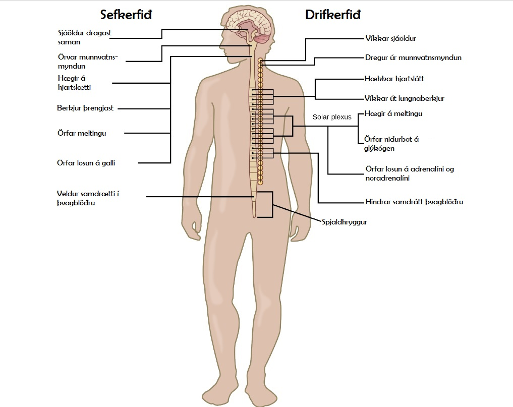
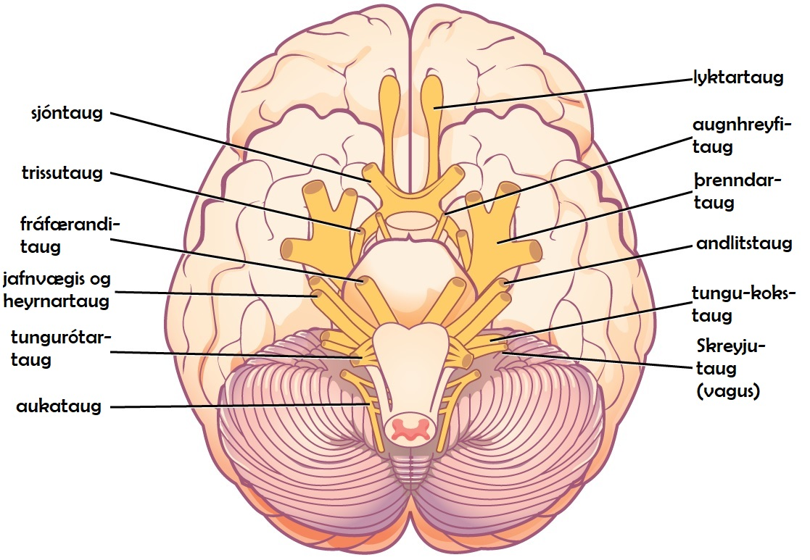

# 35.5 Taugakerfissjúkdómar

## Lærdómsmarkmið

## Eftir þennan kafla átt þú að geta eftirfarandi:

- Lýst einkennum, hugsanlegum ástæðum og meðferð við nokkrum gerðum að sjúkdómum í taugakerfinu

Taugakerfi sem virkar rétt er stórkostlega flókin, vel smurð vél – þar sem taugmótin senda boð, vöðvar hreyfast þegar á þarf að halda, minningar myndast og eru geymdar, og tilfinningar eru undir stjórn.  Því miður, þá þurfa milljónir manna um allan heim að glíma við einhverskonar sjúkdóma í taugakerfinu. Þó svo vísindamenn hafi uppgötvað mögulegar orsakir margra þessara sjúkdóma, og mögulegar meðferðir við þeim, þarf ferkari rannsókna við til að koma betur í veg fyrir og meðhöndla þessa sjúkdóma.

## Taugahrörnunarsjúkdómar

Taugahrörnunarsjúkdómar eru sjúkdómar sem einkennast af tapi á stjórn taugakerfisnins og orsakast oftast af dauða taugafruma.  Þessir sjúkdómar versna með tíma þar sem sífellt fleiri taugungar deyja. Einkennin einstakra sjúkdóma eru tengd við hvar í kerfinu taugungar eru að deyja.  Arfgeng taugabólguóregluhreyfing eða (Refsum‘s heilkennið), leiðir til dauða taugafruma í litlaheila.  Dauði þessara taugafruma leiðir til vandamála þegar kemur að því að halda jafnvægi og að ganga.  Dæmi um taugahrörnunarsjúkdóma er Huntingtons sjúkdómurinn, blönduð hreyfitaugahrörnun, Alzheimer´s sjúkdómurinn, sem og aðrar gerðir minnistaps sjúkdóma og Parkinson‘s sjúkdómurinn.  Í þessum kafla ætlum við að skoða Alzheimer‘s og Parkinson‘s sjúkdómana betur.

## Alzheimer‘s

Alzheimer‘s sjúkdómurinn er algengasta orsök elliglapa.  Árið 2012, telja menn að um 5.4 milljónir Bandaríkjamanna hafi þjáðst af sjúkdómnum, og kostnaður vegna hans hafi numið um 200 milljörðum bandaríkjadala. U.þ.b. einn af hverjum átta á aldrinum 65 og eldri eru með þennan sjúkdóm.  Vegna öldurnar þessarar kynslóðar, áætla menn að um 13 milljón mans verði með sjúkdóminn árið 2050 í Bandaríkjunum einum.

Einkenni Alzheimer‘s eru minnisleysi, ruglingur á tíma og rúmi, vandræði með að skipuleggja og framkvæma verkefni, léleg dómgreind og perónuleikabreytingar.  Tap á lyktnæmi fyrir ákveðnum lyktargerðum getur einnig verið vísbending um að Alzheimer‘s og getur nýst sem viðvörunarbjalla um fyrstu einkenni.  Mörg þessara einkenna eru einnig algeng hjá fólki sem er að eldast eðlilega, þannig að hversu alvarleg og langvarandi einkenni eru skera úr um hvort viðkomandi sé með sjúkdóminn eða ekki.

Alzheimer‘s sjúkdómurinn er nefndur eftir Alois Alzheimer sem var þýskur sálfræðingur.  Hann bitri grein árið 1911 um konu sem sýndi einkenni alvarlegra elliglapa.  Ásamt samstarfsmönnum sínum, skoðaði hann heila konunnar eftir dauða hennar.  Þar sá hann óeðlilega kekki, sem nú eru kallaðar amýlóiða útfellingar, ásamt trefjaflækum í heilavef sem í dag kallast taugatrefjaflækjur.  Amýlóða útfellingarnar, taugatrefjaflækjurnar og almenn rýrnun á heilanum eru algeng einkenni í heila Alzheimar‘s sjúklinga.  Tap á taugungum í derkasvæðinu er sérstaklega mikið hjá langt leiddum Alzheimre‘s sjúklingum.  Mynd 35.30 sýnir samanburð á heilbrigðum heila og heila Alzheimr‘s sjúklings.  Margir vinna nú að rannsóknum á orsökum þessa einkenna.

Ein gerð Alzheimsr‘s er orsakað af stökkbreytingu í eina af þremur þekktum sjúkdómsgenum.  Þetta sjaldgæfa gerð, veldur því að fólk fær einkennin snemma og leggst á færri en fimm prósent sjúklinga.  Einkennin koma fram milli 30 og 60 ára aldurs.  Algengari gerðir sem koma seinna fram, hafa líklega einnig gen sem eru gölluð.  Eitt gen, apolípóprótein E )APOE) er með breytileika (E4) sem eykur líkur þess sem það ber, á að fá sjúkdóminn.  Mörg önnur gen hafa fundist sem gætu verið þátttakendur í sjúkdómsferlinu.

Því miður þá er engin lækning til við Alzheimr.  Núverandi meðferð felst aðalega í að meðhöndla einkenni sjúkdómsins.  Vegna hrörnunar í kólínvirkum taugungum (taugungar sem nota taugaboðefnið asetýlkólín) er algeng hjá fólki með Alzheimer, eru nokkur lyf notuð til að meðhöndla sjúkdóminn sem auka á næmni fyrir asetýlkókin, með því að hindra ensím sem brjóta asetýlkólín niður í taugamótunum.  Önnur meðhöndlun felst í því að meðhöndla einkenni með atferlismeðferð, og andlegum æfingum.  Þar sem Alzheimr‘s viðist taka yfir eðlilegt öldrunarferli, er mikið lagt upp úr fyrirbyggjandi meðferð.  Reykingar, offita og hjarta og æðasjúkdómar geta verið áhættuþættir fyrir sjúkdóminn.  Þannig getu meðferð gegn þessum þáttum verið hindrandi fyrir Alzhiemer sjúkdóminn.  Nokkrar rannsóknir hafa sýnt að fólk sem heldur sér andlega virku með því að spila leiki, lesa, leika á hlóðfæri og vera félagsega virk á efri árum, er með minni áhættu á að fá sjúkdóminn.

## Parkinson’s

Líkt og með Alzheimer sjúkdóminn er Parkinson‘s taugahrörnunarsjúkdómur.  Honum var fyrst lýst af James Parkinson árið 1817.  Á hverju ári eru um 50 – 60.000 einstaklingar sem greinast með sjúkdóminn í Bandaríkjunum.  Parkinson sjúkdómurinn leiðir til taps á dópamín taugungum í svartfyllu, en það er svæði í miðheila sem kemur að því að stjórna hreyfingum okkar. Tap á þessum taugungum veldur mörgum að einkennum sjúkdómsins, eins og skjálfti, hægar hreyfingar, hraðabreytingar, jafnvægi og vandamál með líkamsstöðu ásamt stífum vöðvum.  Þessi einkenni saman valda einkennandi hægri göngu og hokinni líkamsstöðu (sjá mynd 35.31).  Sjúklingar með Parkinson geta einnig verið með andleg einkenni, eins og minnisleysi eða tilfinningavandamál.

Þó svo að sumir sjúklingar séu með sjúkdóm sem vitað er að orsakast af einni stökkbreytingu, þá eru ástæður Parkinson‘s ekki þekkart.  Sjúkdómurinn er líklega tilkomin vegna erfða og umhverfisþátt (líkt og Alzhiemer).  Krufning á heila Parkinson sjúklinga leiðir í ljós Lewy klumpa -  óeðlileg uppsöfnun á próteini og fjöldi þeirra virðist vera í réttu hlutfalli við hversu alvarlegur sjúdómurinn er.  Það er engin lækning til við Parkison, og meðhöndlun felst í draga úr áhrifum einkennanna.  Algengasta lyfið sem notað er af Parkinson sjúklingum, er L-DOPA, sem er efni sem breytist í dópamín inn í taugungunum heilans.  Sú breyting eykur á styrk dópamíns losunar taugunganna og getur hjálpað til við að bæta upp tap á dópamín taugungunum í svarfyllinni.  Önnur lyf hindra ensími í að brjóta dópamín niður.

## Taugaþroskunar Sjúkdómar

Óregla í þroskun taugunga gerist þegar þroski taugakerfisins er truflað.  Það eru nokkrar flokkar taugþroskunar óreglu. Sumar eru eins og Downs heilkennið, valda greindarskerðinu.  Aðara eru hafa áhrif á samskiptagetu sérstaklega, getu til að læra, eða hreyfifærni.  Sumar óreglur eins og einhverfa og athyglisbrestur og ofvirkni eru með flókin einkenni.

## Einhverfa

Einhverfa er óregla í taugaþroska.  Hún er mjög breytileg milli einstaklinga. Áætluð tíðni þessara óreglu hefur breyst mikið á síðustu árum og áratugum.  Núverandi mat er að um eitt af 88 börnum muni þróa með sér þessa óreglu.  Einhverfa er fjórum sinnum algengari hjá körlum en konum.

Einkenni einhvefu eru slök félagsfærni.  Börn með einhverfu eiga erfiðara með að halda augnsambandi og lesa úr ósögðum félagslegum skilaboðum.  Þau eru einnig líkleg til að finna til minni samkenndar með öðrum.   Önnur einkenni einhverfu er endurteknar hreyfingar (eins og að rugga sér fram og aftur), einbeita sér að mjög sérhæfðu efni, fylgja reglum af mikilli nákvæmni og nota tungumálið á óvenjulegan máta.  Um 30% sjúklinga með einhverfu, fá flog, og þeir sem eru með aðra galla (eins og t.d. brothættan X) eru einnig með greindarskerðingu.  Vegna þess að einhverfa er á rófi, geta margir sjúklingar verið vel færir í samfélaginu og verið með mjög góða tungumálakunnáttu.  Margir þessara sjúklinga upplifa sig ekki hamlaða heldur vilja bara meina að heili þeirra vinni öðruvísi úr upplýsingum.

Að frátöldum vel skilgreindum erfðagöllum sem valda einhverfu (borthættur X og Rett‘s heilkennið), þá eru ástæður einhverfu óþekktar.   Breytileiki í nokkrum genum hefur verið tengd við einhverfu, en fyrir hvern einn sjúkling, þarf margar ólíkar stökkbreytingar í mörgum genum til þess að sjúkdómurinn komi fram.  Almennt er einhverfa hugsuð sem „vitlaus“ tenging taugunga.  Þannig að heili sumra einhverfra einstaklinga virðist ekki vera með sömu grisjun á taugamótum og gerist hjá fólki sem ekki er með einkennin.  Árið 1990 kom út rannsóknargrein sem tengdi einhverfu við algeng bóluefni sem gefin eru börunum.  Þessi grein var dregin til baka þegar í ljós kom að höfundur hafði falsað gögn og önnur rannsókn sýndi enga tenginu milli bólusetninga og einhverfu.

Meðhöndlun á einhverfu felst oftast í atferlismeðferð og inngripum, ásamt lyfjum til eiga við aðrar óreglur sem eru algengar hjá fólki með einhverfu (þunglyndi, kvíði og þráhyggjuröskunn). Þó svo að snemmíhlutun geti hjálpað mikið til að draga úr einkennum sjúkdómsins þá er engin lækning til við sjúkdómnum.

## Athyglisbrestur og Ofvirkni (ADHD)

U.þ.b. þrjú til fimm prósent barna og fullorðinna eru með athyglisbrest og ofvirkni (ADHD).  Eins og einhverfa þá er ADHD algengari hjá körlum en konum.  Einkennin þessa óreglu eru meðal annars, athyglisbrestur (erfiðleikar með einbeintingu), eiga erfitt að framkvæma, hvatvísi og ofvirkni umfram það sem eðlilegt telst til hvers þroskastigs.  Sumir þolendur eru ekki með ofvirkni og eru þá flokkaðir bara með athyglisbrest (ADD).  Margir ADHD einstaklingar þróa oft með sér aðra sjúkdóma svo sem þunglyndi eða þráhyggju (sjá mynd 35.32)

Orsök ADHD er óþekkt, þó svo rannsóknir bendi til að seinkunn og óregla í þroska í framheila sem og boðefnatruflun.  Samkvæmt tvíbura rannsóknum, er óreglan með sterkan genaþátt.  Það eru nokkur gen sem koma til greina, en engin bein tenging hefur enn fundist.  Umhverfisþættir, eins og ýmis skordýraeitur, geta mögulega lagt eitthvað að mörkum í þróun ADHD sumra einstaklinga.  Meðhöndlun á ADHD felst oft í atferlismeðferð og lyfjameðferð með örvandi lyfjum, en þau hjálpa þeim að slaka á.

## Geðræn vandmál

Geðræn vandamál eru orsökuð af óreglu í taugakerfinu sem leiða til vandamála með hugsun, skap eða tengingu við annað fólk.  Þessi vandamál eru nógu alvarlega til að hafa áhrif á lífsgæði fólks og geta oft leitt til erfiðleika fyrir fólk að framkvæma dagleg störf.  Hamlandi genræn vandamál hafa áhrif á um 12.5 milljón Bandaríkjamanna (1 af hverjum 17) og kosta yfir 300 milljarða bandaríkjadala.  Nokkrar gerðir geðrænna vandamála eins og geðklofi, alvarlegt þunglyndi, geðhvarfasýki, kvíði og fælni, áfallastreyturöskun sem og þráhyggja svo eitthvað sé nefnt.  The American Psychiatric Association birtir „Diagnostic and Statistical Manual of Mental Disorders (eða DSM), sem lýsir einkennum sem fólk þarf að hafa til að fá greiningu með ákveðinn geðsjúkdóm.  Hvert ný útgáfa af DSM inniheldur ný einkenni og skilgreiningar eftir því sem þekkingin eykst á sjúkdómunum og  því hvernig orsakir þeirra tengjast örum.  Frekari greining á geðklofa og alvarlegu þunglyndi er rædd hér fyrir neðan.

## Geðklofi

Geðklolfi er alvarlegur og oft hamlandi geðsjúkdómur sem leggst á eitt prósent mannkyns. Einkenni sjúkdómsins eru meðal annars þær að sjúklingurinn á erfitt með að greina á milli raunveruleika og ímyndunar, óviðeigandi og óstjórnlega tilfinningaviðbrögð, erfiðleikar með rökhugsun og félagslegar aðstæður. Fólk með geðklofa getur þjáðst af ofsjónum og ofheyrnum sem og ranghugmyndum.  Sjúklingar geta einnig verið með „neikvæð“ einkenni eins og flatar tilfinningar, tap á gleði og vilja til athafna.  Margir geðklofasjúklingar greinast um tvítugt.  Þróun sjúkdómsins er talin vera vegna galla í dópamínmyndandi taugungum og getur einnig verið orsakað af vanda með glútamat taugaboða.  Meðhöndlun krefst geðlyfja sem hindra dópamín viðtaka og draga úr dópamínframleiðslu í heila.  Þessi samdráttur í dópamíni getur leitt til Parkinson líkra einkenna hjá sumum sjúklingum.  Þó svo lyfjameðferð skili góðum árangri þá er ekki til nein lækning og flestir þurfa að vera á lyfjum alla æfi.

## Þunglyndi

Alvarlegt þunglyndi leggst á um 6,7 prósent fullorðinna í Bandaríkjunum á hverju ári og er því algengasta andlega röskunin.  Til þess að greinast með alvarlegt þunglyndi þarf viðkomandi að hafa verulega mikið þunglyndi í tvær vikur ásamt öðrum einkennum eins og áhugaleysi á að stunda eitthvað sem áður veitti gleði, breytingu á matalyst og óreglu á svefn, einbeitingarleysi, upplifa sig tilgangslausan og vera með sjálfskaða hugsanir. Nákvæmleg hvað veldur alvarlegu þunglyndi er óþekkt og líkleg tilkomið vegna bæði erfa þátta og umhverfis.  Sumar rannsóknir styðja við hina „sígildu einamín tilgátuna“ þar sem þunglyndi er útskýrt sem lítils framboðs af noradrenalíni og serótónin taugaboefnum.   Ein rök gegn þessari tilgátu er sú staðreynd að sum þunglyndislyf valda aukningu á þessum boðefnum á innan við nokkrum klukkustundum eftir inntöku -  en bati kemur ekki fram fyrr en nokkrum vikum síðar.  Þetta hefur leitt til annarrar tilgátu:  dópamín getur einnig verið í lágum styrk hjá þunglyndum, eða það getur hreinlega verið aukning á noradrenalíni og serótóníni sem veldur sjúkdómnum, og neikvætt afturhvarf þrýsti styrk þessara boðefna niður.  Meðhöndlun á þunglyndi er meðal annar samtalsmeðferð, rafstuð, djúp-heila örvun og geðlyf. Það eru nokkrir flokkar geðlyfja í boði sem miðla verkunn sinni eftir ólíkum leiðum.  Sem dæmi þá eru mónóamín oxidasa hindrar (MAO hindrar) sem hindra ensímin sem brjóta niður taugaboðefni (þ.m.t. dópamín, serótónín, noradrenalín), sem leiðir til aukins magns þessara taugaboðefna í taugamótum.  Valin serótónín endurupptöku hindrar (SSRI) hindra endurupptöku á serótóníni í taugamótum.  Það leiðir til þess að  styrkur þess eykst í taugamótunum. Aðrar gerðir lyfja eins og noradrenalín-dópamín endurupptökuhindrar og noradrenalín-serótónín endurupptökuhindrar eru einnig notaðir til að meðhöndla þunglyndi.

## Aðrar óreglur í taugakerfinu

Það eru nokkrar óreglur í taugakerfinu sem ekki er auðvelt að setja í þá flokka sem við höfum lýst.  Stöðugir verkir, krabbamein í taugakerfinu, flog og heilablóðfall verða rædd hér fyrir á eftir.

## Flog

Áætlað er að um þrjú prósent íbúa Bandaríkjanna muni greinast með flog á lífsleiðinni.  Það eru nokkrar ólíkar gerðir til af flogum, en allar einkennast af endurteknum flogum.  Flogin sjálf geta komið vegna heilaskaða, sjúkdóma eða annarra veikinda.  Sem dæmi þá getur fólk með greindarskerðingu eða ASD upplifað flog, vegna þess að röng samsetning taugabrauta í heilanum, sem orsakar sjúkdóminn, eykur hættuna á flogum.  Hjá fjölda sjúklinga finnst samt engin ástæða fyrir flogunum og er líkleg tilkomin vegna óhagstæðrar gena og umhverfisþátta.  Oft er hægt að stjórna flogum með lyfjameðferð.  Aftur á móti í alvarlegustu tilfellunum, gætu sjúklingar þurft að fara í heilaskurðaðgerð þar sem upphafsstaður floganna er fjarlægður.

## Heilablóðfall

Heilablóðfall gerist þegar blóð berst ekki til hluta heilans í nógu langan tíma til þess að hann skemmist.  Án súrefnis deyja taugungar heilans.  Þessi dauði getur haft margvíslegar afleiðingar – allt eftir því hvar þær verða – þar með talið höfuðverkur, slappir vöðvar eða jafnvel lömun, málstol, skynvandkvæði, minnisleysi og rugling.  Heilablóðfall verður oft vegna blóðtappa en getur einnig orðið vegna þess að veik æð rifnar.  Heilablóðfall er óhemju algegnt og er þriðja algengasta dánarorsökin í Bandaríkjunum.  Að meðaltali kemur þetta fyrir eina manneskju á 40 sekúndna fresti.  Um 70% þeirra sem fá heilablóðfall eru eldri en 65 ára.  Áhættuþættir eru hár blóðþrýstingur, sykursýki, hátt kólesteról og fjölskyldusaga.  Reykingar tvöfalda áhættuna á heilablóðfalli.  Vegna þess hve að heilablóðfall er eitthvað sem bregðast þarf við strax, þurfa sjúklingar með einkenni að fara strax á bráðamóttöku, þar sem þeir geta fengið lyf sem leysa upp blóðtappa sem gætu hafa myndast.  Þessi lyf virka ekki ef heilablóðfallið er orsakað af rifinni æð eða ef heilablóðfallið gerðist þremur tímum áður en á sjúkrahúsið er komið.  Meðhöndlun eftir heilablóðfall getur verið lyf við blóðþrýsting og stundum mikil sjúkraþjálfun.
