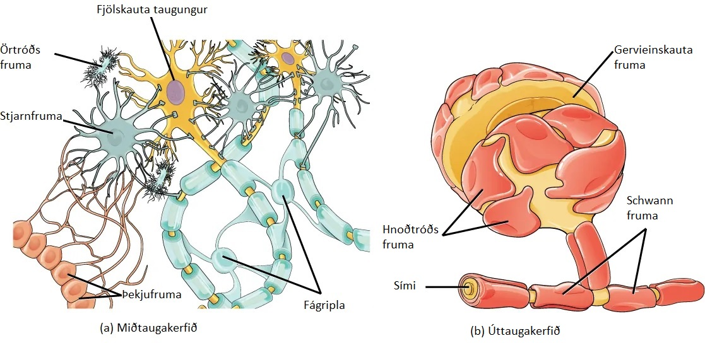
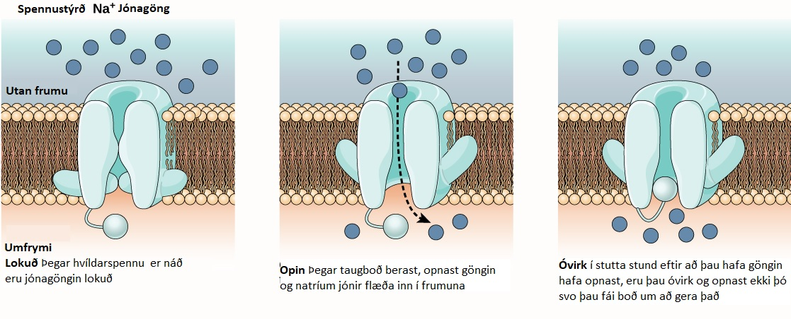
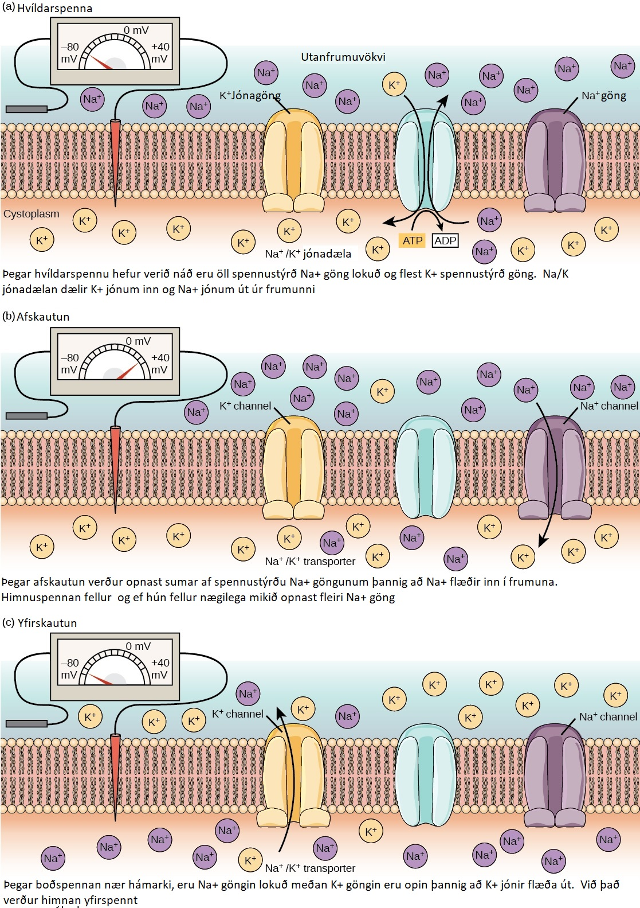
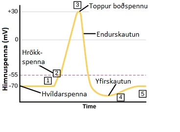

# 35.2 Hvernig miðla taugungar boðum á milli sín?

## Þessum kafla er ætlað að miðla eftirfarandi:

- Hvernig er hvíldarspenna mynduð
- Útskýra boðspennu og hvernig hún ferðast eftir taugasímanum
- Hvað er líkt, ólíkt með efnataugamótum og raftaugamótum
- Útskýra langtíma virkjun og langtíma óvirkjun

Öll starfsemi taugakerfisins, frá einföldum hreyfiboðum til flókinna hluta eins og að búa til minningar eða taka ákvarðanir, krefst þess að taugungar miðli boðum á milli sín.  Á sama hátt og menn nota orð og líkamstjáningu til að miðla boðum á milli sín, nota taugungar rafboð og efnaboð.  Taugungar taka við boðum frá fjölda annarra taugunga, áður en þær „ákveða“ að senda þau áfram til annarra taugunga. Þessi samvinna myndar þig og þínar ákvarðanir.

## Taugboð send eftir taugungum

Til þess að taugakerfið geti starfað, þurfa taugungar að geta sent og tekið við boðum.  Þær geta sent þessi boð vegna þess að frumuhimnur þeirra eru hlaðnar rafspennu (ólík hleðsla inn í og utan við frumuhimnuna), og þessi himnuspenna, getur breyst þegar taugaboðefni sem losuð eru frá öðrum taugungum eða vegna utanaðkomandi áreitis.  Til að geta skilið hvernig taugungar miðla boðum, þarf því fyrst að skilja hvernig hvíldarspenna er mynduð.

## Himnuspenna taugunga

Fosfólípíðsamlokan sem myndar frumuhimnuna, hleypir jónum ekki í gegnum sig.  Til þess að komast inn eða út úr taugung þurfa jónir að fara í gegnum sérhæfð himnuprótein sem kallast jónagöng sem ná í gegnum frumuhimnuna.  Jónagöng geta verið ýmist opin, lokuð eða óvirk (mynd 35.9).  Sum jónagöng þarf að virkja til að þau geti hleypt jónum inn eða út úr frumunni.  Þessi jónagöng eru næm fyrir breytingum í umhverfi sínu og geta breytt um lögun í samræmi við þær breytingar.  Jónagöng sem breyta lögun sinni eftir spennustigi eru kölluð „spennustýrð jónagöng“.  Spennustýrð jónagöng stjórna hlutfallslegum styrk jóna innan og utan frumunnar.  Munurinn á heildar hleðslu milli innri og ytri hluta frumunnar kallast himnuspenna.

## Hvíldarspenna

Taugungur sem er í hvíld, er neikvætt hlaðinn:  innrihluti frumunnar er um 70 millivoltum neikvæðari en ytrihluti frumunnar (-70mV, ath þessi tala er breytileg milli taugunga og dýrategunda).  Þessi spenna kallast hvíldarspenna og er hún orsökuð af ójöfnum styrk jóna innan í og utan við frumuna.  Ef frumuhimnan hleypti jónum í gegnum sig, flæddu þær inn og út úr henni að vild og jafn mikið væri af öllum jónum, alstaðar.  Taugungurinn er með ójafnt hlutfall af K+ jónagöngum og Na+ jónagöngum sem leiðir til þess að hlutfall þessara jóna verður ójafnt í frumunni, þannig að meira verður eftir af Na+ utan við frumuna en inn í henni.  Einnig sjá jónadælur í frumuhimnunni um að dæla Na+ út og K+ inn (3Na+ út á móti 2K+ inn).  Þessi flutningur kostar orku (ATP) og er ástæða þess að heilinn í mönnum tekur um 20% af allri þeirri orku sem við tökum inn.

Tafla 35.1 Hvíldarspenna verður til vegna þess að styrkur jóna fyrir innan frumu er ekki sá sami og fyrir utan frumu

## Boðspenna

Taugungur getur tekið við boðum frá öðrum taugungum og, ef boðið er nógu sterkt, fer boðið áfram til næsta taugungs.  Boð á milli taugunga eru almennt flutt á milli þeirra með efnum sem kallast taugaboðefni.  Boð innan taugunga (frá griplum til símaenda) er flutt með stuttum umskautunum á hvíldarspennunni sem kallast boðspenna.  Þegar taugaboðefnin eru losuð frá símaendum yfir á sérhæfða viðtaka í griplum annars taugungs leiðir það til þess að jónagöng opnast og plúshlaðnar jónir flæða inn.  Við það umskautast frumuhimna taugungsins (spennumunurinn minnkar milli ytra og innra hluta frumunnar).  Örvun frá skynfrumu eða taugung umskautar markfrumuna að hrökkspennu (-55mV).  Na+ jónagöng í símahól opnast og  hleypa jákvætthlöðnum jónum inn (mynd 35,10 og 35.11).  Eftir að natríumgöngin hafa opnast umskautast taugungurinn alveg yfir í +40mV.  Boðspenna er sögð vera „allt eða ekkert“ atburður, þar sem að eftir að hrökkspennu er náð, umskautast taugungurinn alltaf algerlega.   Eftir að umskautun er yfirstaðin, þarf fruman að endursetja himnuspennuna að hvíldarspennu.  Til að það sé hægt, þurfa Na+ jónagöngin að lokast og að vera ófær um að opnast aftur (í smá stund).  Hér hefst hlétími þar sem taugungurinn getur ekki myndað boðspennu því natríumjónagöngin geta ekki opnast.  Á sama tíma opnast spennustýrðu K+ jónagöngin þannig að K+ flæðir út úr frumunni.  Við þetta verður himan aftur neikvæð og í smá stund er hún yfirspennt, þar sem himnuspennan verður neikvæðari en venjuleg hvíldarspenna.  Við það verða natríum jónagöngin aftur virk og geta opnast að nýju ef taugungurinn verður aftur áreittur.  Með hjálp jónadælunnar mun fruman svo aftur ná hvíldarspennu (mynd 35.11 og 35.12).

## Mýelín og flutningur boðspennunnar

Til þess að boðspenna geti flutt boð til annars taugungs, þarf hún að ferðast eftir símanum og ná til símaenda þar sem hún getur losað taugaboðefni yfir á markvef sinn.  Hraði taugaboðsins ræðst af þvermáli símans og því hve vel hann passar upp á jónir sínar (ef jónir leka auðveldlega inn og út um frumuhimnuna, mun boðspennan fljótlega deyja út og ekki ná til símaendans).  Mýelín virkar eins og einangrun sem hindrar það að jónir leki út úr símanum og hraðar þannig um leið ferð boðspennunnar eftir símanum.  Mýelín sjúkdómar eins og MS (multiple slerosis), leiða til þess að mýelínið eyðist og boðspennan nær ekki til símaenda.  Mýlisskor, eru göt á milli mýelínsslíðursins (sjá mynd 35.13).  Þessi göt eru um 1µm að lengd og innihalda spennustýrð Na+ og K+ jónagöng.  Flæði jóna gegnum göngin, sérstaklega Na+, viðhalda boðspennunni aftur og aftur niður eftir símanum.  Þetta stökk boðspennunnar milli mýelínslíðranna kallast stökkleiðni.  Ef mýlelín væri ekki til staðar niður eftir símanum, mundi hægja verulega á hraða boðspennunnar, þar sem hún þyrfti stöðugt að endurnýja sig niður eftir honum, í stað þess að geta hoppað á milli mýelínslíðra.  Mýlisskorin spara einnig orku, þar sem taugungurinn þarf ekki aðeins þarf að byggja upp hýldarspennu á milli mýlisskora en ekki eftir endilöngum símanum.

## Boðflutningur í taugamótum

Taugamótin er staðurinn þar sem upplýsingar flytjast á milli eins taugungs til annars.  Taugamótin myndast alla jafna milli símaenda og griplu, en það er ekki alltaf þannig.  Taugamót geta einnig myndast á milli símaenda-til-símaenda, griplu-til-griplu, og símaenda-til-frumubols. Taugungurinn sem flytur taugaboðið er kallaður „fortaugungur“, og taugungurinn sem tekur við boðinu kallast „eftirtaugungur“.  ATH þessi staðsetning er afstæð og flestir taugungar bæði taka við og senda boð.  Það eru tvær gerðir af taugamótum:  Efnataugamót og raftaugamót.

## Efnataugamót

Þegar boðspennan nær niður til símaenda, umskautast frumuhimnan og opnar spennustýrð Na+ jónagöng.  Na+ flæðir inn í frumuna, og umskautar enn frekar himnu fortaugungsins.  Þessi umskautun leiðir til þess að spennustýrð Ca2+ jónagöng opnast.  Kalsíum jónir sem koma inn í frumuna, koma af stað boðferli sem leiðir til þess að smáar himnubundnar blöðrur, sem kallast taugamótablöðrur og innihalda taugboðefni, renna saman við frumuhimnuna og losa þannig taugaboðefni inn í taugamótin. (mynd 35.14) er rafeindarsmájármynd af símaenda sem er að losa taugamótablöðrur út frumuhimnuna).

Taugaboðefnið flæðir yfir taugamótin og binst við viðtaka í himnum eftirtaugungsins (sjá mynd 35.15).   Binding sérhæfðra taugaboðefna veldur því að bindilstýrð jónagöng, opnast í himnum eftirtaugungsins.  Taugaboðefni geta ýmist verið hvetjandi eða letjandi á himnuspennu eftirtaugungsins (tafla 35.1).  Til dæmis, þegar fortaugungu losar asetýlkólín í taugmót milli taugungs og vöðva, veldur það því að Na+ jónagöng opnast í vöðvafrumunni og umskautun frumuhimnu hennar leiðir til vöðvasamdráttar.  Þessi umskautun kallast „örvandi eftirmótaspenna“ og veldur því að eftirtaugungur er líklegri til að senda boðspennu áfram.  Losun á boðefnis á hindrandi viðtaka kallast „hamlandi eftirmótaspenna“.  Þau valda yfirspennu á frumuhimnunni og draga úr líkum á að eftirtaugungur sendi boðspennuna áfram.  Sem dæmi þá veldur taugaboðefnið GABA (gamma-aminoburtyric acid,  eða gamma smjörsýra) því að Cl- jónagöng opnast í frumuhimnum eftirtaugungsins.  Cl- jónir flæða þá inn í frumuna og yfirstkauta hana, þannig að það verður ólíklegra að fruman sendi boðspennuna áfram.

Eftir að taugaboðin hafa verið flutt á milli, þarf að losa taugaboðefnið úr taugamótunum þannig að eftirtaugungurinn geti endurhlaðið hvíldarspennu sína og tekið við nýjum taugaboðum.  Þetta er hægt að gera á þrenna vegu:

- Taugaboðefnið flæðir burt úr taugamótunum
- Taugaboðefnið er brotið niður af ensímum sem eru til staðar í taugamótunum
- Taugaboðefnið er endurunnið (stundum kallað „enduruupptekið“) af fortaugungnum.

Nokkrar gerðir af lyfjum nýta sér þessa þætti til að miðla virkun sinni.  Alzheimer lyf hindra acetýlkólnínasa, sem er ensímið sem brýtur niður asetýlkólín.  Með því að hindra þetta ensím, eykur virkni taugunga sem losa asetýlkólín.  Eftir að það hefur verið losað, hangir það lengur í taugamótunum og binst óbundum viðtökum í eftirtaugungnum.

## Tafla 35.2 Staðsetning og virkni taugaboðefna

## Raftaugamót

Raftaugamót eru sjaldgæfari en efnataugamót en þau finnast í öllum taugakerfum og hlutverk þeirra er bæði mikilvægt og einstakt.  Miðlun taugaboða um raftaugamót er töluvert frábrugðið efnataugamótum.  Í raftaugamótunum liggja for- og eftirtaugungar svo þétt saman að þeir ekki bara snertast, heldur eru taugungarnir samtengdir með prótein göngum sem liggja á milli þeirra.  Próteingöngin leyfa þannig boðspennunni að fljóta beint á milli taugunga.  Bæði jónir og ATP geta flætt á milli þessara fruma.

Það er lykil munur á milli efnataugamóta og raftaugamóta.  Þar sem efnataugamót treysta á losun taugaboðefna í taugamótin sem svo þurfa að ferðast yfir á griplur eftirtaugungsins, verður smá hlé á milli taugaboða sem varir í um 1 millisekúntu.  Einnig eru efnataugamótin einstefnuboð, þar sem

griplur losa ekki taugaboðefni á símaenda og símaendar hafa ekki viðtaka fyrir taugaboðefni.  Raftaugamót flytja boðin hindrunarlaust sín á milli (sem er mikilvægt fyrir taugakerfi sem miðla mikilvægum taugaviðbrögðum sem þurfa að gerast hratt).  Auk þess geta boðin gengið í báðar áttir.  Raftaugamót eru einnig traustari þar sem erfiðara er að hindra þau í miðlun boða sinna og þau eru mikilvæg til að samhæfa rafvirkni taugahópa.  Sem dæmi þá eru raftaugamót í stúkunni (thalamus) sem talin eru taka þátt í stjórnun hægbylgju svefni,  og truflun á þessum taugamótum getur valdið krömpum.

## Uppsöfnun taugaboða

Stundum er einn taugaboð nægilega öflugur til að senda boðspennu af stað í eftirtaugung, en oft þurfa margir fortaugungar að senda taugaboð á sama tíma til þess að eftirtaugungur umskautis að hrökkspennu (þannig að boðspenna fari af stað).  Þetta ferli kallast uppsöfnun taugaboða og á sér stað í símahólnum (sjá mynd 35.16).  Að auki er einn eftirtaugungur oft tengur mörgum fortaugungum, sem ýmist senda örvandi taugaboð eða letjandi boð.  Þannig getur letjandi taugaboð núllað út hvetjandi taugaboð og öfugt.  Það er því heildar breytingin á himnuspennu eftitaugungs sem ræður því hvort taugaboð fari áfram eða ekki.  Þannig getur uppsöfnun taugaboða og hrökkspenna unnið saman að því að tilviljunnarkennt „suð“ í kerfinu er ekki sent áfram sem upplýsingar.

## Sveigjanleiki taugamóta

Taugamót eru breytileg og tengingin á milli þeirra getur styrkst og veikst. Hægt er að rjúfa þau og mynda ný tengi.  Sveigjanleiki þessi er grunnurinn að baki námi og minningum.  Hér eru tveir ferlar í lykil hlutverki (þó vissulega sé aðrir ferlar líka að verki sem ekki verða ræddir hér), langtíma efling (long-termp potenitation, LTP) og langtíma bæling (long-term depression, LTD).  Þessir ferlar fara fram í drekanum en það tekur þátt í varðveislu minninga okkar.

## Langtíma efling (LTP)

Langtíma efling er stöðug styrking á tengingu milli taugamóta. LTP byggist á Hebbian lögmáli: Frumur sem senda boð saman, tengjast saman.  Það er fjöldi ferla sem við kunnum ekki góðar skýringar á, sem taka þátt í LTP.  Eitt af þessum ferlum fer í gegnum ákveðan gerð af viðtaka sem bindur taugaboðefni glútamat (ummynduð amínósýra).  Viðtakinn kallast NMDA (N-Methyl-D-aspartate), sjá mynd 35.18.  Þessir viðtaka eru alla jafni hindraðir af magnesímujónum (Mg2+).  Aftur á móti þegar eftirtaugungur er umskautaður oft af mörgum fortaugungum, eru magnesíum jónirnar reknar í burtu og við það flæða kalsíum jónir (Ca2+) inn í frumuna. Við það fer af stað ferli innan frumunnar sem veldur því að annar viðtaki, AMPA (α-amino-3-hydroxyl-5-methyl-4-isoxazolepropionic acid) er settur inn í griplur eftirtaugungsins.  Þessi nýi viðtaki hleypir jónum frekar inn í frumuna, þannig að næst þegar fortaugungur losar glútamat á eftirtaugunginn, mun hann senda boðið frekar áfram en hann gerði áður.  Mörg ávandabindandi efni nýta sér LTP ferlið og geta þannig leitt til fíknar.

## Langtíma bæling (LTD)

Langtíma bæling er í raun andstaðan við langtíma eflingu.  Þannig eru taugamót brotin upp yfir langa tíma.  Eitt ferli sem vitað er að veldur LTD notar einnig AMPA viðtakann.  Í þessu tilfelli er það kalsíum sem fer inn í eftirtaugunginn, setur af stað annað ferli sem leiðir til þess að AMPA viðtakar eru fjarlægðir úr frumuhimnum griplunnar.  Það leiðir til þess að eftirtaugungurinn sendir síður taugaboð og þarf meira átreiti til að það fari af stað.  Það hljómar kannski öfugsnúið, en þetta ferli er líka mikilvægt fyrir nám, þannig að hægt sé að loka fyrir minna notaðar leiðir og tengja og styrkja það sem betur á við.

Markvefur: taugaboð geta farið á milli tveggja taugunga, en þau geta líka farið frá einum taugung yfir á marga taugunga. Einnig geta taugaboð legið til líffæra sem við það breyta starfsemi sinni.  Allur vöðvasamsdráttur fer fram með boðum frá taugakerfinu.  Þegar taugungur sendir boð frá heila til vöðva, þá er vöðvinn, markvefur þess taugungs.

![Mynd 35.18 Kalsíum innkoma í eftirtaugunginn, í gegnum NMDA viðtaka, getur valdið tvennskonar taugamóta sveigjanleika.  Langtíma eflingu (LTP) eða langtíma bælingu (LTD).  LTP kemur upp þegar ákveðið taugamót er sífellt örvað.  Þessi örvun veldur kalsíum og CaMKII-háðri keðjuverkun, sem að lokum leiðir til þess að fleiri viðtakar eru settir í taugamótið.  Næst þegar glútamat er losað frá fortaugung binst það bæði NMDA viðtaka og nýinnsettum AMPA viðtakanum og þannig að minni skammtur af glútamati þarf til að  afskauta eftirtaugunginn.  LTD gerist þegar fáar glútamat sameindir bindast við NMDA viðtakann (vegna lítillar örvunnar frá fortaugungi).  Það litla kalsíum sem flæðir inn í eftirtaugunginn setur að stað ólíka keðjuverkun sem leiðir til þess að AMPA viðtakar eru teknir úr frumuhimnunni.  Þetta gerir eftirtaugunginn ónæmari fyrir boðum frá því glútamati sem fortaugungurinn losar.](./images/mynd-35-18.jpeg)
