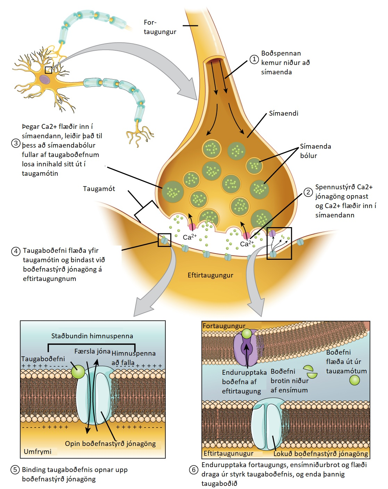
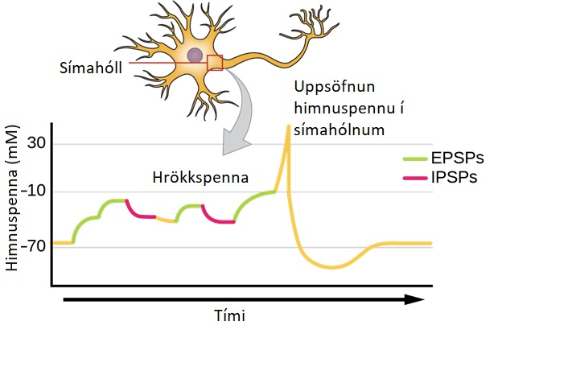
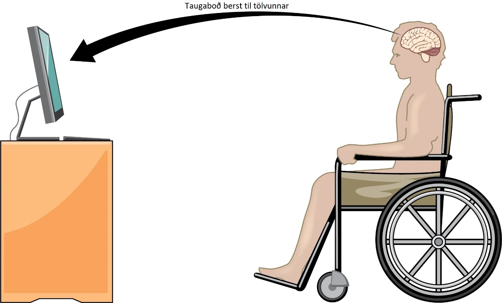
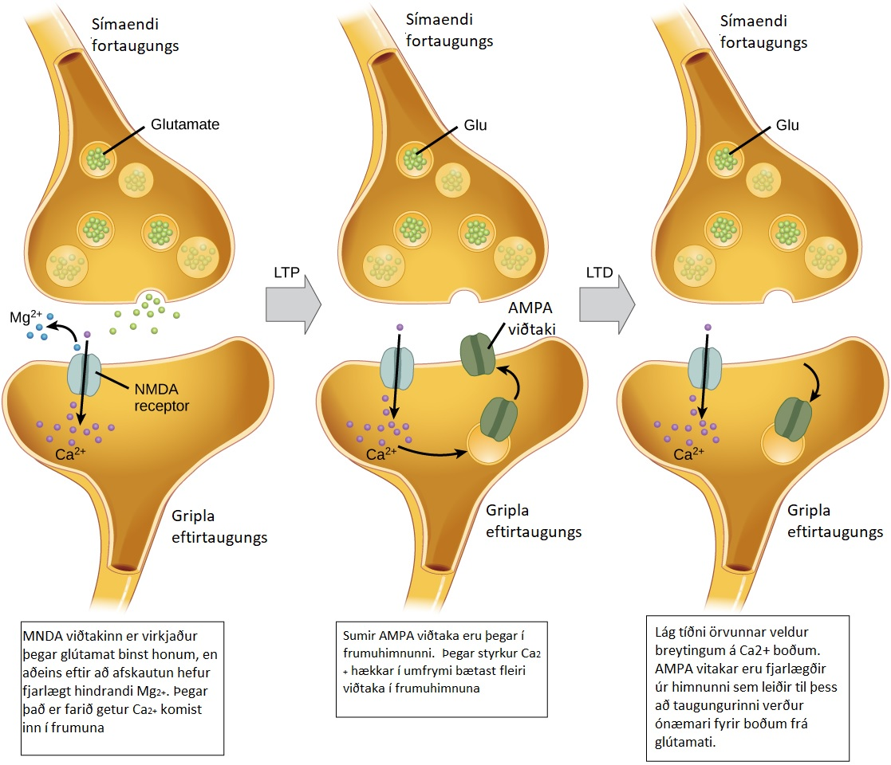
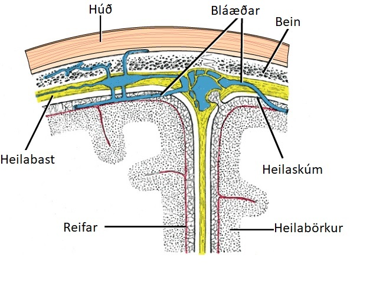
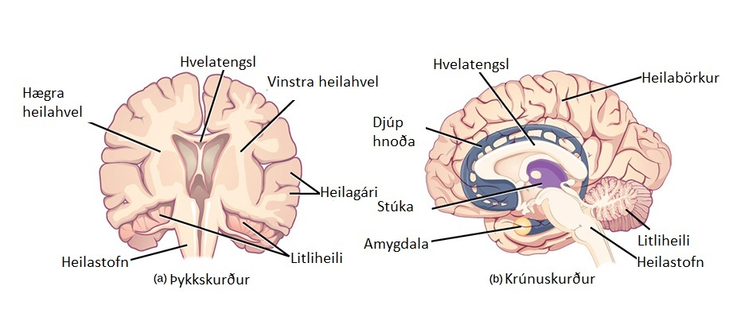

# 35.3 Miðtaugakerfið

## Lærdómsmarkmið

Eftir þennan kafla átt þú að geta eftirfarandi

- Geta þekkt mænuna, heilablöð og önnur svæði heilans á skýringarmyndum af heilanum
- Lýsa megin starfsemi mænu, heilabarkarblaða og öðrum svæðum heilans

Miðtaugakerfið (MTK) er samsett úr heila (sjá mynd 35.19) og mænu sem varin eru að þremur vefjalögum sem kallast heila og mænuhimna.  Ysta lagið kallast heilabast  (dura mater).  Dura mater þýðið hörð móðir á latínu enda er það helsta hlutverk þessara þykku himnu að verja miðtaugakerfið.  Heilabastið inniheldur einnig pípur, sem líkjast æðum og flytja blóð frá heilanum til hjartans. Miðlagið er vefjalíkt heilaskúm (arachnoid mater).  Síðasta lagið er reifar (pia mater, mjúk móðir á latínu), sem er í beinni tengingu við heilan og hylur hann og mænuna eins og plastfilma.  Bilið á milli heilaskúms og reifar er fyllt af heila- og mænuvökva (verður hér eftir kallað mænuvökvi).  Mænuvökvinn er myndaður af vef sem kallast æðaflækja (choroid plexus) og finnst í vökvafylltum holum miðtaugakerfisins sem kallast heilahólf (ventricles).  Heilinn flýtur um í mænuvökvanum, sem virkar bæði sem púði og höggdempari.  Mænuvökvinn dreifir líka næringarefnum um heilan og mænuna.    Heildar magn mænuvökva er ekki nema um 8,5 teskeið, en það er stöðugt verið að mynda nýjan vökva í heilahólfunum.  Það getur skapað vandræði ef heilahólfin lokast, þá byggist upp mænuvökvi og veldur bólgu í heila þannig að hann þrýstist út í hauskúpuna.  Þetta fyrirbæri kallast „vatnshöfuð“ (hydrocephalus) og getur valdið krömpum, vitsmunaglöpum, og jafn vel dauða ef ekki tekst að losa út vökva til að létta á þrýsting.

## Heilinn

Heilinn er sá hluti miðtaugakerfisins sem hýstur er í höfukúpunni.  Hlutar hans eru heilabörkur, limpiska kerfið, djúphnoðan, stúkan, undirstúkan og litliheili. Hægt er að skera heilan á þrennskonar vegur til að skoða uppbyggingu hans: þykktarskurður þar sem heilinn er skorinn frá vinstri til hægri (sjá mynd 35.21b), krúnusnið þar sem skorið er að aftan og fram (sjá mynd 35.20a) og láréttur skurður þar sem heilinn er sneiddur frá toppi og niður úr.

## Heilabörkurinn

Ysti hluti heilans er þykkur taugavefur sem kallast heilabörkur.  Heilabörkurinn myndar fellingar sem kallast heilagárar (gyri) og heilaskorir (sulci).  Heilabörkurinn er í tveimur heilahvelum, hægri og vinstra, sem aðskilin af stórri heilaskoru.  Þykkur trefjaríkur vefur, hvelaltengsl, (corpus callosum) tengir hvelin saman og samskipti á milli heilahvelanna fara fram um hvelatengslin.  Heilahvelin geta haft ólík hlutverk, en það er þó breytilegt.  Í einstaka tilvikum getur það gerst að fjarlægja þarf annað heilahvelið nær algerlega til að koma í veg fyrir alvarleg flog.  Sjúklingar þjást af nokkrum aukaverkunum af svona aðgerðum, en þær eru furðu litlar samt, sérstaklega þegar aðgerðin er framkvæmd á börnum sem hafa óþroskaða heilastarfsemi.

Einnig er hægt að bregðast við alvarlegum flogaköstum með því að skera á hvelatengslin í stað þess að fjarlægja annað heilahvelið.  Þetta veldur ástandi sem kallast klofheila, sem getur gefið innsýn í einstaka starfsemi heilans.  Þegar einstaklingar sem hafa undirgengist svona meðferð er leyft að sjá hlut, en bara með vinstra auganu, geta þeir átt í basli  með að útskýra hvað þeir sáu (og segjast jafnvel ekki hafa séð neitt).  Þetta kemur til vegna þess að það sem vinstra augað sér, fer yfir í hægra heilahvelið en málstöðvarnar eru vinstra megin í heilanum.   Þar sem búið er að skera á milli heilahvelanna, berast upplýsingar ekki á milli.  Ef sami einstaklingur er svo beðinn um að taka upp það sem hann sá, með vinstri hendi, gerir hann það auðveldlega.

Hvort heilahvel inniheldur svæði sem kallast „blöð“ sem hafa ólík hlutverk.  Vísindamenn nota ýmsar aðferðir til að finna út hvaða svæði heilans gera hvað og hvernig galla á þeim koma fram í hegðan þeirra einstaklinga sem eru með þá.   Með því að skoða sjúklinga sem hafa skaðast vegna slysa, eða sjúkdóma á ákveðnum svæðum í heila má áætla hvaða starfsemi fari þar fram.  Einnig er hægt að stunda dýrarannsóknir þar sem ákveðin svæði heilans eru örvuð og sjá svo hvaða áhrif það hefur á hegðan þeirra.   Aðferð sem kallast „transcranial magnetic stimulation (TMS)“ þar sem öflugir seglar eru notaðir til slá tímabundið út ákveðin svæði í heilanum og skanna svo með segulómun til að sjá hvaða svæði heilans eru að taka upp súrefni og hver ekki og bera saman við hegðun dýranna.  Þessar aðferðir sem og aðrar, hafa gefið okkur mikla innsýn í starfsemi heilasvæða, en einnig sýnt að eitt heilasvæði getur tekið þátt í mörgum ólíkum starfsþáttum eða hegðunarferli.  Einnig getur ein ákveðin hegðun eða ferli almennt verið byggð á taugungum margra heilasvæða. Að því sögðu þá er almennt hægt að skipta heilaberki spendýra niður í fjögur ólík svæði hvað varðar starfsemi og staðsetningu:  Framheilablað, hvirfilblað, gagnaugablað og hnakkablað (sjá mynd 35.21).

Framheilinn er staðsettur fremst og er fyrir ofan augun.  Þetta svæði inniheldur lyktarklumpuna, sem vinnur úr lyktarboðum.  Framheilinn inniheldur einnig hreyfibörkinn, sem er mikilvægur fyrir skipulag og framkvæmd heyfinga.   Svæði innan hreyfibörksins sinna ólíkum vöðvahópum og hægt er að kortleggja hvaða svæði sinna hvaða hreyfingum (sjá mynd 35.22). Sem dæmi, þá eru

taugarnar sem stjórna hreyfingu fingranna staðsettar við hlið þeirra sem sinna hreyfingu handanna.  Taugungar í framheila koma einnig að vitrænni starfsemi og viðhaldi athygli, máli og ákvörðunartöku.  Rannsóknir á fólki sem hefur skaðast á framheila, sýna að hluti hans er mikilvægur fyrir persónuleika, samskipgahæfni og áhættumat.

Hvirfilblaðið er staðsett efst í heilanum.  Taugungar í hvirfilblaði taka þátt í máli og lestri.  Tvö helstu hlutverk hvirfilblaðsins eru úrvinnsla á líkamsskynjun-snerting, þrýtstingur, sársauki, hiti, kuldi- en einnig úrvinnsla á líkamsstöðu- þ.e. tilfinningin fyrir því að vita hvar hver líkamspartur er í rýminu.  Uppröðun líkamshluta raðast upp í þessi svæði á svipaðan hátt og í hreyfiberkinum.

Hnakkablaðið er staðsett aftast í heilanum.  Helsta starfsemi þess er úrvinnsla sjónboða sem og að þekkja og greinda sýnilega heiminn.

Gagnaugablaðið, er staðsett við grunn heilans og tekur aðalega þátt í túlkun á hljóði.  Gagnaugablaðið inniheldur einnig drekann (hippocampus), en hann er svæði í heilanum sem höndlar með upplýsingar (sjá mynd 35.24).  Hlutverk drekans í varðveislu upplýsinga (minni) kemur að miklu leiti frá rannsóknum á frægum flogaveikissjúkling sem kallaðist HM.  Bæði drekasvæði hans voru fjarlægð til að reyna að lækna hann af flogaveiki.  Hann fékk ekki flog eftir aðgerðina, en gat heldur ekki myndað neinar nýjar minningar (þó svo hann gæti kallað fram minningar frá því fyrir aðgerð, og lært nýjar hreyfingar).

## Djúphoðan

Samþættar heilastöðvar sem kallast djúphoða eða djúpkjarnar (sjá mynd 35.20), hafa mikilvægt hlutverk í stjórn hreyfinga og líkamsstöðu.  Skaði á djúphnoðu, eins og Parkinson skúdómurinn, leiðir til skertrar hreyfigetu eins og skrikkjóttum gangi.  Djúphnoðan kemur einnig að hvatningu.  Þegar vespu stunga olli skemmdum á djúphnoðu 25 ára viðskiptamann, fór hann að eyða degi sínum upp í rúmi og sýndi lítinn áhuga á að sinna starfi sínu né samskiptum við fólk.  En þegar einhver ýtti við honum, bað hann um að spila við sig eða eitthvað sambærilegt, gat hann hagað sér eðlilega.  Sjúklingar eins og þessi maður, tala ekki um að þeim leiðist eða láta þetta ástand sitt trufla sig.

## Stúkan

Stúkan (sjá mynd 35.24) er eins og tollahlið sem taugaboð frá og til heilabarkar þurfa að fara um.  Stúkan tekur við skynboðum og hreyfiboðum frá líkamanum en einnig fer viðbragðið frá heilaberkinum um stúkuna.  Þetta afturhvarfskerfi getur haft áhrif meðvitaða upplifun á skyn- og hreyfiupplifun, háð athygli og örvunarástandi dýrsins.  Stúkan hjálpar til við stjórnun á meðvitund, örvun og vökuástandi.  Sjaldgæf stökkbreyting sem veldur „fatal familial insomnia“ veldur hrörnun í taugungum og stjarnfrumum stúkunnar. Það veldur því að sjúklingurinn getur ekki sofnað, ásamt öðrum einkennum, sem að lokum leiðir til dauða.

## Undirstúkan

Undir stúkunni er undirstúkan (sjá mynd 35.24).  Undirstúkan stjórnar innkritlakerfinu með því að senda boð til heiladingulsins.  Heiladingullinn er innkirtill á stærð við baun sem losar nokkur ólík hormón sem hefur áhrif á aðra kirtla sem og aðrar frumur.  Þetta samband þýðir í raun að undirstúkan stjórnar mikilvægum ferlum sem þessi hormón stýra.  Undirstúkan er höfuðrofi líkamans þaðan sem lykil starfsemi hans er stjórnað.  Inntaka fæðu, vatns, orkunotkunn, og líkamshita er haldið innan réttra gilda.  Taugungar innan undanstúkunnar, stjórna einnig dagsveiflunni og þannig hvenær við sofum og vökum.

## Randkerfið

Randkerfið tengist mengi heilastöðva sem stýra tilfinningum sem og hegðun sem tengist ótta og hvatningu.  Það tekur þátt myndun minninga og stúkan, undirstúkan sem og drekasvæðið eru hluti af randkerfinu.  Mandlan er stór hluti af randkerfinu (sjá mynd 35.24).  Báðar möndlurnar eru mikilvægar fyrir myndun óttatilfinninga og greiningu á ótta í andliti annarra.   Gyrðilgárinn hjálpar til við stjórnun tilfinninga og sársauka.

## Litliheili

Litliheili (sjá mynd 35.21), er neðarlega í heilanum og situr ofan á heilastofninum.  Litliheili stýrir jafnvægi og samhæfðum lærðum hreyfingum (eins og að reima skóna sína) og þegar við lærum nýjar hreyfingar.

## Heilastofninn

Heilastofninn (sjá mynd 35.21), tengir heilann við mænuna.  Hann er samsettur úr miðheila, mænukylfu og brú.  Hreyfi og skyntaugungar ná í gegnum heilastofninn þannig að boð geta farið á milli mænu og heila.  Taugar sem liggja um heilastofninn víxlast þar, þannig að vinstra heilahvel stýrir hægri helming líkamans og öfugt.  Heilastofninn stjórnar hreyfiboðum sem berast frá líkamanu til heilans.  Heilastofninn stjórnar einnig nokkrum mikilvægum ferlum eins og athygli, örvunarástandi, öndun, blóðþrýsting, meltingu, hjartslætti, kyngingum, göngu og samhæfingu skyn og hreyfiboða.

## Mænan

Tengist við heilastofninn og nær niður í líkaman í gegnum hryggsúluna (sjá mynd 34.21).  Mænan er þykkur vafningur af taugavef sem ber boð frá líkama til heila og frá heila til líkama.  Mænan liggur inn í beinum hryggsins en getur miðlað boðum til og frá líkamanum með tengingum í gegnum mænutauga (hluti af úttaugakerfinu).  Þversnið af mænunni myndar hvíta, hringlaga skífu  með grátt efni í miðjunni sem er í laginu eins og fiðrildi (sjá mynd 35.25).  Mýelín um síma taugunga gefur hvíta litinn og taugungar og stjarnfrumur sem eru ómýldar eru gráar.   Gráa efnið inniheldur einnig millitaugafrumur, sem tengja saman taugunga sem annars eru staðsettar á ólíkum stöðum í líkamanum.  Símar og frumubolir í baklæga hluta mænunnar flytja að mestu skynupplýsingar frá líkama til heila.  Símar og frumbolir sem eru kviðlægt í mænunni flytja aðalega hreyfiboð til líkamans.  Mænan stjórnar einnig hreyfi viðbrögðum.  Þær hreyfingar eru snöggar og ómeðvitaðar, eins og þegar þú ósjálfrátt kippir að þér hendinni af heitum hlut.  Viðbragðið er svo hratt vegna þess að það fer fram í mænunni.  Sem dæmi þá er hnéviðbragð sem læknar nota þegar verið er að yfirfara heilsu sjúklinga, stjórnað af einum taugasíma sem tengir saman skyntaugung og hreyfitaugung.  Á meðan boðið fer bara um tvo taugunga, þá senda aðrir taugungar boð upp til heila til að láta hann vita hvað gerðist (fóturinn kipptist til eða hendinni var kippt að sér).

Í Bandaríkjunum verða um 10.000 mænuskaðar á ári.  Vegna þess að mænan er upplýsingahraðbraut milli heila og líkama, getur skaði á henni leitt til lömunar.  Hversu mikil lömunin er ræðst af staðsetningu skaðans á mænunni og hvort mænan hafi farið alveg í sundur eða bara marsit.  Sem dæmi, ef mænan skaðast við háls, getur það valdið lömun frá hálsi og niður úr, meðan skaði neðar veldur valdi lömun í fótum.  Erfitt er að meðhöndla mænuskaða því mænutaugungar endunýjast ekki, þó svo að nýjustu rannsóknir bendi til að stofnfrumu ígræðsla geti hjálpað við að brúa bilið á yfir skaðaða svæðið.  Rannsóknir beinast einnig að því hvernig hægt er að draga úr bólgu sem eykur enn frekar á skaðann.  Ein meðferðaleið er að dæla kaldri saltlausn inn í líkaman til að valda ofkólnun.  Kælingin getur hindrað bólgusvar og aðra ferla sem talið er að valdi auknum mænuskaða.

